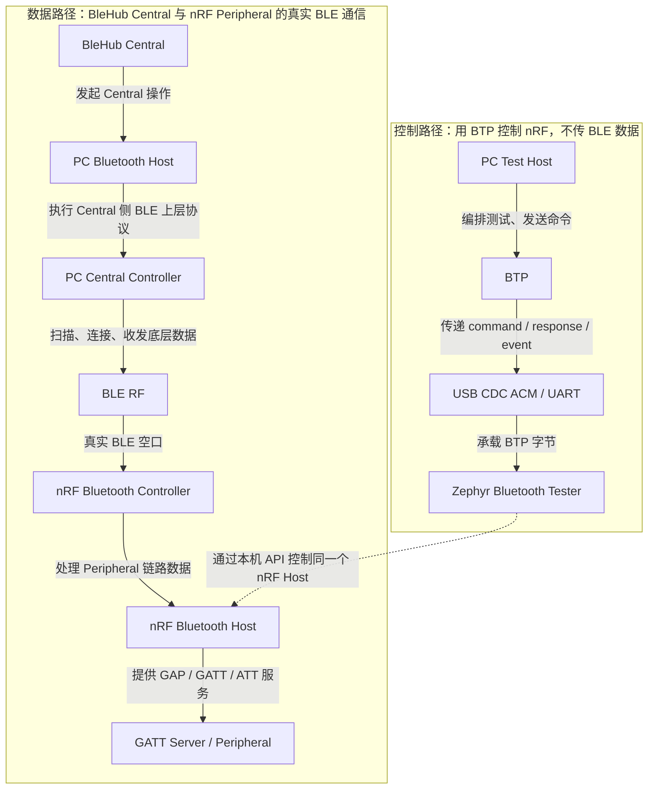
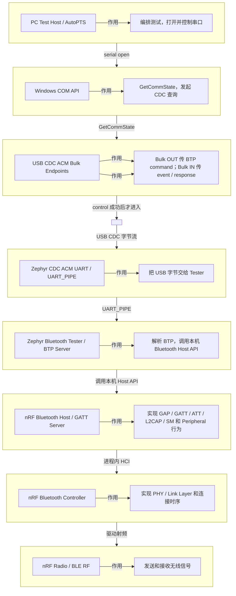

# BTP、BLE、Zephyr Bluetooth Tester 与 PCA10059 实验分层调查

## 1. 报告目的

这份报告用于澄清以下概念和事实边界：

- BLE 和 BTP 分别是什么；
- `Zephyr Bluetooth Tester` 到底是哪一层的程序；
- `Zephyr Bluetooth Shell` 与 Tester、CDC echo 分别能验证什么；
- USB CDC ACM、UART、`UART_PIPE`、BTP 和 BLE 如何连接；
- `pre-DTR banner v1` 与 `pre-DTR IRQ banner v2` 分别改动了哪一层；
- 为什么两个 banner 实验没有形成“Tester 已经通过”的证据；
- 当前问题究竟发生在哪一层；
- 已完成实验分别证明了什么，尚未证明什么。

本文只记录当前调查证据，不改变已批准的 BTP-first 计划，也不修改 `blehub`。T8–T13 的 assertion 根因、单变量修复及配置影响详见
[《Zephyr Bluetooth Tester zero-backend logging assertion 根因报告》](2026-09-08-zephyr-tester-zero-backend-logging-assertion.md)。

## 2. 术语表

| 名称 | 所在位置 | 简短说明 |
|---|---|---|
| **PC Test Host / HIL Host** | PC | 测试意义上的上位机，运行测试编排、设备控制和证据收集。 |
| **HIL Runner** | PC | Hardware-in-the-Loop 总协调器，同时驱动 nrftest 和 BleHub DUT。 |
| **nrftest Host / Fixture Host** | PC | nrftest 的 Python 控制程序，通过 BTP 控制 nRF 测试靶机。 |
| **AutoPTS / pybtp** | PC | upstream 的 BTP 控制端/自动化测试代码；当前计划优先复用其已有实现。 |
| **PC Bluetooth Host** | PC 操作系统 | BleHub Central 所使用的 Bluetooth 上层协议栈，例如 Windows Bluetooth/WinRT。 |
| **PC Central Controller** | PC 蓝牙适配器 | PC 侧的 BLE Controller，负责把 PC Bluetooth Host 的 Central 操作变成无线动作。 |
| **BLE** | PC 与 nRF 之间的无线链路 | Bluetooth Low Energy；本项目中指真实 BLE RF 通信。 |
| **nRF Bluetooth Host** | nRF 固件 | nRF 上的 BLE 上层协议栈，负责 GAP、GATT、ATT、L2CAP、SM 等。 |
| **nRF Bluetooth Controller** | nRF52840 芯片 | nRF 上的 BLE 底层 Controller/Link Layer/Radio 控制部分。 |
| **GATT Server / Peripheral** | nRF 固件 | nRF 对外提供 Service、Characteristic、Descriptor 和属性读写的 BLE 角色。 |
| **Bluetooth Central** | BleHub 所在 PC/平台 | BleHub DUT 扮演的 BLE Central 角色，通过 RF 访问 nRF Peripheral。 |
| **BTP** | PC 与 nRF 之间的有线控制通道 | Bluetooth Test Protocol；传输测试命令、响应和事件，不是 BLE 空口协议，也不是 HCI。 |
| **BTP Server** | nRF application | 接收 BTP command、返回 response/event，并调用本机 Bluetooth Host API。 |
| **Zephyr / Zephyr RTOS** | nRF52840 固件 | 面向微控制器的开源实时操作系统和软件平台；当前在 nRF52840 上提供内核、设备驱动以及 Bluetooth Host/Controller 运行基础。它本身不是 BLE Peripheral 角色，也不是 BTP/RPC 协议。 |
| **Zephyr Bluetooth Tester** | nRF application | 运行在 Zephyr 上的 upstream 具体程序；它实现 BTP Server，并把 BTP 命令映射到 Zephyr Bluetooth。 |
| **Zephyr Bluetooth Shell** | nRF application | Zephyr 官方的交互式 Bluetooth 命令行应用，通过文本命令调用 Bluetooth Host/GAP/GATT；它是独立控制面，不是 Tester 自带的 shell，也不实现 BTP。 |
| **CDC** | USB 设备类 | USB Communications Device Class，规定 USB 通信设备的通用接口；不是 BLE 或 BTP。 |
| **CDC ACM** | PC 与 nRF 之间 | CDC 的 Abstract Control Model；PCA10059 用它枚举出虚拟串口，承载 BTP。 |
| **UART** | nRF 固件/驱动接口 | 字节流设备接口；USB CDC ACM 在 Zephyr 中表现为 UART 设备。 |
| **UART_PIPE** | Zephyr nRF application | Tester 使用的 UART 字节流通道，把 CDC ACM UART 接给 BTP。它不是新的无线协议。 |
| **HCI** | Bluetooth Host 与 Controller 之间 | Host/Controller 的标准接口；当前 nRF 单芯片方案中是进程内调用，不走 PC USB。 |
| **RF** | 空中 | Radio Frequency；BleHub Central 与 nRF Peripheral 之间真正传输 BLE 数据的路径。 |
| **DUT** | 被测试的一方 | Device Under Test；本项目中主要指 BleHub Central，而不是 nRF 测试靶机。 |

这里的两个 `Host` 必须分开理解：

```text
PC Test Host = 测试系统的上位机
nRF Bluetooth Host = nRF 自己的 BLE 协议栈
PC Bluetooth Host = BleHub 所在平台自己的 BLE 协议栈
```

## 3. 系统分层（简版）

当前系统有两条路径：

- **控制路径**：PC 用 BTP 配置、触发和观测 nRF 测试程序；走 USB/UART，不传 BLE 数据。
- **数据路径**：BleHub 作为 Central，经 PC 的 Bluetooth Host/Controller 和真实 BLE RF，访问 nRF 的 GATT Server。

### 3.1 总览：两条路径如何汇合



### 3.2 分层：USB/BTP 调试路径

这张图把 USB CDC 和 BTP 拆开；从上到下是路径顺序，每行右侧是该层的作用。



| 观测项 | 所属层 | 方向 | T12 前失败观测与当前结论 |
|---|---|---|---|
| `GET_LINE_CODING` response | USB CDC ACM control transfer | nRF → PC | T12 前失败候选中 Windows `GetCommState` 未完成；NCS T12/T13 和正式 upstream no-logging 候选均已完成。 |
| `IUT_READY` event | BTP over CDC ACM bulk IN | nRF → PC | 原始抓包和 T11 均观察到；它是 event，不是 response。 |
| BTP Core command | BTP over CDC ACM bulk OUT | PC → nRF | T5、T9、T12、T13 和正式 upstream 候选已通过固定 AutoPTS transport 发送。 |
| BTP Core response | BTP over CDC ACM bulk IN | nRF → PC | NCS 最小候选与正式 upstream 完整 Tester 均已读回 capabilities；两者 feature set 不同，不能要求 command mask 相同，也不能用 `IUT_READY` 代替 response。 |

关键区别仍然成立：`GET_LINE_CODING` 的返回属于 USB control transfer，不属于 bulk IN；只有 `IUT_READY` 和 BTP response 才属于 BTP over bulk IN。T11/T12 已把原串口打开失败定位并收敛到 zero-backend logging process thread assertion；T13 证明完整关闭无输出目的地的 logging subsystem 后仍可恢复，正式 upstream `v4.4.2` no-logging 候选随后也通过了 Win32 serial 和 BTP Core response。

当前模式：Host、Controller 和 GATT Server 都在同一个 nRF52840 standalone Peripheral 固件中；PC 的 Bluetooth Host 属于 PC 自己的 Central 链路。只有刷写 HCI Controller 固件时，才由 PC Host 通过 HCI 接管 nRF Controller；那不是当前 BTP Peripheral fixture。

## 4. 本次调查的六个关键变量

这六个变量必须分开记录；只要一次实验同时改变其中两个以上，就不能把结果直接归因给其中某一个。

| 变量 | 需要比较的取值 | 当前已有证据 | 当前缺口 |
|---|---|---|---|
| **硬件种类** | PCA10059 Dongle、nRF52840 DK | Dongle 已运行 upstream/NCS CDC sample、原始 Tester、NCS T12/T13 和正式 upstream no-logging Tester；正式 upstream 的 Windows serial/BTP Core 已通过。DK 的 NCS 官方 Tester 仅完成 build-only | DK 尚未连接、刷写和运行；两个硬件均未完成 RF 对照 |
| **Zephyr 版本与来源** | GitHub upstream Zephyr、NCS 携带的 Zephyr、具体 tag/commit | upstream `v4.4.2` 与 NCS Zephyr `4.4.0` 的原始 Dongle Tester 均复现串口失败；NCS T11/T12 定位并修复 assertion path，NCS T13 和正式 upstream 均已验证 `CONFIG_LOG=n` | NCS 与 upstream 的 feature set/capability mask 不同；GAP/GATT/RF 仍需在正式 upstream 上验证 |
| **系统层级** | USB CDC、UART/UART_PIPE、BTP、Bluetooth Host、Bluetooth Controller、BLE RF | CDC control/bulk、`UART_PIPE` 和正式 upstream BTP Core command/response 已通过 | GAP、Bluetooth Host/Controller 的具体操作与 BLE RF 仍未通过 |
| **控制面应用** | 官方 CDC ACM echo sample、Zephyr Bluetooth Shell、Zephyr Bluetooth Tester/BTP | upstream/NCS CDC echo 通过；NCS T12/T13 与正式 upstream Tester/BTP Core 通过；固定 source 已确认包含 Bluetooth Shell | Shell runtime 仍未执行，但已不再是定位当前根因的必要前置；下一步是 Tester GAP |
| **板卡配置与 Transport** | PCA10056 DK stock Tester 配置；PCA10059 Dongle 的 nrftest 配置；CDC/pre-DTR 实验配置 | PCA10059 原生 USB CDC、`board_cdc_acm_uart`、`UART_PIPE`、动态 identity 和正式 no-logging config 已通过 | DK runtime 未执行；PCA10059 的 RF 行为仍未验证 |
| **CDC 初始化与 line-state 时序** | CDC sample 的手动 init/enable + DTR 后发送；Tester 的自动 init/enable + `UART_PIPE` + 首个 BTP event 时序 | T1–T4 已逐项对照注册、自动初始化、DTR 和 pre-DTR send；T11/T12 定位到 logging assertion，NCS T13 与正式 upstream no-logging 候选通过 | 不再把初始化/首次发送时序作为当前根因；macOS/Linux line-state 表现仍需分别验证 |

这里还要区分 Zephyr source、NCS workspace 和 toolchain：

```text
Zephyr source = 编译进去的 RTOS、Bluetooth、USB 和 application 源码
Zephyr SDK   = 编译器、链接器和相关 host/target 工具
west/cmake/ninja = 构建编排工具
NCS workspace = Nordic 的 SDK workspace，包含 nrf 仓库和一套由 manifest 固定的 Zephyr checkout
```

本机实际检查结果：

```text
当前 nrftest firmware source:
  E:\dev\nrftest-upstream\zephyrproject\zephyr
  tag    = v4.4.2
  commit = dccb09599635bdff17633fa7e9dab014b91dce90

当前 nrftest toolchain:
  Zephyr SDK 1.0.1
  target arm-zephyr-eabi
  west/cmake/ninja 来自 Pixi 环境

本机独立 NCS workspace:
  root   = E:\dev\v3.4.0
  nRF    = v3.4.0 / 99553055607b2e9885fbc80ccd11fa9da81c2df0
  manifest 中 Zephyr revision = ncs-v3.4.0
  Zephyr = bf801e4e3d19e1ffa76164346480cb7734dd2800
  Zephyr VERSION = 4.4.0
```

因此，NCS 确实携带了另一份 Zephyr checkout，而且本机这份 NCS Zephyr 与当前 upstream `v4.4.2` 不是同一个 revision。此前 nrftest 的正式构建配置明确指向 upstream checkout；本次已另外使用 NCS source/toolchain 完成 Dongle Tester 与 CDC sample 的构建、打包、刷写和运行对照。

NCS checkout 中也存在 `tests/bluetooth/tester`，但它不是同一份文件内容：NCS 与 upstream 的 `prj.conf`、`CMakeLists.txt`、`README.rst`、`src/main.c`、`src/btp.c`、`src/btp_core.c`、`src/btp_gap.c`、`src/btp_gatt.c` 以及 nRF52840 DK 的 Tester config/overlay 文件 SHA-256 均不同。因此，“NCS 里也有 Tester”不能等同于“它与当前 upstream Tester 相同”。

### 4.1 CDC 初始化、UART_PIPE 与 DTR 时序

这是 T1–T4 阶段优先控制的变量。两种固件都使用 Zephyr USB device-next 和 CDC ACM，但最终 Kconfig 与应用初始化方式不同：

| 配置/行为 | 官方 CDC ACM sample | 当前 Bluetooth Tester |
|---|---|---|
| `CONFIG_CDC_ACM_SERIAL_INITIALIZE_AT_BOOT` | `n` | `y` |
| `CONFIG_CDC_ACM_SERIAL_ENABLE_AT_BOOT` | 不适用 | `y` |
| `CONFIG_UART_PIPE` | `n` | `y` |
| `CONFIG_UART_LINE_CTRL` | `y` | `n` |
| USB 初始化 | sample 应用手动 `init/enable` | `cdc_acm_serial` 在 application init 阶段自动初始化/enable |
| 发送起点 | 等待 DTR 后开始 echo | Tester 启动后可能先发送 `IUT_READY` |
| 当前结果 | `GET_LINE_CODING`、bulk OUT/IN、echo 通过 | `IUT_READY` Bulk IN 曾通过，但 Windows `GetCommState` 的 `GET_LINE_CODING` 未完成 |

Zephyr 的 PCA10059 CDC backend defconfig 在非 MCUboot 应用中默认打开 `CONFIG_CDC_ACM_SERIAL_INITIALIZE_AT_BOOT`；当前 `pca10059.conf` 明确设置 `CONFIG_BOOTLOADER_MCUBOOT=n`，因此该自动初始化路径会被选中。CDC sample 则明确关闭自动初始化，并在应用中调用 `sample_usbd_init_device()`、`usbd_enable()`，再等待 DTR。

`CONFIG_UART_LINE_CTRL=n` 不是单独证明 `GET_LINE_CODING` 必然失败的原因；它的直接影响是 Tester 没有使用应用层 DTR 状态控制发送。T1–T4 阶段的最高优先级诊断假设曾是：

```text
自动 CDC init/enable
  + UART_PIPE 注册
  + DTR 尚未完成时发送 IUT_READY
  + Windows 随后发起 GET_LINE_CODING
```

后续 T1–T3 已分别证明手动/自动初始化、`UART_PIPE` 注册时机、DTR polling 和 pre-DTR send 均不是充分原因；T4 的 DTR gate 也未恢复。T11/T12 最终把本次被测失败定位并收敛到 zero-backend logging process thread assertion，T13 完整关闭 logging 后仍通过。因此上面的组合只保留为历史假设，不再是当前根因解释。

### 4.2 Zephyr Bluetooth Shell 在变量矩阵中的位置

固定的 upstream Zephyr `v4.4.2` source 中包含官方 Bluetooth Shell：

```text
doc/connectivity/bluetooth/bluetooth-shell.rst
tests/bluetooth/shell/
subsys/bluetooth/host/shell/bt.c
subsys/bluetooth/host/shell/gatt.c
```

它是一个独立的、面向人工交互的 Bluetooth 控制面，典型提示符为 `uart:~$`。它通过 `bt init`、`bt scan`、`bt advertise`、`bt connect`、`bt disconnect`、`gatt register`、`gatt discover`、`gatt read`、`gatt write`、`gatt subscribe` 和 `gatt notify` 等文本命令调用 Zephyr Bluetooth Host API。

它不是 Bluetooth Tester 内部附带的命令行，也不解析 BTP header。三种控制面应这样比较：

| 控制面应用 | PC 与固件间的接口 | 能验证 | 不能验证 | 在 nrftest 中的定位 |
|---|---|---|---|---|
| 官方 CDC ACM echo sample | 原始字节输入与 echo 输出 | USB 枚举、CDC control、bulk OUT/IN、应用收发 | Bluetooth Host、Controller、GAP/GATT、BLE RF、BTP | USB transport 基线 |
| **Zephyr Bluetooth Shell** | 文本命令与人类可读输出 | 实际执行后可独立验证 Bluetooth Host、Controller、GAP/GATT 和 BLE RF；也能验证承载 shell 的串口 transport | BTP header、Core/GAP/GATT BTP command/response、AutoPTS 兼容性和稳定的机器关联语义 | 官方诊断/参考控制面 |
| Zephyr Bluetooth Tester | 二进制 BTP command/response/event | BTP 自动控制以及经 BTP 驱动的 GAP/GATT 行为 | 在 USB 串口初始化本身失败时，不能单独证明底层 transport 正常 | 最终自动化控制面 |

因此，Bluetooth Shell 是本次调查中的有效变量：如果同一 PCA10059、同一 Zephyr source、尽量相同的 USB CDC transport 下，Shell 可以完成 GATT Server、广播、连接和 Notification，而 Tester 仍卡在 BTP 前，则问题会进一步收敛到 Tester/BTP/初始化组合；如果 Shell 也失败，则应继续调查共同的 USB 配置、Bluetooth Host/Controller 或板级适配。

但 Shell 的文本输出没有 BTP 的固定 header、opcode、response/event 结构和 AutoPTS `pybtp` 兼容性，自动化解析也更脆弱。因此它应作为**官方诊断/参考控制面**，不能直接替代 nrftest 最终采用的 BTP 自动化协议。

当前这项仅完成了固定本地 source 审计，尚未在 PCA10059 上 build、flash 或 RF 验证，不能记录为运行通过。

### 4.3 官方 CDC ACM sample 在变量矩阵中的位置

官方 CDC ACM sample 的链路是：

```text
PC
  -> USB CDC ACM
  -> nRF application
  -> echo 原始字节
```

| 层级 | 官方 CDC ACM sample 覆盖内容 | 它能证明什么 | 它不能证明什么 |
|---|---|---|---|
| USB 设备 | USB 设备枚举、CDC ACM class | nRF application 能以 USB CDC ACM 设备被 Host 发现 | BTP 或 Bluetooth Tester 已经启动 |
| USB 控制面 | control transfer、`GET_LINE_CODING` | CDC ACM 的控制请求/响应链路可用，Host 串口初始化可以完成 | BTP header、Core/GAP/GATT response 可用 |
| USB 数据面 | bulk OUT、bulk IN | Host 与应用之间可以双向传输数据 | 数据已经按 BTP framing/opcode 解释 |
| 应用层 | 原始字节 echo | 应用可以收到 Host 数据并把相同数据发回 | BTP command/event worker、超时、错误分类 |
| BTP 协议 | 不覆盖 BTP header 解析 | — | BTP header、长度、opcode、response/event 关联 |
| Bluetooth 控制 | 不覆盖 Core/GAP/GATT command | — | Bluetooth Host、BLE Controller、BTP Core/GAP/GATT 能力 |
| Peripheral 功能 | 不覆盖 GATT Server、广播 | — | Service/Characteristic、动态 GATT、读写和订阅 |
| RF 数据面 | 不覆盖 Notification/Indication | — | BLE 广播、连接、Notification/Indication 发送和确认 |

因此它是一个非常有价值的**USB transport 对照实验**，但不是完整的 Bluetooth Tester。

当前官方 sample 对照使用的 upstream 源码是：

```text
E:\dev\nrftest-upstream\zephyrproject\zephyr\samples\subsys\usb\cdc_acm\
```

实验使用了 nrftest 的 PCA10059 实验配置和 overlay，位置是：

```text
.work/experiments/cdc-control/pca10059.conf
.work/experiments/cdc-control/pca10059.overlay
```

所以准确表述是：

```text
upstream CDC ACM sample source
+ nrftest PCA10059 experiment config
+ PCA10059 hardware
```

它不是官方已经为 PCA10059 预编译好的完整测试夹具。

### 4.4 NCS 自洽 source/toolchain 的 build/package 对照

保持 PCA10059 board target 和 nrftest 的 `firmware/app/pca10059.conf`、`firmware/app/pca10059.overlay` 不变，切换到 NCS 自带的 source 和 toolchain；为与 upstream 的直接 application build 对齐，成功构建显式使用了 NCS West 的 `--no-sysbuild`。因此本次不是完全单变量实验，还需要把构建模式和 host-tool 版本作为记录项：

```text
source:
  E:\dev\v3.4.0\zephyr
  Zephyr 4.4.0 / ncs-v3.4.0

toolchain:
  E:\dev\toolchains\dcbdc366a1\opt\zephyr-sdk
  Zephyr SDK 1.0.1
  arm-zephyr-eabi
  NCS bundle Python 3.12.4 / West 1.5.0 / CMake 4.2.1 / Ninja 1.13.2 / DTC 1.4.7

upstream 对照使用的 host tools 是 Pixi 环境中的 Python 3.12.14 / CMake 4.4.3 / Ninja 1.13.2，以及 nrftest 管理的 DTC 1.6.1
```

结果：

```text
board target：nrf52840dongle/nrf52840
Kconfig/DTS：通过
ELF/HEX/BIN：生成
Flash：392728 B / 1020 KiB
RAM：111208 B / 256 KiB
```

NCS build/package 产物目录：

```text
.work/experiments/ncs-pca10059-tester-direct/build/zephyr/
```

其中：

```text
zephyr.hex SHA-256 = bffacca85ad87f6c388473e3e2ecea2f42b41bc1e3be8061a262a137f36d5132
zephyr.bin SHA-256 = af74cf3e3cbf0a3620b6d21398bff777763c89fc8d973054135812cb57e367a7
DFU ZIP SHA-256  = d3480bdf1c916c20d763746e0d18455abe6acd33b35981348b7ff72d543c9f96
```

DFU ZIP：

```text
.work/experiments/ncs-pca10059-tester-direct/nrftest-pca10059-ncs-tester-v1.zip
```

该 unsigned package 使用项目固定的 Nordic `nrf5sdk-tools` 生成，规范化 ZIP 时间后重新通过 Nordic `pkg display`；包内为 `manifest.json`、`zephyr.bin` 和 `zephyr.dat`。HEX 地址段为 `0x1000..0x5a2d8` 和 `0x5a2e0..0x60e18`，未覆盖 `0xe0000` 起始的原厂 bootloader。

该 package 随后已在用户确认后刷入同一 PCA10059，并按 `2FE3:0004`、serial `DBDBE94A2CED8C63` 动态重枚举。同一个 AutoPTS `btp-doctor` 未返回 Core response；分阶段 Win32 probe 明确完成 `CreateFile`，但 `GetCommState` 在 15 秒内未完成，`CloseHandle` 未到达。结果记录在 `.work/experiments/ncs-pca10059-tester-direct/experiment-manifest.json` 和 `.work/reports/usb/ncs-win32-serial-stages-20260907T071608Z.json`。

因此，NCS 自洽 source/toolchain 没有改变当前失败层级；但两组 Tester 仍共同使用 nrftest 的 PCA10059 config/overlay，不能据此排除配置和初始化模式。

### 4.5 NCS 官方 CDC ACM sample 的同硬件 USB 层对照

保持 PCA10059 和原 CDC 实验配置不变，把 sample source/toolchain 切换到 NCS 自带版本：

```text
application = E:\dev\v3.4.0\zephyr\samples\subsys\usb\cdc_acm
Zephyr      = 4.4.0 / ncs-v3.4.0
toolchain   = E:\dev\toolchains\dcbdc366a1
config      = .work/experiments/cdc-control/pca10059.conf
overlay     = .work/experiments/cdc-control/pca10059.overlay
```

NCS CDC sample 构建使用 Flash `54924 B`、RAM `18296 B`；DFU ZIP 为：

```text
.work/experiments/ncs-pca10059-cdc-control/nrftest-pca10059-ncs-cdc-control-v1.zip
SHA-256 = a0e0c96cbae8e5fc1b3d953514e028095209c8cb183dea2c6a1012666fa5a9ca
```

在用户确认后刷入同一 PCA10059，设备按 `2FE3:0001`、serial `DBDBE94A2CED8C63` 动态重枚举为 `COM14`。与 upstream CDC 对照相同的 probe 完成：

```text
pyserial open / GetCommState：通过
19-byte bulk OUT：通过
19-byte bulk IN echo：通过
close：通过
```

因此，在 NCS 4.4.0 自带 source/toolchain 下，PCA10059 的通用 USB CDC control/bulk 路径仍然正常。该结论在当时只把失败范围收缩到 Tester application/config/runtime 组合，不能单独证明根因；后续 T11/T12 定位并移除 logging assertion path，NCS T13 完整关闭 logging 后通过。正式 upstream `v4.4.2` no-logging 候选随后也已完成独立实机复验。

独立证据：

```text
.work/experiments/ncs-pca10059-cdc-control/experiment-manifest.json
.work/reports/ncs-cdc-control-flash-20260907T072932Z.json
.work/reports/usb/cdc-control-pyserial-20260907T072957Z.json
```

## 5. 对照实验矩阵

下表按控制变量和排查层级排序。`完成` 表示该行列出的实验边界已经实际执行并有记录；`—` 表示尚未执行，不能提前填写结论。

| 针对的变量 | 对象 / 实验内容 | 是否完成 | 得到的结论 |
|---|---|---|---|
| Zephyr source/toolchain、Tester 运行时 | PCA10059 + upstream Zephyr `v4.4.2` + upstream Bluetooth Tester + nrftest PCA10059 config/overlay；构建、打包、刷写、枚举和 Win32/BTP probe | 完成 | Tester 已启动并发出 `IUT_READY`；`CreateFile` 成功，`GetCommState`/`GET_LINE_CODING` 未完成；尚未到达 BTP Core response 或 BLE RF。 |
| Zephyr source/toolchain、Tester 运行时 | 保持 PCA10059 和 nrftest config/overlay，切换为 NCS `v3.4.0`、Zephyr `4.4.0`、NCS toolchain；构建、打包、刷写、枚举和同一 probe | 完成 | 仍是 `CreateFile` 成功、`GetCommState` 超时；更换为 NCS 自洽 source/toolchain 没有改变失败层级，但共同使用的 nrftest 配置尚未排除。 |
| USB CDC 层、Zephyr source/toolchain | PCA10059 + upstream `v4.4.2` 官方 CDC ACM sample + nrftest CDC 实验配置；手动 USB 初始化和 19-byte echo | 完成 | `GetCommState`、bulk OUT/IN 和 echo 均通过；upstream 的通用 USB CDC control/bulk 路径在该 Dongle 上可用。 |
| USB CDC 层、Zephyr source/toolchain | 保持同一 PCA10059 和同一 CDC 实验配置，切换为 NCS `4.4.0` 官方 CDC ACM sample/NCS toolchain；手动 USB 初始化和同一 echo probe | 完成 | `GetCommState`、19-byte bulk OUT/IN 和 close 均通过；NCS 的通用 USB CDC 路径也可用，版本/toolchain 差异不是通用 CDC 失败的充分解释。 |
| T0 基线复核、CDC 时序证据 | 保持当前 NCS CDC sample 和同一 PCA10059，重新执行串口 probe，并尝试按当前 USB 地址重采 USBPcap | 完成 | 串口 open/`GetCommState`、19-byte bulk OUT/IN echo 和 close 再次通过；此前 `device15` PCAP 已完整记录 control/DTR/bulk 时序。本次地址 38 的抓包只含描述符，不能作为新的完整时序证据。 |
| Application、配置、USB 初始化模式 | 对比 Bluetooth Tester 的自动 CDC + `UART_PIPE` 与 CDC sample 的手动 USB 初始化 + echo | 完成 | 失败范围缩小到 Tester application、nrftest 配置、自动 CDC 初始化、`UART_PIPE` 或首个 BTP event 的组合；因为这些变量同时变化，尚不能归因到单一项。 |
| 控制面应用 | 保持 PCA10059、Zephyr source 和原生 USB CDC transport，构建并运行官方 Zephyr Bluetooth Shell，验证 `bt init`、advertising 和基础 GATT Server | — | — |
| 首次发送时序、UART API | `pre-DTR banner v1`：自动 CDC 初始化，使用 `uart_poll_out()` 尝试在 Host open/DTR 前发送 5-byte banner | 完成 | `GetCommState` 成功，但未观察到真实 bulk IN；实验未复现 Tester 的 data-IN 条件，结论不确定。 |
| 首次发送时序、UART IRQ/TX | `pre-DTR IRQ banner v2`：自动 CDC 初始化，使用 TX IRQ、`uart_fifo_fill()` 尝试发送相同 banner | 完成 | 仍未观察到真实 bulk IN；比 v1 更接近 TX 路径，但仍未复现 Tester 条件，结论不确定。 |
| 硬件种类、官方 board 配置、构建 | nRF52840 DK + NCS `v3.4.0` source/toolchain + NCS Zephyr Tester 自带 `nrf52840dk_nrf52840.conf/.overlay`，不使用 nrftest PCA10059 配置 | 完成 | 官方 DK 组合已构建出 ELF/HEX/BIN；只证明编译/链接通过，不证明 DK 串口、BTP 或 RF 运行时。 |
| 硬件种类、官方 board 配置、运行时 | 将上述 NCS 官方 DK Tester 刷入 nRF52840 DK，通过板载 J-Link VCOM 的 `uart0` 做 serial/BTP Core probe | — | — |
| 硬件种类、Transport 基线 | 若 DK Tester 的串口 probe 失败，在同一 DK、同一 NCS source/toolchain 和同一 `uart0`/J-Link VCOM 上运行最小 UART echo，单独验证 115200、硬件流控和板载 VCOM | — | — |
| 板卡配置与 Transport | 保持 PCA10059 和 Tester/BTP，改用可用板级 UART + 外接 USB-UART，绕过 PCA10059 原生 USB CDC | — | — |
| 控制面应用、UART_PIPE、构建 | T1：保持 NCS `4.4.0`、PCA10059、手动 USB init/enable、line-control、DTR gate 和 T0 USB identity，仅启用 `UART_PIPE`；构建、比较最终 Kconfig、校验 Flash 边界并打包 | 完成 | T0/T1 最终 Kconfig 只有 `CONFIG_UART_PIPE: n → y` 一项差异；构建和 Nordic DFU package 校验通过，HEX 未覆盖 MBR 或 bootloader；尚未产生运行时结论。 |
| 控制面应用、UART_PIPE、运行时 | 将 T1 刷入同一 PCA10059；DTR 后接收 `00 80 ff 00 00`，再验证 19-byte `UART_PIPE` bulk OUT/IN echo | 完成 | open/`GetCommState`、DTR 后 5-byte `IUT_READY`、19-byte `UART_PIPE` bulk OUT/IN echo 和 close 均通过；`UART_PIPE` 在手动 USB init + line-control/DTR gate 组合下可用。 |
| DTR 检测机制、构建 | T1b：保持 T1 最终 Kconfig 完全不变，仅把 DTR 检测从 USBD event semaphore 改为 `uart_line_ctrl_get()` 轮询；构建、边界校验并打包 | 完成 | T1/T1b 最终 Kconfig 差异为 0；构建和 DFU package 校验通过，尚未产生运行时结论。 |
| DTR 检测机制、运行时 | 将 T1b 刷入同一 PCA10059，执行与 T1 相同的 5-byte `IUT_READY` 和 19-byte echo probe | 完成 | open/`GetCommState`、轮询观察 DTR、5-byte `IUT_READY`、19-byte `UART_PIPE` echo 和 close 均通过；DTR polling 可作为自动初始化对照的稳定桥梁。 |
| USB 初始化模式、构建 | T2：保持 `UART_PIPE`、line-control 轮询、DTR gate 和等价 USB descriptor 值，从 sample 手动 USB context/init 切换为 `cdc_acm_serial` 自动 init/enable；构建、边界校验并打包 | 完成 | 构建和 DFU package 校验通过；最终 Kconfig 的 14 项文本差异由自动 init/enable 及同值 descriptor 配置从 `SAMPLE_USBD_*` 命名空间迁移到 `CDC_ACM_SERIAL_*` 组成，尚未产生运行时结论。 |
| USB 初始化模式、运行时 | T1b 通过后，将 T2 刷入同一 PCA10059，执行相同 DTR 后 `IUT_READY` 和 19-byte echo probe | 完成 | 自动 CDC init/enable 下，open/`GetCommState`、轮询 DTR、5-byte `IUT_READY`、19-byte `UART_PIPE` echo 和 close 均通过；自动初始化或其与 `UART_PIPE` 的组合不是当前故障的充分原因。 |
| `UART_PIPE` 注册时机、构建 | T2r：保持 T2 的自动 CDC init/enable、DTR polling/gate、post-DTR `IUT_READY`、USB identity 和最终 Kconfig 不变，只把 `uart_pipe_register()` 从 DTR 后移到 DTR 前；构建、边界校验并打包 | 完成 | T2/T2r 最终 Kconfig 差异为 0；build/package/Flash 边界通过；该行只证明制品与边界，运行结果见下一行。 |
| `UART_PIPE` 注册时机、运行时 | 将 T2r 刷入同一 PCA10059，执行与 T2 相同的 DTR 后 `IUT_READY` 和 19-byte echo probe | 完成 | open/`GetCommState`、DTR 后 5-byte `IUT_READY`、19-byte `UART_PIPE` bulk OUT/IN echo 和 close 均通过；DTR 前注册 `UART_PIPE` 并启用 RX IRQ 不是 Tester 阻塞的充分原因。 |
| IUT_READY 发送时机、构建 | T3：保持 T2 最终 Kconfig 完全不变，只移除 DTR gate，在启动阶段通过 `UART_PIPE` 发送同一 5-byte event；构建、边界校验并打包 | 完成 | T2/T3 最终 Kconfig 差异为 0；构建和 DFU package 校验通过，尚未产生运行时结论。 |
| IUT_READY 发送时机、运行时 | 将 T3 刷入同一 PCA10059，观察 pre-DTR `IUT_READY` 是否导致 open/`GetCommState` 卡住，并在可继续时验证 19-byte echo | 完成 | open/`GetCommState`、19-byte `UART_PIPE` echo 和 close 通过，但 Host 未收到 pre-DTR event；单纯调用早期发送没有复现 Tester 故障，也没有复现真实早期 bulk IN，结果继续指向完整 Tester/实际 data-IN 时序组合。 |
| 完整 Tester、line-control/DTR gate、构建 | T4：复制 NCS 官方 Zephyr Bluetooth Tester，只在 `src/btp.c` 中等待 DTR 后再初始化 Core/发送 `IUT_READY`，并启用 `CONFIG_UART_LINE_CTRL`；构建、源文件/Kconfig 差异、边界和 package 校验 | 完成 | 117 个 Tester 文件中仅 `src/btp.c` 与 NCS 原文不同；相对失败的 NCS Tester 最终 Kconfig 仅 `CONFIG_UART_LINE_CTRL: n → y`；BTP parser/Core/GAP/GATT 未改，尚未产生运行时结论。 |
| 完整 Tester、line-control/DTR gate、运行时 | 将 T4 刷入同一 PCA10059，首次打开运行当时的 AutoPTS BTP Core probe，随后用分阶段 Win32 probe 定位阻塞点 | 完成 | 当时的 AutoPTS 30 秒 timeout 早于 `/dev/ttyS(n-1)` socat 地址修正和 90/120 秒 supervisor 预算修正，结果受 Host transport/预算混淆，不能作为 T4 的 BTP 失败证据。独立 Win32 probe 不经过 socat，仍有效证明 `CreateFile` 成功而 `GetCommState` 未完成；T4 在 DTR 前不会发送 `IUT_READY`，故早期 event 不是该 Win32 阻塞的必要条件。 |
| T4 固件、修正后的 Host transport | 重新刷入同一 T4 package，复位后使用 `COMn → /dev/ttyS(n-1)` 和 120 秒 supervisor 预算执行 BTP Core capability probe；与独立 Win32 probe 分开判定 | 完成 | 已明确选择 `/dev/ttyS12`，但仍在 120 秒内超时且未生成内层 capability report。固定 AutoPTS 源码显示 Windows `controller.start()` 会先在 `flush_serial()` 中把 tty 还原为 `COM13` 并调用 pyserial，返回后才启动 socat；结果与独立 `GetCommState` 阻塞一致，说明本次尚未到达 socat/BTP response。socat 地址修正排除了旧 Host 参数错误，但没有使 T4 通过。 |
| 完整 Tester 功能配置、构建 | T5 粗筛：保持 T4 的 64 个 Tester `src/` 文件、自动 CDC、`UART_PIPE`、DTR gate、PCA10059 和 source/toolchain 不变；移除非 Core/GAP/GATT 必需的 L2CAP Tester/EATT、OTS、ISO、EAD、扩展/周期广播、DIS 和 testing hooks | 完成 | T5 与 T4 的 Tester `src/` 逐文件一致；最终 Kconfig 有 163 项直接或派生差异；只编译五个 Core/GAP/GATT application 对象；build/package/Flash 边界通过。该粗筛同时移除多个功能组，运行通过时必须再逐组加回，不能直接归因到单组。 |
| 完整 Tester 功能配置、运行时 | 将 T5 刷入同一 PCA10059，分别验证 Win32 serial stages、AutoPTS transport 和 BTP Core capabilities | 完成 | `CreateFile`、`GetCommState(115200)`、close 均通过；修正 Host socat 地址后，AutoPTS 读回 `CORE/GAP/GATT` services 和三组 supported-command masks。T5 粗筛消除了 T4 的 CDC control failure，说明 163 项配置差异中至少一项或其组合参与故障，但不能归因到单组。 |
| `CONFIG_TEST` 及其派生配置、构建 | T6：保持 T5 的硬件、64 个 Tester `src/` 文件、Core/GAP/GATT 功能集、自动 CDC、`UART_PIPE`、DTR gate、board config/overlay 和 source/toolchain 不变，只在根配置增加 `CONFIG_TEST=y`；pristine build、最终 Kconfig、DTS、对象、Flash 边界和 package 校验 | 完成 | 根输入只增加 `CONFIG_TEST=y`，最终 Kconfig 产生 16 项直接/派生差异；`CONFIG_BT_TESTING` 及 L2CAP/OTS/ISO/EAD/扩展广播/DIS 仍关闭，仍只编译五个 Core/GAP/GATT application 对象。去掉生成的 source-location 注释后 DTS 与 T5 一致；Flash `278812 B`、RAM `73240 B`，HEX 段未覆盖 MBR/bootloader，规范化 DFU ZIP 已通过 Nordic 校验。该行没有运行时结论。 |
| `CONFIG_TEST` 及其派生配置、运行时 | 将 T6 刷入同一 PCA10059；首次只执行 Win32 serial stages，若 `GetCommState` 通过，则复位设备后执行 120 秒 BTP Core capability probe | 完成 | T6 为 `CreateFile` 成功、`GetCommState` 15 秒未返回，复现 T4 的 CDC control failure；按预设门槛未运行 AutoPTS，因为其 Windows `flush_serial()` 会先阻塞于同一 pyserial open。由此可判定：相对通过的 T5，`CONFIG_TEST=y` 及其 15 个派生差异作为一组足以重新触发故障；尚不能归因到其中单项。 |
| `CONFIG_ASSERT` 及其派生配置、构建 | T7：保持 T5 全部硬件、source、Tester `src/`、Core/GAP/GATT、USB/UART/DTR 和 board 配置不变，只增加 `CONFIG_ASSERT=y`；pristine build、最终 Kconfig、DTS、对象、Flash 边界和 package 校验 | 完成 | T7 相对 T5 产生 10 项差异，正好是 T6 中的 `ASSERT`、`ASSERT_LEVEL`、日志线程栈、slab/spin 校验、workqueue timeout 和 heap hardening 这一组；`CONFIG_TEST`、`THREAD_NAME`、`TEST_*` 仍关闭。仍只编译五个 Tester 对象；Flash `278844 B`、RAM `72856 B`，DTS 语义和 Flash 安全边界通过，DFU ZIP 已通过 Nordic 校验。该行没有运行时结论。 |
| `CONFIG_ASSERT` 及其派生配置、运行时 | 将 T7 刷入同一 PCA10059，首次只执行 Win32 serial stages；通过时才在复位后执行 BTP Core capability probe | 完成 | T7 同样为 `CreateFile` 成功、`GetCommState` 15 秒未返回；按门槛未运行 AutoPTS。相对通过的 T5，`CONFIG_ASSERT=y` 及其 9 个派生差异作为一组已足以复现故障，因此 T6 额外的 `CONFIG_TEST`、`THREAD_NAME` 和 `TEST_*` 6 项不是复现所必需；仍需在 assert 组内继续拆分。 |
| 隔离的 `CONFIG_ASSERT`、构建 | T8：保持 T5 不变，启用 `CONFIG_ASSERT=y`，同时显式把 spin/slab 校验、heap hardening、日志线程栈、workqueue timeout 和 RPC filename size 恢复为 T5 值；pristine build 并核对最终配置 | 完成 | T8 相对 T5 的最终 Kconfig 只剩 `CONFIG_ASSERT: n → y` 和 `CONFIG_ASSERT_LEVEL: n → 2`；仍只编译五个 Tester 对象，DTS 语义一致，Flash `269376 B`、RAM `71284 B`，安全边界和 Nordic package 校验通过。该行没有运行时结论。 |
| 隔离的 `CONFIG_ASSERT`、运行时 | 将 T8 刷入同一 PCA10059，首次只执行 Win32 serial stages；通过时才在复位后执行 BTP Core capability probe | 完成 | T8 仍为 `CreateFile` 成功、`GetCommState` 15 秒未返回；按门槛未运行 AutoPTS。相对 T5 仅 `CONFIG_ASSERT=y` 与 `CONFIG_ASSERT_LEVEL=2` 两项差异就足以复现故障，已排除 T7 中其他 8 个可配置派生值作为必要条件；下一步需区分 assert 宏实际启用与仅存在 `CONFIG_ASSERT` 编译符号。 |
| Assert 宏开关、构建 | T9：保持 T8 的 `CONFIG_ASSERT=y` 和全部 T5 派生值恢复项，只把 `CONFIG_ASSERT_LEVEL=2 → 0`；按本地 `__assert.h`，`__ASSERT()`/`__ASSERT_NO_MSG()` 在 level 0 展开为禁用行为 | 完成 | T9 相对 T5 仍只有 `CONFIG_ASSERT=y` 与 `CONFIG_ASSERT_LEVEL=0` 两项符号差异；Flash `242600 B`、RAM `71284 B`，仍只编译五个 Tester 对象，DTS 语义、安全边界和 Nordic package 校验通过。该行没有运行时结论。 |
| Assert 宏开关、运行时 | 将 T9 刷入同一 PCA10059 并执行 Win32 serial stages；若通过，则复位后执行 BTP Core capability probe | 完成 | Win32 `CreateFile`、`GetCommState(115200)`、close 全部通过；普通拔插复位后，修正的 AutoPTS transport 读回 `CORE/GAP/GATT` 和与 T5 相同的三组 command masks。注销仍仅有已验证 upstream cleanup status defect。由 T8 失败、T9 通过可判定：`CONFIG_ASSERT` 符号本身不足以触发故障，必须有 `ASSERT_LEVEL>0` 使 assertion 宏真正生效；尚未定位具体触发的 assertion。 |
| Assert 触发位置 telemetry、构建 | T10：保持 T8 的硬件、Kconfig、DTS、Tester/BTP 实现和 USB/UART/DTR 配置不变；仅在 `main.c` 覆盖 weak `assert_post_action(file, line)`，将 file 指针和 line 写入 24-byte `.noinit` 记录后 warm reset，诊断 boot 跳过 Tester/UART_PIPE 并在 DTR 后回传固定帧 | 完成 | T8/T10 最终 Kconfig 差异为 0，去除 source-location 注释后 DTS 一致，64 个 Tester 源文件中仅 `main.c` 不同；强符号 `assert_post_action` 和 24-byte `retained_assert` 已在 ELF/map 中确认。Flash `269768 B`、RAM `71308 B`，相对 T8 RAM 正好增加 24 B；Flash 边界与 Nordic DFU package 校验通过。该行没有运行时结论。 |
| Assert 触发位置 telemetry、运行时 | 将 T10 刷入同一 PCA10059；首次 Win32 `GetCommState` 触发 T8 路径，等待 warm-reset/re-enumeration，再打开诊断 boot 读取 24-byte frame，并用同一 ELF 将 file 指针还原为源码路径和 line | 完成 | 设备约每 4–6 秒在 application 枚举、消失和重新枚举之间循环；诊断 boot 在回传记录前再次 assertion/reset，因此没有得到有效 telemetry。该结果只否定 T10 的直接 warm-reset 读取流程，尚不能单独判定记录在哪一段丢失。 |
| Assert retained record、可返回 hook、构建 | T10b：保持 T10 设计，增加 NCS 官方 `CONFIG_ASSERT_TEST=y`；第一条 assertion 记录并 reset，后续 assertion 返回且不覆盖 retained record | 完成 | 相对 T8 唯一 Kconfig 差异为 `CONFIG_ASSERT_TEST: n → y`；Tester/BTP、DTS 和其余配置保持不变，build、Flash 边界与 Nordic DFU package 校验通过。该行没有运行时结论。 |
| Assert retained record、可返回 hook、运行时 | 将 T10b 刷入同一 PCA10059，最多四次等待 re-enumeration、open、设置 DTR 并读取 24-byte frame | 完成 | 四次均能 open 和设置 DTR，随后设备在约 1–3 秒内消失并由 Windows 报 `ClearCommError` 失败，之后重新枚举；始终没有有效 frame。结合 T10 可判定 `.noinit` 记录没有以有效状态跨越 application → stock Nordic bootloader → application 路径，不再依赖该 retention 路径。 |
| Assert 同次启动 live telemetry、构建 | T11：从 T8 增加 `CONFIG_ASSERT_TEST=y`，在普通 BSS 保存第一条 file/line；允许 assertion hook 返回，待 `tester_init` 发出 `IUT_READY` 后通过同一 `UART_PIPE` 紧接发送诊断帧 | 完成 | T8/T11 最终 Kconfig 只有 `CONFIG_ASSERT_TEST: n → y`；DTS 语义相同，64 个 Tester 文件中仅 `main.c` 不同，`btp.c` 未修改；build、Flash 边界与 Nordic DFU package 校验通过。该行没有运行时结论。 |
| Assert 同次启动 live telemetry、运行时 | 将 T11 刷入同一 PCA10059，在同一次启动中设置 DTR、读取 `IUT_READY` 和 24-byte `NRTAST11` frame，并用同一 ELF 解析 file 指针 | 完成 | 一次运行成功捕获第一条 assertion：`WEST_TOPDIR/zephyr/subsys/logging/log_core.c:956`，失败条件为 `log_backend_count_get() > 0`。最终配置启用了 deferred logging process thread，却关闭全部 logging backend；4 秒 startup delay 也解释了此前约 4–6 秒的 reset 周期。尚需 T12 单变量修复实验确认运行恢复。 |
| Logging process thread 单变量修复、构建 | T12：从失败的 T8 原样复制硬件、NCS source/toolchain、64 个 Tester 文件、Core/GAP/GATT、USB/UART/DTR、assert level 2 和 zero-backend logging 配置；输入仅增加 `CONFIG_LOG_PROCESS_THREAD=n` | 完成 | 64 个 Tester 文件无差异，DTS 语义一致且仍只编译五个 Tester 对象；最终 Kconfig 只有 process thread `y → n` 及其 sleep/stack 两个派生符号消失。Flash `268860 B`、RAM `70324 B`，安全边界和 Nordic DFU package 校验通过；package SHA-256 为 `1e38730be97a82913c8eff3dbb7f72ddef848ced269770950db8a74b9a77b77f`。该行没有运行时结论。 |
| Logging process thread 单变量修复、运行时 | 将 T12 刷入同一 PCA10059；先执行 Win32 serial stages；该 probe 未置 DTR、未读取 `IUT_READY` 且未开始 BTP session，随后直接执行首次 120 秒 BTP Core capability probe | 完成 | Win32 `CreateFile`、`GetCommState(115200)` 和 close 全部通过；AutoPTS 原生 transport 读回 `CORE/GAP/GATT`、services mask `0x7` 以及与 T5/T9 相同的三组 command masks。结合 T11 的 `log_core.c:956` 捕获，可判定 T8 的失败根因为 assertions 启用时，zero-backend deferred logging process thread 启动并触发 `log_backend_count_get() > 0` assertion；只关闭该线程即可恢复 Windows CDC 与 BTP。cleanup 仍只有已验证的 upstream unregister status defect。 |
| 完整关闭 logging、构建 | T13：从已通过 T12 复制同一硬件、NCS source/toolchain、64 个 Tester 文件、DTS、assert level 2、Core/GAP/GATT 和 USB/UART/DTR；设置 `CONFIG_LOG=n`，删除失去作用的 module level/backend/process-thread 输入，保留 `CONFIG_TEST_LOGGING_DEFAULTS=n` | 完成 | 最终 Kconfig 相对 T12 有 104 项差异，全部是 logging/module-level/deferred-buffer 派生项，`non_logging_differences=[]`；64 个 Tester 文件、五个编译对象与 DTS 语义不变，Bluetooth/USB/BTP 关键 symbols 保持。Flash `265308 B`、RAM `69108 B`，相对 T12 减少 `3552 B`/`1216 B`；规范化 DFU package SHA-256 为 `7f844816520b9ae9ec83329680664707e758b82d030e356c7a3e6afd6bb044ef`。 |
| 完整关闭 logging、运行时 | 将 T13 刷入同一 PCA10059；动态确认 application identity 后依次执行 Win32 serial stages 与首次 120 秒 AutoPTS BTP Core capability probe | 完成 | Win32 `CreateFile`、`GetCommState(115200)`、close 全部通过；AutoPTS 读回 `CORE/GAP/GATT`、services mask `0x7` 和与 T12 完全相同的三组 command masks。证明在 NCS 对照基线上，删除无输出目的地的 logging core/thread/backend/buffer 不影响当前 CDC/BTP 能力；assertions 仍为 `y`、level 2。该结果当时不能代替 upstream 复验；后续正式结果见下一行。 |
| 正式 upstream no-logging、构建与 package | 在活动 `firmware/app/pca10059.conf` 迁入 `CONFIG_TEST_LOGGING_DEFAULTS=n`、`CONFIG_LOG=n`，保持固定 upstream `v4.4.2`、原始完整 Tester source、board/overlay 和 SDK；pristine build 后用正式两进程 package 入口规范化并由 Nordic parser 复验 | 完成 | 最终 build manifest 确认 `CONFIG_LOG=n`，Flash `393484 B`、RAM `95256 B`，HEX 段 `[0x1000, 0x6110c)` 安全；HEX SHA-256 `4a1a79fc123082a3ec987df10e566b4432a401aeee0bda351f7a50d9dff20308`，DFU ZIP SHA-256 `d53fa63143ad862de23cff4dcc3af68e538f94feafa1fcadb37e295029b25326`。upstream `prj.conf` 的 debug log choice 在 logging 被 extra config 关闭后产生已记录 Kconfig warning；复制整份 upstream config 只为消警告不被采用。 |
| 正式 upstream no-logging、运行时 | 动态确认 `1915:521F/F3CDDDE125C5` bootloader 后刷入正式 package；等待 `2FE3:0004/DBDBE94A2CED8C63` application，再执行独立 upstream Win32 serial probe 和正式 `btp-doctor` | 完成 | DFU、重枚举、`CreateFile/GetCommState(115200)/CloseHandle` 和固定 AutoPTS Core direct probe 全部通过。正式完整 Tester mask 为 `0x2000000f`；probe 确认 Core/GAP/GATT，command masks 为 `0x1e`、`0xef7fe1f7fff6e`、`0xffdbffefe`。它们与 NCS T13 最小功能集不同是 feature/config 差异，不是 no-logging 回归。cleanup 仍只命中已知 upstream unregister status defect。Phase 0 控制面通过，RF 尚未执行。 |
| Host transport 串口命名 | 保持 T5、COM13、同一 socat/TCP 参数不变，对比 upstream 裸 `COM13` 与 Python 内部派生 `/dev/ttyS12` | 完成 | 裸 `COM13` 被固定 Windows socat `1.7.3.2` 拒绝为 unknown address；`/dev/ttyS12` bridge 保持运行。nrftest 仅在 AutoPTS 参数入口做 `COMn → /dev/ttyS(n-1)` 规范化，BTP parser/worker 不变。 |
| Host probe timeout 预算 | 分离 68 个 West project/SDK 环境验证与 AutoPTS 原生 20 秒 BTP response timeout | 完成 | 单次 `verify_upstream()` 实测 `31.13 s`；原 30/45 秒 supervisor 会在前置校验或协议完成前误报。90/120 秒总预算下 BTP 成功，未放宽 AutoPTS 单响应 20 秒边界。 |
| USB 初始化模式 | 保持 PCA10059、Tester/BTP 和 BTP transport，改为官方 CDC sample 风格的手动 USB init/enable | — | — |
| USB 初始化与 DTR 组合 | 在手动 USB init/enable 基础上等待 DTR，再启动 `UART_PIPE`/发送 `IUT_READY` | — | — |
| CDC 初始化与 line-state 时序 | 对已通过的 CDC sample 与失败的 Tester 使用同一 Windows probe 和 USBPcap 条件，逐项比较枚举、`SET/GET_LINE_CODING`、DTR、bulk IN/OUT 的顺序与未完成请求 | — | — |
| USB stack 实现 | 仅在上述 init/line-state/`UART_PIPE` 对照仍不能解释故障时，保持 Tester/BTP/硬件并建立 `USB device_next` 与 legacy USB stack 对照 | — | — |
| BTP 层 | USB serial open 稳定后，用固定 AutoPTS `pybtp` 读取 Core supported services/commands | 完成 | services mask 为 `0x7`，仅含 `CORE/GAP/GATT`；command masks 分别为 `0x1e`、`0x84001f7fff6e`、`0xf7dbffefe`。GAP/GATT 注销返回 Fail，且未复位重复注册失败；NCS `4.4.0` 与 upstream `v4.4.2` 的 `unregister_service()` 均无条件返回失败，故 service unregister 不记为通过。 |
| GAP service 生命周期、Bluetooth Host/Controller re-enable | 正式 upstream 固件、同一 PCA10059 boot 和同一 GAP session；执行 advertising → `SET_POWERED(false)` → `SET_POWERED(true)` → 再次 advertising | 完成 | power off/on response 与 re-enable 后 advertising 均通过；`bt_disable() → bt_enable()` 可恢复当前 Host/Controller 运行，但不等于 reboot，也不清除 BTP service handler。 |
| GAP service unregister/register | 正式 upstream 固件；power off 后 Core unregister GAP，关闭并重建 AutoPTS transport，再次 register GAP | 完成 | 第 1 session 通过，第二次 register 无 response；Core commands 在失败前仍可响应。固定源码显示 GAP unregister 是 stub、Core 清 registered bit 后仍返回 failure、handler pointer 未清，第二次 init 命中 non-NULL assertion 边界。精确 assertion 未由 telemetry 直接捕获，结论等级为实机行为与源码闭环支持的高置信根因。 |
| Host transport、常驻 GAP service | 干净 boot 只 register GAP 一次；Python 进程 A 完成 1 次 register + 9 次 attach 后退出；独立进程 B 从第 1 轮开始 attach 并再完成 10 轮；每轮读取 controller info 并启停 advertising | 完成 | 两个独立 Python 命令进程、合计 20/20 transport session 通过；每轮 `COM13`、hardware serial、GAP command mask 和 controller address 稳定，无 cleanup error，且未发 power off、unregister、reset 或 power-cycle。正常 Host session 可自动重建，不需要人工拔插。 |
| BTP service 启动策略 | 两个独立正式 `btp-doctor` 进程使用 AUTO 模式，分别覆盖 mixed resident/fresh 与全 resident 状态 | 完成 | 首次 `GAP=attached/GATT=registered`，第二次 `GAP=attached/GATT=attached`；仅精确 unknown-command 允许 register fallback，timeout/transport/其他协议错误不会盲目注册。 |
| Host crash、socat/COM 所有权恢复 | 子进程 AUTO attach GAP 并开始 advertising 后被 `subprocess.kill()`；父进程等待 COM 释放并新建 transport 接管状态 | 完成 | COM 在 `0.609 s` 内释放；新 Host AUTO attach、观察遗留 advertising=true 并完成 stop/start/stop，无 target reset、power-cycle、power off 或 unregister。未覆盖 pending BTP response 或固件死锁。 |
| GAP/Bluetooth Host/Controller 层 | BTP Core 通过后，执行 power、controller info、start/stop advertising 和 connection/disconnection events | 完成 | controller info、power 与 advertising 已通过；最终 RF fixture 从 AutoPTS GAP state 分别观察到 public peer 加入和移除，cleanup clean。 |
| BLE RF 数据面 | GAP 控制通过后，由独立 BleHub Windows Central 通过自己的 Central Controller 执行 scan/connect/disconnect | 完成 | BleHub `connect-smoke` 对显式 advertised `FDF0` selector 输出 PASS；nrftest 独立 JSON 同步记录 connected/disconnected。只证明 GAP/RF，不证明动态 GATT。 |
| GATT Server 与 BTP 层 | 通过 BTP 创建 Service、Characteristic、Descriptor，设置/读取 value，并读取 attribute database | 完成 | active schema v1 映射为 1 个 primary service、4 个 characteristic、1 个 CCC，共 10 attributes；两个独立 Host 进程 attach 后得到稳定 handles `33..42`，可读初值与 source SHA 一致。固定 Tester 的 metadata `0x0c`、native prepare-write permission 和 128-bit UUID lookup 缺陷已由源码/实机闭环，未修改 upstream。 |
| GATT 与 BLE RF 数据面 | BleHub 通过真实 BLE RF 执行 discovery、read、write；PC Test Host 通过 BTP 读取外设侧 value/attribute-changed 事实 | 完成 | BleHub 已通过 root service、四 characteristic properties、updates CCC、公开 read、1-byte write with response/write without response 和 readback；nRF 两轮均报告 handle `35`、精确 value、`changed_count=1`，连接/断开与 cleanup clean。详见 [`2026-09-09-phase2-dynamic-gatt-rf.md`](2026-09-09-phase2-dynamic-gatt-rf.md)。 |
| 订阅与 BLE RF 数据面 | BleHub 严格启用/禁用 Notification 和 Indication；PC Test Host 通过 BTP 驱动 value 更新并核对实际 peer CCC、本地 readback 和停订状态 | 完成 | stock Notification 首轮通过；status-only 对照证明 stock Indication 隐藏 `bt_gatt_indicate(NULL, ...)` immediate failure；indication-only 候选后续又暴露 Notification `conn=NULL` failure。最终 wire-compatible update-single-subscriber 最小 patch 后 `Notification → Indication → Notification`、每轮 CCC `0100/0200 → 0000`、after-disable readback 和 2 秒静默双侧通过。固定 Tester 没有 BTP confirmation event，不声称 Peripheral 侧观察到 ATT Confirmation。详见 [`2026-09-09-phase3-notification-indication-rf.md`](2026-09-09-phase3-notification-indication-rf.md)。 |


## 6. 证据索引

主要本地源码和配置：

```text
firmware/app/pca10059.conf
firmware/app/pca10059.overlay
.work/experiments/cdc-control/
.work/experiments/cdc-control/pre-dtr-banner/src/main.c
.work/experiments/cdc-control/pre-dtr-banner-irq/src/main.c
.work/experiments/pca10059-uart-pipe-manual-dtr/
.work/experiments/pca10059-uart-pipe-manual-dtr-poll/
.work/experiments/pca10059-uart-pipe-auto-dtr-poll/
.work/experiments/pca10059-uart-pipe-auto-register-pre-dtr/
.work/experiments/pca10059-uart-pipe-auto-pre-dtr/
.work/experiments/ncs-pca10059-tester-dtr/
.work/experiments/ncs-pca10059-tester-core-gap-gatt-minimal/
.work/experiments/ncs-pca10059-tester-plus-zephyr-test/
.work/experiments/ncs-pca10059-tester-plus-assert/
.work/experiments/ncs-pca10059-tester-assert-only/
.work/experiments/ncs-pca10059-tester-assert-level-zero/
.work/experiments/ncs-pca10059-tester-assert-telemetry/
.work/experiments/ncs-pca10059-tester-assert-telemetry-return/
.work/experiments/ncs-pca10059-tester-assert-live-telemetry/
.work/experiments/ncs-pca10059-tester-assert-no-log-thread/
.work/experiments/ncs-pca10059-tester-no-logging/
.work/experiments/upstream-pca10059-tester-no-logging/
```

主要实验报告和抓包：

```text
.work/reports/usb/getcommstate-device11-20260906T115014Z.pcap
.work/reports/usb/cdc-control-device15-20260906T122829Z.pcap
.work/reports/usb/cdc-control-pyserial-20260906T122832Z.json
.work/reports/usb/cdc-control-pyserial-20260907T081611Z.json
.work/reports/usb/cdc-control-device38-20260907T081906Z.pcap
.work/reports/t1-uart-pipe-flash-20260907T084920Z.json
.work/reports/usb/t1-uart-pipe-manual-dtr-20260907T084949Z.json
.work/reports/t1b-uart-pipe-flash-20260907T091445Z.json
.work/reports/usb/t1b-uart-pipe-manual-dtr-poll-20260907T091551Z.json
.work/reports/t2-uart-pipe-flash-20260907T091855Z.json
.work/reports/usb/t2-uart-pipe-auto-dtr-poll-20260907T091920Z.json
.work/reports/t2r-uart-pipe-flash-20260907T101837Z.json
.work/reports/usb/t2r-uart-pipe-register-pre-dtr-20260907T101902Z.json
.work/reports/t3-uart-pipe-flash-20260907T093350Z.json
.work/reports/usb/t3-uart-pipe-auto-pre-dtr-20260907T093423Z.json
.work/reports/t4-ncs-tester-dtr-flash-20260907T095359Z.json
.work/reports/btp-core-probe/t4-ncs-tester-dtr-20260907T095432Z.json
.work/reports/usb/ncs-win32-serial-stages-20260907T095534Z.json
.work/reports/t4-ncs-tester-dtr-flash-20260907T125426Z.json
.work/reports/btp-core-probe/t4-corrected-host-transport-20260907T125450Z.json
.work/reports/t5-ncs-tester-core-gap-gatt-flash-20260907T113234Z.json
.work/reports/usb/t5-win32-serial-stages-20260907T113714Z.json
.work/reports/usb/t5-autopts-flush-serial-20260907T114130Z.json
.work/reports/usb/t5-autopts-socat-20260907T114741Z.json
.work/reports/usb/t5-autopts-socat-20260907T115237Z.json
.work/reports/btp-core-probe/20260907T115748Z.json
.work/reports/btp-core-probe/20260907T120302Z.json
.work/reports/btp-core-probe/20260907T120822Z.json
.work/reports/btp-core-probe/20260907T121635Z.json
.work/reports/btp-core-probe/t5-ncs-tester-core-gap-gatt-minimal-20260907T121600Z.json
.work/reports/t6-ncs-tester-plus-config-test-flash-20260907T130830Z.json
.work/reports/usb/t6-win32-serial-stages-20260907T130932Z.json
.work/reports/t7-ncs-tester-plus-assert-flash-20260907T133032Z.json
.work/reports/usb/t7-win32-serial-stages-20260907T133056Z.json
.work/reports/t8-ncs-tester-assert-only-flash-20260907T134555Z.json
.work/reports/usb/t8-win32-serial-stages-20260907T134620Z.json
.work/reports/t9-ncs-tester-assert-level-zero-flash-20260907T140307Z.json
.work/reports/usb/t9-win32-serial-stages-20260907T140326Z.json
.work/reports/btp-core-probe/20260907T140818Z.json
.work/reports/btp-core-probe/t9-ncs-tester-assert-level-zero-20260907T140738Z.json
.work/reports/t10-ncs-tester-assert-telemetry-flash-20260907T151723Z.json
.work/reports/assert-telemetry/t10-v1-enumeration-cycle-20260907T152100Z.json
.work/reports/t10b-ncs-tester-assert-telemetry-return-flash-20260907T154124Z.json
.work/reports/assert-telemetry/t10b-assert-telemetry-20260907T154149Z.json
.work/reports/t11-ncs-tester-assert-live-telemetry-flash-20260907T160839Z.json
.work/reports/assert-telemetry/t11-assert-live-telemetry-20260907T160902Z.json
.work/reports/t12-ncs-tester-assert-no-log-thread-flash-20260907T163459Z.json
.work/reports/usb/t12-win32-serial-stages-20260907T163525Z.json
.work/reports/btp-core-probe/20260907T163647Z.json
.work/reports/btp-core-probe/t12-ncs-tester-assert-no-log-thread-20260907T163601Z.json
.work/reports/t13-ncs-tester-no-logging-flash-20260907T180548Z.json
.work/reports/usb/t13-win32-serial-stages-20260907T180616Z.json
.work/reports/btp-core-probe/20260907T180657Z.json
.work/reports/btp-core-probe/t13-ncs-tester-no-logging-20260907T180626Z.json
.work/build/pca10059-tester/nrftest-build-manifest.json
.work/reports/firmware-flash-20260908T064850Z.json
.work/reports/usb/upstream-v4.4.2-no-logging-win32-serial-20260908T072104Z.json
.work/reports/btp-core-probe/20260908T071901Z.json
.work/reports/usb/pre-dtr-irq-reflash-20260906T134846Z.json
.work/reports/btp-core-probe/cdc-control-restore-20260906T124058Z.json
.work/reports/firmware-flash-20260906T135645Z.json
.work/reports/btp-gap-lifecycle-probe/20260908T115819Z-7624c9dd-eea2-47ff-a021-3ecd0947afbc.json
.work/reports/btp-gap-lifecycle-probe/20260908T121316Z-d1f3a1d7-9524-49a7-8267-4aaca6f228a9.json
.work/reports/btp-gap-transport-reuse-probe/20260908T125454Z-3a379f25-e645-472c-abd8-e244ce7c2453.json
.work/reports/btp-gap-transport-reuse-probe/20260908T131058Z-85f2301d-68a2-45c8-ab07-fc16c90d20a8.json
.work/reports/btp-core-probe/20260908T132739Z.json
.work/reports/btp-core-probe/20260908T132823Z.json
.work/reports/btp-gap-host-crash-probe/20260908T133808Z-4e119bfa-4940-4f5a-b6a4-83fe4f1dd121.json
.work/reports/btp-gap-rf-fixture/20260908T135416Z-9ab8d247-3e10-42b8-83f5-8fe9122506a9.json
```

已有 upstream 审计报告：

```text
docs/research/2026-09-06-zephyr-tester-autopts-audit.md
docs/research/2026-09-08-zephyr-tester-zero-backend-logging-assertion.md
docs/research/2026-09-08-zephyr-tester-service-lifecycle-and-reset.md
docs/research/2026-09-08-phase1-gap-rf-smoke.md
docs/research/2026-09-09-phase2-dynamic-gatt-rf.md
docs/research/2026-09-09-phase3-notification-indication-rf.md
```

这些报告补充记录了：

- upstream Tester 的源码入口；
- BTP serial 实现；
- PCA10059 的 `board_cdc_acm_uart`；
- `zephyr,uart-pipe` overlay 缺口；
- integrated Controller 的原因；
- AutoPTS `pybtp` 复用边界；
- 固件构建和 package 证据；
- GAP service unregister/register 缺陷；
- 常驻 GAP service 跨两个独立 Python 命令进程、合计 20 个 Host transport 的实机复用证据；
- 正式 AUTO service 协商的 mixed resident/fresh 与全 resident 实机证据；
- advertising 期间 Host 强杀、orphan socat/COM 释放和新 Host 接管证据；
- 独立 nrftest Peripheral 与独立 BleHub Windows Central 的 scan/connect/disconnect 双侧 RF 证据；
- J-Link、target reset 与 USB power-cycle 的职责边界；
- dynamic GATT read/two-mode write 与 Attribute Value Changed 双侧证据；
- stock/status-only/combined 三组 Tester 的 Notification/Indication、CCC disable 和取消后静默证据。
