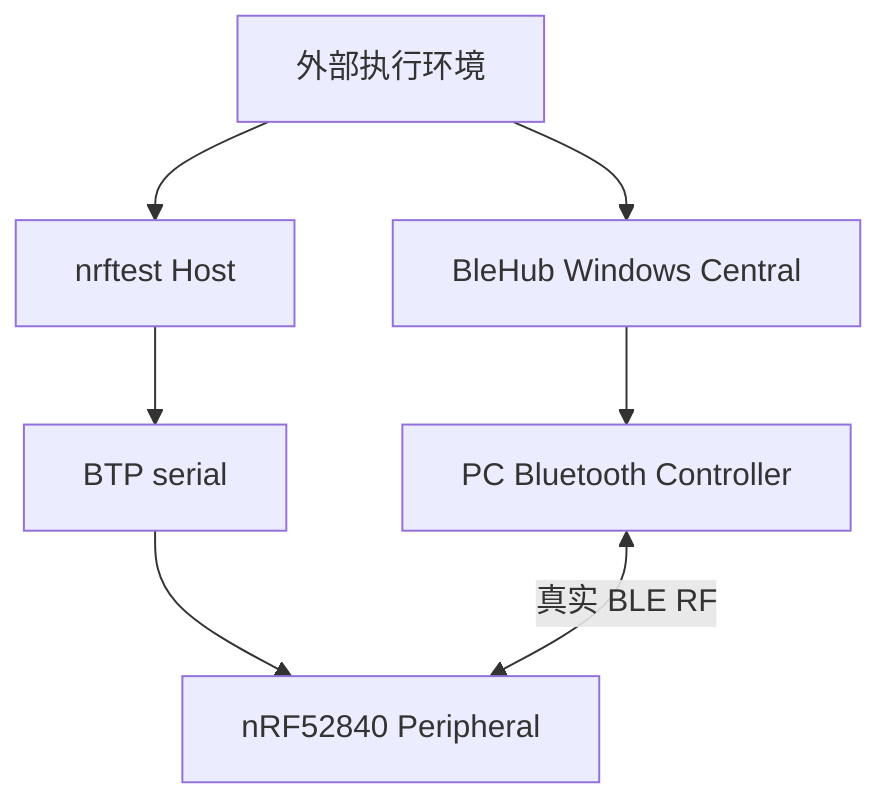

# Phase 1 Core/GAP 与真实 RF 退出报告

## 1. 结论摘要

| 项目 | 结果 |
|---|---|
| 阶段 | Phase 1：Core/GAP 和第一条真实 RF |
| 日期 | 2026-09-08 |
| nrftest Host | Windows + 固定 AutoPTS `54e81c7f3495bce72e5f688e9c996b85b8272799` |
| Peripheral | PCA10059 + upstream Zephyr Tester `v4.4.2` / `dccb09599635bdff17633fa7e9dab014b91dce90` |
| Central DUT | 独立 BleHub Windows Central + PC 自己的 Bluetooth Controller |
| RF selector | advertised UUID `0000fdf0-0000-1000-8000-00805f9b34fb` |
| 最终结果 | **双侧通过；Phase 1 退出条件满足** |

本次运行保持两个项目的进程和代码边界独立：`nrftest` 只配置 nRF Peripheral 并记录 nRF 侧事实；BleHub 只使用自己的 Windows Central backend。两者运行时唯一交互是 BLE RF。

## 2. 实验拓扑



`nrftest` 没有定位、导入、配置或启动 BleHub；BleHub 也没有通过 USB/BTP 调用 nRF。两条命令只由本次外部执行环境并行启动和关联结果。

## 3. 固定变量

| 变量 | 固定值 |
|---|---|
| Zephyr | `v4.4.2` / `dccb09599635bdff17633fa7e9dab014b91dce90` |
| Zephyr SDK | `1.0.1` / `arm-zephyr-eabi` |
| AutoPTS | `54e81c7f3495bce72e5f688e9c996b85b8272799` |
| Firmware HEX SHA-256 | `4a1a79fc123082a3ec987df10e566b4432a401aeee0bda351f7a50d9dff20308` |
| DFU ZIP SHA-256 | `d53fa63143ad862de23cff4dcc3af68e538f94feafa1fcadb37e295029b25326` |
| USB application identity | `2FE3:0004` / `DBDBE94A2CED8C63` |
| BTP service lifecycle | AUTO attach/register；正常关闭保留 service |
| Local name | `NrftestP1` |
| Advertised selector | UUID16 `fdf0` |
| Canonical selector | `0000fdf0-0000-1000-8000-00805f9b34fb` |

端口在本次机器上解析为 `COM13`，但命令和代码没有硬编码该值；fixture 按配置与 USB identity 动态选择设备。

## 4. 双侧执行

### 4.1 nRF Peripheral 侧

在 `D:/projects/nrftest` 执行：

```text
pixi run just btp-gap-rf-fixture "" NrftestP1 fdf0 120
```

最终干净复验输出依次包含：

```text
NRFTEST_FIXTURE_READY
NRFTEST_FIXTURE_CONNECTED
NRFTEST_FIXTURE_DISCONNECTED
nRF Peripheral GAP RF fixture: PASS
```

结构化报告：

```text
.work/reports/btp-gap-rf-fixture/
20260908T135416Z-9ab8d247-3e10-42b8-83f5-8fe9122506a9.json
```

关键 Peripheral 事实：

| 时间（UTC） | 事实 |
|---|---|
| `13:54:10.382270` | nRF advertising=true，广播 `NrftestP1` 与 UUID16 `fdf0` |
| `13:54:11.322297` | nRF 观察到 public peer `387a0ec160dc` 已连接 |
| `13:54:15.645161` | nRF 观察到同一 peer 已断开 |
| `13:54:16.658007` | fixture 报告完成，`outcome=peripheral-pass` |

报告同时确认：

- `service_actions.GAP=attached`；
- supported services mask 为 `0x2000000f`；
- cleanup 为 `clean`，无 cleanup error；
- 最终连接集合为空，advertising 已停止；
- Peripheral 报告只声明 nRF 侧 BTP/GAP 事实，不替 BleHub 判定结果。

### 4.2 BleHub Central 侧

在独立的 `D:/projects/blehub` checkout 执行：

```text
pixi run just windows connect-smoke 120 0000fdf0-0000-1000-8000-00805f9b34fb
```

命令退出成功并输出：

```text
Windows connect smoke: PASS
```

该 recipe 调用 `tests/hil/windows/src/connect.rs`。只有以下 gate 全部成功才会输出 PASS：

1. 初始化 BleHub Windows backend；
2. 按显式 `FDF0` service UUID 扫描并停止扫描；
3. 连接匹配到的 Peripheral；
4. 收到 `Connected`；
5. 验证 Windows capability 为 false 的 connected RSSI 以 `NotSupported` 终止，而不是伪造 RSSI 值；
6. 主动断开并收到 `Disconnected`；
7. `dispose()` 成功。

本次没有修改 BleHub 文件。BleHub recipe 当前只输出最终 gate 结果，没有生成独立结构化 HIL JSON；Central 侧证据是该独立命令的成功退出与 `PASS` 输出，Peripheral 侧证据由 nrftest JSON 单独保存。

## 5. AutoPTS 对端地址兼容修正

第一次双侧 RF 运行已经功能通过，报告为：

```text
.work/reports/btp-gap-rf-fixture/
20260908T134826Z-e93f3e22-eee4-4a48-bccb-92c3f9007f85.json
```

但连接后出现两条：

```text
BTPError('Received data mismatch')
```

分层检查确认它不是 BTP framing、串口或 RF 失败：

- nRF 侧仍完整观察到 connected/disconnected；
- BleHub 仍返回 PASS；
- 错误来自固定 AutoPTS `autopts/pybtp/btp/gap.py` 的连接参数事件校验；
- AutoPTS 面向 PTS 编排，要求先通过其现有 `set_pts_addr()` 设置预期 PTS peer；
- nrftest 使用外部 BleHub Central，不运行 PTS 编排，因此该全局上下文此前仍是默认值。

最小修正位于 `host/nrftest/autopts_adapter.py`：`wait_for_connection()` 成功且当前只有一个连接时，调用 AutoPTS 自带的 `set_pts_addr(actual_peer, address_type)`。该改动：

- 不修改或 vendor AutoPTS；
- 不实现第二套 BTP parser/framing；
- 不增加私有 opcode；
- 只为后续 AutoPTS GAP event handler 补齐它本来由 PTS 编排设置的上下文。

单元测试 `test_connection_wait_sets_autopts_peer_for_followup_gap_events` 已覆盖该适配。完全相同的第二次双侧 RF 运行两端再次通过，且不再出现 mismatch 日志，因此最终退出证据采用第二次干净复验。

## 6. 证明范围与限制

| 能力 | 状态 | 证据边界 |
|---|---:|---|
| BTP Core/GAP transport | 通过 | 固定 AutoPTS 与固定 Tester |
| AUTO attach/register | 通过 | 本轮 GAP 为 resident，动作是 `attached` |
| GAP advertising | 通过 | nRF 报告记录 advertising=true |
| BleHub 按 advertised service selector 扫描 | 通过 | 独立 `connect-smoke` PASS |
| 真实 BLE RF connect/disconnect | 通过 | Central 命令 PASS，Peripheral JSON 观察同一连接生命周期 |
| nRF 侧 connection/disconnection events | 通过 | JSON 中有连接集合增加与清空 |
| 动态 GATT service | **未验证** | `FDF0` 仅在 advertising data 中；没有创建同 UUID GATT service |
| GATT discovery/read/write | **未验证** | 属于 Phase 2 |
| Notification/Indication | **未验证** | 属于 Phase 3 |
| pending command crash recovery | **未验证** | advertising hold 期间 Host crash 不能外推 |
| firmware assertion/deadlock reset | **未验证** | J-Link/USB power-cycle 尚未执行 |
| macOS/Linux Host | **未验证** | 当前证据仅 Windows |

## 7. Phase 1 退出判断

计划中的 Phase 1 退出条件是：

```text
BleHub Central ↔ nRF BTP Peripheral
完成第一条真实 scan/connect/disconnect RF smoke
```

本次最终复验同时满足：

- 独立 BleHub Windows Central 命令通过；
- 独立 nrftest Peripheral fixture 观察到 advertising、connected、disconnected；
- 双方使用同一显式 advertised `FDF0` selector；
- 两个项目之间无代码、仓库或进程依赖；
- fixture cleanup clean；
- AutoPTS PTS-address 噪声经现成 API 适配后消失。

因此 **Phase 1 于 2026-09-08 通过**。下一阶段按已批准计划进入 Phase 2：从归档迁移 JSON Profile schema v1 到活动目录，并通过 AutoPTS 现有 GATT API 建立动态 GATT Profile。