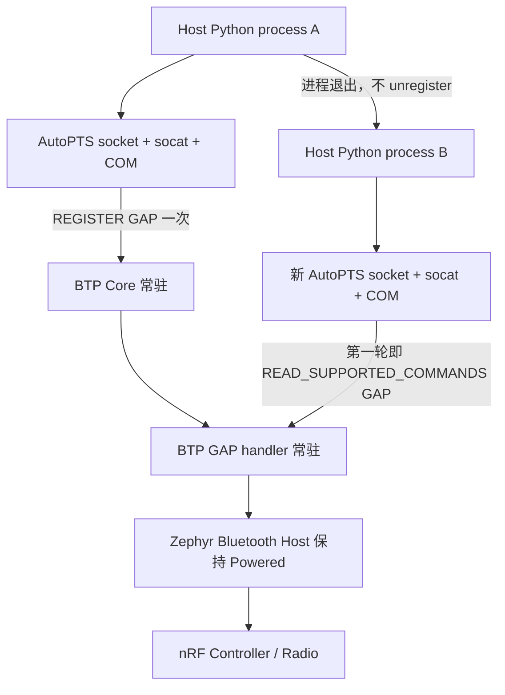
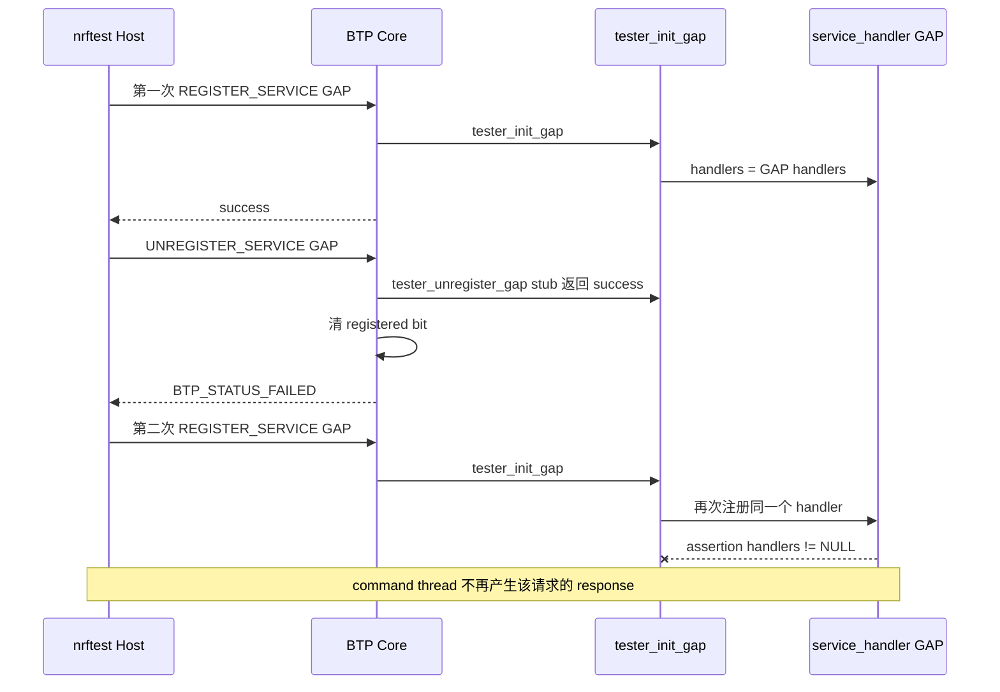

# Zephyr Bluetooth Tester service 生命周期与自动复用调查

## 1. 报告状态与结论摘要

| 项目 | 内容 |
|---|---|
| 报告日期 | 2026-09-08 |
| 调查阶段 | Phase 1：Core/GAP 生命周期与普通 Host crash recovery |
| 实机对象 | Windows + PCA10059 + upstream Zephyr Bluetooth Tester |
| 固件 | Zephyr `v4.4.2` / `dccb09599635bdff17633fa7e9dab014b91dce90` |
| Host client | AutoPTS `54e81c7f3495bce72e5f688e9c996b85b8272799` |
| 当前结论 | 正式 adapter 已采用 AUTO 协商；mixed resident/fresh、全 resident 及 advertising 期间 Host 强杀后的无 reset attach/清理均已通过 |
| 不采用 | 每轮 `unregister GAP → register GAP`；stock Tester 的 handler 生命周期不完整，第二次注册会进入 assertion 边界 |
| J-Link 定位 | 不是正常 session 或普通 Host crash 的必需依赖；可作为 assertion/deadlock 的 target-reset 后端，但尚未实机验证 |
| 未覆盖 | pending command 中断、固件 assertion/deadlock、USB 物理故障、自动 target reset、动态 GATT DB 重建、macOS/Linux |

本次调查得到两个必须分开的结论：

1. **正常路径已经不需要人工拔插。** 在同一 PCA10059 boot 中只注册一次 GAP。第一个 Python
   命令进程完成 1 次 register + 9 次 attach；该进程退出后，第二个独立命令进程从第一轮开始
   直接 attach，并再完成 10 轮。合计 20/20 AutoPTS/socat transport session 的 controller info
   与 advertising start/stop 均通过。
2. **普通 Host crash 已经不需要人工拔插。** 子进程在 advertising active 时被
   `subprocess.kill()` 强杀后，孤儿 socat 在 `0.609 s` 内释放 COM；新 Host 以 AUTO 模式 attach，
   观察到遗留 advertising，再完成 stop/start/stop，全程没有 target reset、power-cycle、Bluetooth
   power off 或 service unregister。
3. **更深层异常恢复仍需要后续门。** pending BTP command、固件 assertion、BTP command thread
   卡死、USB 物理故障或未知 GATT 状态不能由本次结果保证恢复；J-Link target reset、受控 USB
   power-cycle 或项目管理的 upstream patch 仍是候选，但本报告不把它们标记为已通过。

这不是通过关闭 assertions 或修改 upstream Tester 得到的规避结果。当前正式固件继续保留
`CONFIG_ASSERT=y`、`CONFIG_ASSERT_LEVEL=2`，只关闭无输出目的地的 logging。

---

## 2. 层级与生命周期边界

### 2.1 本报告中的对象

| 名称 | 所在位置 | 本报告关注的职责 |
|---|---|---|
| nrftest Host | PC Python 进程 | 创建 AutoPTS controller、socat bridge 和 BTP worker |
| Host transport session | PC | 一组 socket/socat/COM 资源；关闭后可重新创建 |
| BTP Core | nRF 固件 | 报告 supported services，并注册/注销 BTP service |
| BTP GAP service | nRF 固件 | 将 GAP BTP command 映射到 Zephyr Bluetooth Host API |
| Zephyr Bluetooth Host | nRF 固件 | 管理 GAP、连接、GATT 等上层 Bluetooth 状态 |
| Zephyr Bluetooth Controller | nRF 固件 | 执行 Link Layer 与 radio 时序 |
| USB CDC ACM | PC 与 nRF 之间 | 只承载 BTP 字节；不是 BLE RF，也不是本报告中的 reset 机制 |
| J-Link/SWD | 独立调试链路 | 可复位 target MCU；不修复 Tester service cleanup 代码 |

### 2.2 五种容易混淆的动作

| 动作 | 实际影响 | 是否等于设备 reboot |
|---|---|---:|
| 关闭 AutoPTS transport | 关闭 PC 端 BTP socket、socat 和 COM 占用 | 否 |
| `UNREGISTER_SERVICE(GAP)` | 请求 Tester 清理 GAP service；stock 实现不完整 | 否 |
| `SET_POWERED(false)` | 调用 `bt_disable()`，关闭 Bluetooth Host/Controller 的运行部分 | 否 |
| J-Link target reset | 复位 nRF target MCU，重新执行固件初始化 | 是，target 级 |
| USB power-cycle/人工拔插 | 断电并重新枚举整个 PCA10059 USB device | 是，整棒级 |

本次成功路径只执行第一项，不执行后四项。



图中的“常驻”只指同一 nRF boot 内的固件状态，不代表 PC 进程常驻，也不代表发生了
MCU reset。

---

## 3. 固定变量

| 变量 | 固定值 |
|---|---|
| Host OS | Windows |
| Board | Nordic nRF52840 Dongle，PCA10059 |
| Application USB identity | `VID:PID=2FE3:0004` |
| Hardware serial | `DBDBE94A2CED8C63` |
| 实验端口 | `COM13`，仅为本次观测值；代码不硬编码 |
| Zephyr | `v4.4.2`，commit `dccb09599635bdff17633fa7e9dab014b91dce90` |
| 本地已核对的 `origin/main` | `434233e9751e7cca7bea82047e812bca607722d3`，2026-09-04 |
| Zephyr SDK | `1.0.1`，`arm-zephyr-eabi` |
| AutoPTS | `54e81c7f3495bce72e5f688e9c996b85b8272799` |
| 固件 HEX SHA-256 | `4a1a79fc123082a3ec987df10e566b4432a401aeee0bda351f7a50d9dff20308` |
| DFU ZIP SHA-256 | `d53fa63143ad862de23cff4dcc3af68e538f94feafa1fcadb37e295029b25326` |
| Assertions | `CONFIG_ASSERT=y`、`CONFIG_ASSERT_LEVEL=2` |
| Logging | `CONFIG_TEST_LOGGING_DEFAULTS=n`、`CONFIG_LOG=n` |
| AutoPTS reset 参数 | `pylink_reset=False`、`board_name=None`、`gdb=True` |

由于 `gdb=True`，固定 AutoPTS 的 `_stop_tty_mode()` 不进入 `if not self.gdb` 的 board reset
分支；它只关闭 BTP socket，并终止 socat。故 10-session 实验中的 transport 重建没有暗含
AutoPTS target reset。

---

## 4. stock Tester 的 service 生命周期缺陷

### 4.1 Core 有 registered bit，dispatch 还有独立 handler pointer

固定 Zephyr 的 Tester 同时维护两份相关状态：

```text
btp_core.c
└── registered_services bitset

btp.c
└── service_handler[service].handlers pointer
```

service 初次注册成功时，Core 设置 registered bit；具体 GAP 初始化则注册 command handler：

```c
void tester_register_command_handlers(uint8_t service,
                                      const struct btp_handler *handlers,
                                      size_t num)
{
    __ASSERT_NO_MSG(service_handler[service].handlers == NULL);
    service_handler[service].handlers = handlers;
    service_handler[service].num = num;
}
```

这里要求每个 service 的 handler pointer 只能从 `NULL` 注册一次。

### 4.2 GAP/GATT unregister 是 stub

固定 `v4.4.2` 中：

```c
uint8_t tester_unregister_gap(void)
{
    return BTP_STATUS_SUCCESS;
}

uint8_t tester_unregister_gatt(void)
{
    return BTP_STATUS_SUCCESS;
}
```

它们没有：

- 注销 command handler；
- 将 `service_handler[service].handlers` 恢复为 `NULL`；
- 注销 GAP callback；
- 释放/重建完整 service state；
- 将 service 生命周期恢复为“可安全再次 init”。

对本地已有 `origin/main` commit
`434233e9751e7cca7bea82047e812bca607722d3` 的窄检查也没有找到
`tester_unregister_command_handlers()` 或 handler 清空路径；因此该边界并非只存在于项目固定的
`v4.4.2`。这只表示本地已获取的该 commit 仍存在，不代表对未来 upstream 的永久判断。

### 4.3 Core 清 bit 后仍无条件返回失败

`btp_core.c::unregister_service()` 在 service stub 返回 success 时会清 registered bit，但函数末尾
仍返回 `BTP_STATUS_FAILED`：

```c
if (status == BTP_STATUS_SUCCESS) {
    atomic_clear_bit(registered_services, cp->id);
}

return BTP_STATUS_FAILED;
```

这解释了两个表面上矛盾的现象：

- AutoPTS 收到合法 BTP error response，记录 `Unexpected response received!`；
- Core 内部 registered bit 实际已经被清除。

### 4.4 第二次 register 为什么没有 response



因此第二次 `REGISTER_SERVICE(GAP)` 的 timeout 不是“串口随机丢包”的首选解释，而是与固定源码
状态机逐步对应的高置信根因。当前正式固件没有独立日志/telemetry 直接打印这一次 assertion 的
file/line，所以本文将其标为**实机行为与源码闭环支持的高置信结论**，不虚构为直接捕获。

---

## 5. 实验矩阵

| 实验 | 固定与变化 | 结果 | 证明范围 |
|---|---|---:|---|
| L1：原始跨 session 生命周期 | 同一 PCA10059 boot；每轮 advertising → power off → unregister → 关闭 transport → 重新 register | 第 1 轮通过；第 2 轮 timeout | stock unregister/register 不能作为正常重复 session 路径 |
| L2：同 session off/on | 第 1 轮增加 `SET_POWERED(false) → true → advertising`，随后仍 unregister 并新建 session | 同 session off/on 与再次 advertising 通过；新 session 第二次 register timeout | `bt_disable() → bt_enable()` 本身可用，但不清 command handler/service state |
| L3：service 常驻、进程内 transport 重建 | 干净 boot；Python 进程 A 的第 1 轮 register GAP；每轮只关闭 Host transport；第 2–10 轮直接读 GAP commands | **10/10 通过** | 同一 Host 进程内可反复销毁/重建 AutoPTS controller、worker、socat 与 COM session |
| L4：新 Host 进程直接 attach | L3 的进程 A 已退出且未 unregister；新 Python 进程 B 从第 1 轮开始只 attach，再完成 10 轮 | **10/10 通过** | resident GAP 可跨独立 Host 进程复用；正常进程退出后无需 reset/拔插 |
| L5：正式 AUTO service 协商 | 两个独立 `btp-doctor` 进程；先验证 mixed resident/fresh，再验证全 resident | **2/2 通过** | 第一次得到 `GAP=attached/GATT=registered`，第二次得到 `GAP=attached/GATT=attached`；正式工具无需预知 target service 状态 |
| L6：advertising 期间 Host 强杀恢复 | 子进程 AUTO attach 并开始广播后由父进程 `subprocess.kill()`；新 transport AUTO attach 并接管遗留状态 | **通过** | COM 在 `0.609 s` 内释放；新 Host 观察 advertising=true 并完成 stop/start/stop；无需 reset、power-cycle、power off 或 unregister |

### 5.1 L1：第一次失败复现

证据：

```text
.work/reports/btp-gap-lifecycle-probe/
20260908T115819Z-7624c9dd-eea2-47ff-a021-3ecd0947afbc.json
```

关键事实：

- cycle 1 的 controller info、advertising start/stop、power off 均通过；
- GAP unregister 返回已知 BTP error；
- cycle 2 仍能打开同一个 `COM13`；
- cycle 2 在重新 register GAP 时 timeout。

### 5.2 L2：排除 Bluetooth re-enable

证据：

```text
.work/reports/btp-gap-lifecycle-probe/
20260908T121316Z-d1f3a1d7-9524-49a7-8267-4aaca6f228a9.json
```

cycle 1 的顺序与结果：

```text
register GAP                                 PASS
start/stop advertising                      PASS
SET_POWERED(false)                          PASS
SET_POWERED(true)                           PASS
start/stop advertising after re-enable      PASS
SET_POWERED(false)                          PASS
unregister GAP                              返回已知 failure status
close Host transport                        完成
```

cycle 2 的 Core supported services/commands 仍有 response；只在
`REGISTER_SERVICE(GAP)` 后不再收到 response。由此排除：

- USB CDC 整体失效；
- socat bridge 整体失效；
- BTP Core transport 整体失效；
- `bt_disable() → bt_enable()` 自身无法恢复 Controller。

### 5.3 L3：进程 A 的 10-session 通过

命令：

```text
pixi run just btp-gap-transport-reuse
```

证据：

```text
.work/reports/btp-gap-transport-reuse-probe/
20260908T125454Z-3a379f25-e645-472c-abd8-e244ce7c2453.json
```

| 检查项 | cycle 1 | cycle 2–10 |
|---|---:|---:|
| AutoPTS controller/transport 新建 | 1 次 | 每轮 1 次 |
| Core supported services/commands | 通过 | 每轮通过 |
| GAP service 动作 | register | 直接 `READ_SUPPORTED_COMMANDS(GAP)` attach |
| GAP command mask | `0xef7fe1f7fff6e` | 每轮相同 |
| Controller address | `f3cddde125c5` | 每轮相同 |
| Powered | `true` | 每轮 `true` |
| advertising start | 通过 | 每轮通过 |
| advertising stop | 通过 | 每轮通过 |
| service unregister | 未执行 | 未执行 |
| Bluetooth power off | 未执行 | 未执行 |
| target reset/power-cycle | 未执行 | 未执行 |
| application identity | `COM13` / `DBDBE94A2CED8C63` | 每轮相同 |
| cleanup errors | 无 | 每轮无 |

最终报告字段为：

```text
outcome = pass
completed_cycles = 10
host_transport_rebuilt_each_cycle = true
gap_service_registered_once = true
gap_service_unregistered = false
commanded_reset = false
commanded_power_cycle = false
```

固件未提供 boot ID，因此“同一 boot”仍是由无 reset/power 动作、USB port 与 hardware serial
持续稳定共同推断；报告没有把它升级为 boot-ID 级证明。

### 5.4 L4：新 Python 进程从第一轮直接 attach

L3 命令完全退出后，另一次独立 `pixi run just` 启动了新的 Python 进程，并显式选择
`initial_mode=attach`。该进程没有 bootstrap register，从第一轮起直接探测 resident GAP：

```text
pixi run just btp-gap-transport-reuse "" NrftestResidentGap 10 0.5 attach
```

证据：

```text
.work/reports/btp-gap-transport-reuse-probe/
20260908T131058Z-85f2301d-68a2-45c8-ab07-fc16c90d20a8.json
```

结果为 10/10 通过。报告明确记录：

```text
initial_service_startup_mode = attach
gap_service_expected_resident_at_start = true
gap_service_registered_by_this_run = false
gap_service_unregistered = false
commanded_reset = false
commanded_power_cycle = false
```

因此最终正常路径证据是两个独立 Python 命令进程、20 个 transport session，而不只是一个
Python 循环内的 transport 重建。

### 5.5 L5：正式 AUTO service 协商

正式 `AutoPtsSession` 使用 `AUTO` 模式逐个探测 service handler。仅当固定 Tester 对
`READ_SUPPORTED_COMMANDS(service)` 精确返回 AutoPTS 的 `Error opcode in response!` 时，才将其
解释为 fresh service 并调用上游 register；timeout、transport、service ID 或 opcode 异常不会盲目
fallback。

两个独立 `btp-doctor` 进程的结果为：

| 报告 | GAP | GATT | 结果 |
|---|---|---|---:|
| `20260908T132739Z.json` | attached | registered | 通过 |
| `20260908T132823Z.json` | attached | attached | 通过 |

这分别覆盖 mixed resident/fresh 与全 resident 两种启动状态。两次 cleanup 均为 clean，且没有调用
service unregister。

### 5.6 L6：advertising 期间 Host 强杀恢复

`btp-gap-host-crash` 启动独立子 Python 进程，AUTO attach GAP 并开始 advertising；父进程在收到
`NRFTEST_CRASH_CHILD_READY` 后调用 `subprocess.kill()`，使子进程没有机会执行正常 cleanup。
随后父进程等待 orphan socat 释放串口，再建立新的 AutoPTS transport。

实机结果：

```text
child termination = subprocess.kill
child returncode = 1
COM release = 0.609 s
recovery GAP action = attached
observed inherited Advertising = true
recovery sequence = stop → start → stop
outcome = pass
```

本实验没有发送 target reset、power-cycle、Bluetooth power off 或 service unregister。它证明普通
Host 进程崩溃和 transport 所有权中断可以通过 attach 接管；kill 没有发生在 pending BTP response
期间，因此不能外推到命令中途断流。

---

## 6. 为什么不是 USB CDC、socat 或普通串口问题

| 证据 | 对串口假设的影响 |
|---|---|
| L2 cycle 2 可读 Core services/commands | COM、socat、BTP framing/worker 仍能完成 request/response |
| L2 只在第二次 GAP register 后无 response | 失败与特定 service lifecycle 转移对齐，不是所有字节都中断 |
| L3 连续创建 10 个 transport session | 同一 Python 进程内 close/reopen socket、socat、COM 的普通生命周期可重复 |
| L4 新 Python 进程第一轮直接 attach | resident GAP 不依赖前一进程的 AutoPTS 全局对象才能继续使用 |
| L3/L4 每轮 GAP commands 与 advertising 均通过 | 不只是打开端口成功，而是完整 BTP GAP command/response 成功 |
| 所有 cycle 使用稳定 USB identity | 没有观察到隐式 USB re-enumeration 或 COM 漂移 |

因此，原始失败不应继续描述为“PCA10059 串口需要每次拔插”。更准确的描述是：

> stock Tester 的 service unregister/register 路径破坏了 service registry 与 command handler
> registry 的一致性；人工拔插之所以能恢复，是因为 MCU 重新启动把两份静态状态都恢复到初始值。

---

## 7. 官方历史讨论与当前 upstream 状态

官方 issue
[#67346](https://github.com/zephyrproject-rtos/zephyr/issues/67346) 请求让 Tester 能关闭并重新启用
Bluetooth。对应 PR
[#67359](https://github.com/zephyrproject-rtos/zephyr/pull/67359) 最终于 2024-03-07 合入
`SET_POWERED` 支持。

该 PR 讨论提供了三条与本次结果一致的官方边界：

1. 维护者指出，当时 service unregister 实现只是 stubs，因为 AutoPTS 正常并不使用它；真正的
   unregister 必须逐 service 正确清理资源。
2. 最终接受的 `SET_POWERED` 方案只是将命令映射为 `bt_disable()` / `bt_enable()`。
3. 评审明确说明 `bt_disable() → bt_enable()` **不等于 reboot**；Host 中的已注册 service、callback
   和其他 application state 不会因此全部清除。

官方讨论不是“本项目第二次 register assertion”的专门 bug report，但它直接支持本报告对
power、service cleanup 与 reboot 三个边界的区分。对 GitHub 的窄关键词搜索没有找到专门跟踪
“GAP stub unregister 后再次 register 命中 handler assertion”的独立 issue；这不等于证明整个
issue tracker 中绝对不存在。

---

## 8. J-Link、DK 与 PCA10059

### 8.1 J-Link 能解决什么

J-Link target reset 会重新启动 nRF MCU，因此能清空静态 service handler、Core registered bits、
Bluetooth Host application state 和 BTP command thread。它可以替代“人工拔插才能恢复已卡死
固件”的操作。

但它不能：

- 修复 stock `tester_unregister_gap()` / `tester_unregister_gatt()`；
- 让同一 boot 中的第二次 register 变正确；
- 证明动态 GATT cleanup 完整；
- 消除 reset 后重新发现 serial identity 的需要。

所以 J-Link 是**恢复机制**，不是本次源码缺陷的修复。

### 8.2 PCA10059 与 nRF52840 DK 的差异

| 项目 | PCA10059 Dongle | nRF52840 DK |
|---|---|---|
| 板载 J-Link | 无 | 有 |
| target reset 所需调试硬件 | 外部 J-Link/SWD | 板载 interface MCU 可执行 |
| BTP CDC/VCOM 来源 | target nRF52840 自身 USB device | 通常由板载 interface MCU 提供 VCOM |
| target reset 时串口表现 | target USB 会消失并重新枚举 | VCOM 通常可保持，target 本身重启 |
| 自动恢复复杂度 | 需要外部 SWD 或自动 USB 电源硬件，并重新发现 CDC | 板载 J-Link 更容易自动化 |

当前 PCA10059 adapter 参数明确为：

```text
pylink_reset = false
board_name = None
gdb = true
```

本次 10-session 通过不依赖 J-Link。是否增加外部 J-Link，只应由后续“异常恢复”实机门决定，
不应为了正常 session 生命周期提前成为必需硬件。

---

## 9. 方案决策

| 方案 | 正常 session 是否需人工拔插 | 当前证据 | 代价/限制 | 决策 |
|---|---:|---|---|---|
| service 常驻 + transport attach | 否 | 两个独立 Python 命令进程、合计 20/20 transport session 实机通过 | 需要启动时识别 fresh/resident 状态；异常恢复另测 | **正常路径首选** |
| 每轮 power off/on，不 unregister | 否 | 同 session 已实机通过 | 不清 service/callback/app state，不是 reboot | 可作为 controller 控制，不作为 service reset |
| stock unregister/register | 实际需要 reset 才恢复 | 第二 session 实机失败；源码闭环 | registry 不一致并触发 assertion 边界 | **禁止作为正常路径** |
| Host 强杀后重建 transport | 否 | advertising active 时强杀并 attach 接管已通过 | 未覆盖 pending response 或固件死锁 | **普通 Host crash 正常恢复路径** |
| 长生命周期 Host daemon | 正常时否 | 不是恢复所必需；独立 Host 进程重建已通过 | daemon 仍需使用相同 AUTO attach 策略 | 可选编排，不是根因修复 |
| 最小 upstream lifecycle patch | 目标上可否 | 未实施 | 必须完整 cleanup；维护 patch 漂移 | 暂不需要，GATT 重建失败时再评审 |
| PCA10059 外部 J-Link reset | 可自动 | 未实机验证 | 增加 SWD 硬件；CDC 会重枚举 | 异常恢复候选 |
| DK 板载 J-Link reset | 可自动 | 未实机验证 | 更换硬件变量；不是 PCA10059 证据 | 并行对照/恢复候选 |
| 自动 USB power switch | 可自动 | 未实机验证 | 增加供电控制硬件；整棒重枚举 | 最终 fallback |

---

## 10. 对 Host 设计的影响

### 10.1 已实现的实验能力

`AutoPtsSession` 现有三种启动模式，正式默认是 `AUTO`：

```text
AUTO
REGISTER
ATTACH
```

`AUTO` 与 `ATTACH` 均优先复用 AutoPTS 已有的：

```text
read_supported_commands("GAP")
```

若 GAP handler 不存在，stock Tester 会快速返回 unknown-command status，AutoPTS 将其作为 BTP
error；若 handler 常驻，则返回 supported-command mask。没有新增私有 BTP opcode，也没有复制
framing/parser/worker。

正式默认 `close(unregister_services=False)` 只关闭 AutoPTS transport，不调用有缺陷的 upstream
service unregister。旧生命周期缺陷探针显式选择 `REGISTER` 和
`close(unregister_services=True)`，不会污染正常工具路径。

### 10.2 正式 adapter 的推荐协商顺序

正式 adapter 已将显式实验模式收敛为可报告的自动协商，不要求用户知道 target 当前状态：

```text
建立 Core transport
→ READ_SUPPORTED_SERVICES / READ_SUPPORTED_COMMANDS(Core)
→ 直接 READ_SUPPORTED_COMMANDS(GAP)
   ├─ 成功：GAP handler 已常驻，attach
   ├─ 固定 Tester 精确返回 AutoPTS "Error opcode in response!"：fresh service，REGISTER_SERVICE(GAP)
   └─ timeout/transport/service ID/opcode/其他错误：状态未知，进入 recovery，不盲目 register
```

必须以“GAP command handler 是否真实可响应”为依据，不能只相信 Core registered bit；stock
unregister 会清 bit，却不会清 handler。

正常关闭顺序推荐为：

```text
停止 advertising / 结束连接
→ 保留 GAP/GATT BTP service
→ 关闭 BTP socket、socat、COM
```

这会在 nRF 上留下**可被下一 session 主动识别的常驻状态**，而不是无法识别的隐式状态。

### 10.3 当前设备状态与操作限制

本次 L6 结束后，PCA10059 的状态是：

```text
GAP service resident
GATT service resident
Bluetooth Powered = true
Advertising = false
Host transport closed
```

正式 `btp-doctor`、GAP 工具和 RF fixture 均使用 AUTO 协商并在正常关闭时保留 service。只有
`btp-gap-lifecycle` 是故意触发 stock unregister/register 缺陷的诊断入口，不得把它用于正常 HIL
生命周期。

---

## 11. 已通过与尚未验证的异常恢复门

正常 transport reuse 与 advertising 期间 Host 强杀恢复已解决“普通测试进程退出或崩溃就要人工
拔插”的问题，但更深层故障仍是独立工作：

| 项目 | 状态 | 需要回答的问题或已得结论 |
|---|---:|---|
| Host 进程在 advertising 时被强杀 | 已通过 | 新进程 AUTO attach 后观察遗留 advertising，并安全完成 stop/start/stop；COM 释放耗时 `0.609 s` |
| Host 进程在 pending BTP command 时被强杀 | 未验证 | command response/worker/serial 缓冲是否可重新同步 |
| 普通 socat/COM 所有权随 Host 强杀释放 | 已通过 | orphan socat 释放 COM 后新 transport 可 attach；不等于任意字节中断点均已覆盖 |
| nRF command thread assertion/deadlock | 未验证 | 如何自动判断已不可恢复，而不是持续 timeout |
| PCA10059 外部 J-Link reset | 未验证 | target reset、CDC disappearance、按 hardware serial 重发现能否全自动完成 |
| 自动 USB power-cycle | 未验证 | 是否有可管理、跨平台且身份稳定的电源控制设备 |
| 动态 GATT profile rebuild | 未验证 | database removal 是否足够，还是需要真实 device reset/最小 patch |
| macOS/Linux | 未验证 | 相同 transport attach 与 serial recovery 是否成立 |

后续 recovery 状态机应至少区分：

```text
BTP handler 可响应
→ attach 并恢复活动状态

BTP Core 可响应但目标 service 不响应
→ 仅在明确 fresh boot 时注册；否则判为不一致状态

BTP Core 也不响应
→ target reset / USB power-cycle fallback
```

在上述 destructive recovery gate 完成前，不能声称“所有故障都无需人工操作”。

---

## 12. 最终结论

1. 原先观察到的“第二个 Host session 需要拔插”不是 PCA10059 USB CDC 的固有限制，也不是
   普通 socat/COM 重连失败；根因位于 stock Zephyr Bluetooth Tester 的 BTP service 生命周期。
2. `SET_POWERED(false) → true` 可以在同一已注册 GAP session 中恢复 Bluetooth 并再次广播，
   但官方和实机证据都表明它不是 reboot，也不清 service handler。
3. stock GAP/GATT unregister 是 stub；Core 清 registered bit 后仍返回 failure，dispatch handler 又
   没有清除。随后第二次 register 命中 non-NULL handler assertion，是与实机 timeout 一致的
   高置信源码根因。
4. 对正常 nrftest 工作流，当前最佳方案不是 J-Link，也不是立即维护固件 patch，而是：
   **nRF boot 内 service 常驻，PC Host transport 可关闭并重新 attach。** PCA10059 已完成两个
   独立 Python 命令进程、合计 20/20 transport session 的实机验证，正常测试 session 不再依赖
   人工拔插。
5. J-Link 仍有价值，但定位应是 assertion/deadlock/未知状态时的自动 target-reset recovery。
   PCA10059 需要外部 SWD；DK 板载 J-Link 更便于做并行对照。两条 recovery 路径均尚未标记通过。
6. 正式 AUTO 协商与 advertising 期间 Host 强杀恢复均已通过；后续独立 nrftest RF fixture 与
   独立 BleHub Windows Central 的真实 scan/connect/disconnect 也已双侧通过，见
   [`2026-09-08-phase1-gap-rf-smoke.md`](2026-09-08-phase1-gap-rf-smoke.md)。该后续结果不改变本报告对
   pending command、固件死锁和 target reset 的未验证边界。

---

## 13. 证据索引

### 项目文件

```text
host/nrftest/autopts_adapter.py
tools/btp_gap_lifecycle_probe.py
tools/btp_gap_transport_reuse_probe.py
tools/btp_gap_host_crash_probe.py
tests/unit/test_autopts_adapter.py
tests/unit/test_btp_gap_transport_reuse_probe.py
tests/unit/test_btp_gap_host_crash_probe.py
firmware/app/pca10059.conf
```

### 实机报告

```text
.work/reports/btp-gap-lifecycle-probe/
20260908T115819Z-7624c9dd-eea2-47ff-a021-3ecd0947afbc.json

.work/reports/btp-gap-lifecycle-probe/
20260908T121316Z-d1f3a1d7-9524-49a7-8267-4aaca6f228a9.json

.work/reports/btp-gap-transport-reuse-probe/
20260908T125454Z-3a379f25-e645-472c-abd8-e244ce7c2453.json

.work/reports/btp-gap-transport-reuse-probe/
20260908T131058Z-85f2301d-68a2-45c8-ab07-fc16c90d20a8.json

.work/reports/btp-core-probe/
20260908T132739Z.json
20260908T132823Z.json

.work/reports/btp-gap-host-crash-probe/
20260908T133808Z-4e119bfa-4940-4f5a-b6a4-83fe4f1dd121.json
```

### 固定本地 upstream 源码

```text
E:/dev/nrftest-upstream/zephyrproject/zephyr/
  tests/bluetooth/tester/src/btp.c
  tests/bluetooth/tester/src/btp_core.c
  tests/bluetooth/tester/src/btp_gap.c
  tests/bluetooth/tester/src/btp_gatt.c

E:/dev/nrftest-upstream/auto-pts/
  autopts/ptsprojects/iutctl.py
  autopts/pybtp/btp/btp.py
  autopts/pybtp/common.py
```

### 官方在线历史

- [Zephyr issue #67346：请求 Tester power off/on](https://github.com/zephyrproject-rtos/zephyr/issues/67346)
- [Zephyr PR #67359：合入 `BTP_GAP_SET_POWERED`](https://github.com/zephyrproject-rtos/zephyr/pull/67359)
