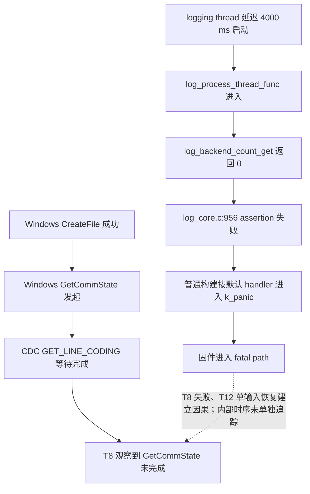
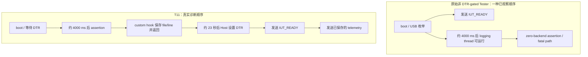
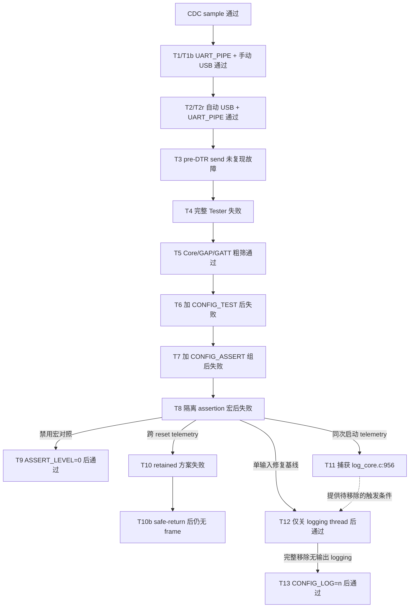

# Zephyr Bluetooth Tester zero-backend logging assertion 根因报告

## 1. 报告状态与范围

| 项目 | 内容 |
|---|---|
| 报告日期 | 2026-09-08 |
| 实机证据日期 | 2026-09-07 至 2026-09-08 |
| 调查阶段 | Phase 0：PCA10059 控制面可行性与 Windows BTP direct probe |
| 调查对象 | Windows + PCA10059 + Zephyr Bluetooth Tester + BTP over USB CDC ACM |
| 已完成 | 故障复现、变量收缩、assertion 定位、T12 单变量修复、T13 完整关闭 logging 对照、DFU 刷写、Win32 串口验证、BTP Core capabilities 验证 |
| 当前正式实机候选 | upstream Zephyr `v4.4.2` Tester，`CONFIG_LOG=n`，已通过 Windows Phase 0 控制面门 |
| NCS no-logging 对照 | T13，NCS `v3.4.0` 携带的 Zephyr `4.4.0`，`CONFIG_LOG=n`，assertions 保持启用 |
| 根因最小修复基线 | T12，仅关闭 logging process thread；完整保留，作为因果证明和 fallback |
| 未覆盖 | GAP advertising、真实 BLE RF、动态 GATT、Notification/Indication、soak、macOS/Linux |

本文聚焦一个具体问题：

> 为什么 PCA10059 上的 Zephyr Bluetooth Tester 能枚举并发送 BTP
> `IUT_READY`，但 Windows 在打开 COM 口后的 `GetCommState` 阶段卡住；以及
> `CONFIG_LOG_PROCESS_THREAD=n` 为什么能恢复 USB CDC 和 BTP，以及在保持 assertions 的同时改为
> `CONFIG_LOG=n` 是否能得到更纯净且功能等价的 BTP 固件。

完整术语和系统分层见
[《BTP、BLE、Zephyr Bluetooth Tester 与 PCA10059 实验分层调查》](2026-09-06-btp-ble-layered-investigation.md)，上游 Tester/AutoPTS 结构见
[《Zephyr Tester、PCA10059 与 AutoPTS pybtp 本地源码审计》](2026-09-06-zephyr-tester-autopts-audit.md)。本文不改变
[已批准计划](../PLAN.md)，也不修改 BleHub。

---

## 2. 问题所在层级

### 2.1 本次没有失败在 BLE RF

故障发生时，Host 还没有发送 BTP Core command，更没有开始 BLE advertising、scan
或 connection。因此失败边界位于：

```text
Windows COM API
→ USB CDC ACM control request
→ Zephyr firmware runtime
```

而不是：

```text
BTP command parser
→ Zephyr Bluetooth Host
→ nRF Controller
→ BLE RF
```

| 层级 | 当时是否到达 | 证据 |
|---|---:|---|
| Windows `CreateFile` | 是 | Win32 probe 已记录 `after-CreateFile` |
| Windows `GetCommState` | 发起但未完成 | 失败候选在 15 秒 supervisor 内没有返回 |
| CDC `GET_LINE_CODING` | 发起但未完成 | USBPcap 与 Win32 阶段证据一致 |
| CDC bulk IN `IUT_READY` | 原始 Tester 已发送 | USBPcap 捕获合法 `00 80 ff 00 00` |
| BTP Core command/response | 失败候选未到达 | AutoPTS `flush_serial()` 先卡在 pyserial open |
| GAP/GATT command | 未到达 | Core transport 尚未完成 |
| BLE RF | 未到达 | 没有 advertising/scan/connect 操作 |

### 2.2 `GetCommState` 是下游症状，不是根因位置

T11 捕获的第一条失败 assertion 位于固件 logging thread；本地默认 assertion handler
源码表明，未插桩的 T8 会由该路径进入 `k_panic()`。T8 的稳定复现与 T12 的单输入恢复
共同证明该 assertion path 是本次被测失败的原因。

但 T8 没有记录 assertion、fatal transition 与具体 USB control request 之间的时间戳；
Host 也可能在固件已经进入 fatal path 后才调用 `GetCommState`。因此本文不声称已经逐指令
追踪“某一个 pending request 恰好被 panic 中断”，只把 `GetCommState` 未完成记录为固件
fatal path 在 Windows 上的已观察症状。



---

## 3. 固定环境与关键变量

### 3.1 硬件和 Host

| 变量 | 固定值 |
|---|---|
| Board | Nordic nRF52840 Dongle，PCA10059 |
| SoC | nRF52840，单核，片上 Bluetooth Host + Controller |
| Bootloader | PCA10059 stock Nordic nRF5 SDK USB bootloader |
| Application USB identity | `VID:PID=2FE3:0004`，serial `DBDBE94A2CED8C63` |
| Bootloader USB identity | `VID:PID=1915:521F`，serial `F3CDDDE125C5` |
| Host OS | Windows |
| Application port | 本次为 `COM13`，但脚本按 identity 动态选择，不把 COM 号视为固定值 |
| Bootloader port | 本次为 `COM10`，同样只作为本次报告事实 |
| BTP transport | USB CDC ACM → Zephyr UART device → `UART_PIPE` |
| Host BTP implementation | 固定 AutoPTS `IutCtl`/`BTPSocketSrv`/`BTPWorker`/`pybtp` |
| Windows socat mapping | `COM13 → /dev/ttyS12` |

### 3.2 Source 和 toolchain

| 用途 | Source | Toolchain |
|---|---|---|
| 根因实机实验 | NCS `v3.4.0`，Zephyr `4.4.0`，commit `bf801e4e3d19e1ffa76164346480cb7734dd2800` | NCS bundle `dcbdc366a1`，Zephyr SDK `1.0.1` |
| 正式项目基线 | upstream Zephyr `v4.4.2`，commit `dccb09599635bdff17633fa7e9dab014b91dce90` | upstream Zephyr SDK `1.0.1` |
| Host BTP | AutoPTS commit `54e81c7f3495bce72e5f688e9c996b85b8272799` | Pixi Python `3.12` |

NCS 与 upstream 的以下文件已在本机做 `git diff --no-index` 对比，没有逻辑文本差异；
byte-level SHA 不同来自工作区行尾形式：

```text
subsys/logging/log_core.c
subsys/logging/Kconfig.processing
```

两套 source 的以下关键行相同：

- `log_core.c:954-956`：logging thread 入口及 backend count assertion；
- `log_core.c:1004-1020`：有线程时创建线程，无线程时直接调用 `z_log_init()`；
- `Kconfig.processing:52-60`：`LOG_PROCESS_THREAD` 默认启用；
- `Kconfig.processing:64-93`：startup delay、sleep 和 stack 配置；
- `boards/common/usb/Kconfig.cdc_acm_serial.defconfig:42-44`：CDC board 默认 startup delay 为 4000 ms。

这使得“同一机制也存在于正式 upstream 基线”具有直接本地源码依据，但 NCS 实机通过
不能替代 upstream 正式候选的 build/flash/runtime gate。

---

## 4. 触发故障的配置组合

### 4.1 失败候选的有效配置

T8 最终配置的关键部分为：

```text
CONFIG_ASSERT=y
CONFIG_ASSERT_LEVEL=2
CONFIG_ASSERT_TEST=n

CONFIG_LOG=y
CONFIG_LOG_MODE_DEFERRED=y
CONFIG_LOG_PROCESS_THREAD=y
CONFIG_LOG_PROCESS_THREAD_STARTUP_DELAY_MS=4000
CONFIG_LOG_PROCESS_THREAD_SLEEP_MS=1000
CONFIG_LOG_PROCESS_THREAD_STACK_SIZE=768

CONFIG_LOG_DEFAULT_LEVEL=0
CONFIG_LOG_OVERRIDE_LEVEL=0
CONFIG_BTTESTER_LOG_LEVEL_OFF=y

CONFIG_LOG_BACKEND_UART=n
CONFIG_LOG_BACKEND_SWO=n
CONFIG_LOG_BACKEND_IPC_SERVICE=n
CONFIG_LOG_BACKEND_RPC=n
```

这里存在一个运行时不变量冲突：

```text
创建了专门处理 log backend 的线程
但固件里没有任何实际 log backend instance
```

`.config` 中出现的：

```text
CONFIG_LOG_BACKEND_SHOW_TIMESTAMP=y
CONFIG_LOG_BACKEND_SHOW_LEVEL=y
```

只是 backend 输出格式选项，不会注册 backend instance。真正的
`log_backend_count_get()` 使用 iterable section 中的 `struct log_backend` 数量，因此
T11 实机返回的事实是 `0`。

### 4.2 为什么恰好约 4 秒后出问题

PCA10059 使用公共 CDC ACM serial board 配置。两套 Zephyr source 都包含：

```text
# Wait 4000ms at startup for logging
config LOG_PROCESS_THREAD_STARTUP_DELAY_MS
    default 4000
```

`4000 ms` 确定的是 logging thread 相对于 boot 何时具备运行条件，不保证它相对于
`IUT_READY` 的统一先后顺序：

- 原始非 DTR-gated Tester 可以先枚举并发送 `IUT_READY`，随后进入延迟的 fatal path；
- T8/T11 的 `tester_init()` 在发送 `IUT_READY` 前等待 DTR。T11 的 Host 在刷写约 23 秒后才
  设置 DTR，因此 assertion 已经先发生并被 custom hook 保存，之后才回传 `IUT_READY` 和
  telemetry；串口中的帧顺序不是 assertion 发生顺序。

这解释了为什么“曾观察到 `IUT_READY`”与“固件存在约 4 秒后的 assertion”并不矛盾。



### 4.3 默认 assertion 为什么不能返回

Zephyr `include/zephyr/sys/__assert.h` 的普通路径执行：

```text
assert_post_action(file, line)
→ CODE_UNREACHABLE
```

默认 weak `assert_post_action()` 位于 `lib/os/assert.c`，最终调用 `k_panic()`。只有显式
启用：

```text
CONFIG_ASSERT_TEST=y
```

宏才允许 custom assertion hook 返回。该选项是 T10b/T11 的诊断机制，不是正式修复，
也没有进入 T12。

---

## 5. 排查方法：先分层，再控制变量

### 5.1 排查顺序

本次没有直接修改 USB driver，而是依次回答：

1. PCA10059 的通用 USB CDC 是否可用；
2. `UART_PIPE` 是否可用；
3. 自动 USB 初始化是否可用；
4. DTR polling、注册时机和 pre-DTR send 是否参与故障；
5. 完整 Tester 的哪些配置组能复现；
6. 是 `CONFIG_TEST`、其派生配置，还是实际 assertion 宏；
7. 第一条 assertion 在哪里；
8. 移除该 assertion 的触发条件是否恢复同一 Host/BTP 路径。



### 5.2 关键实验矩阵

| 实验 | 相对基线的主要变化 | Win32/运行结果 | 能得出的结论 |
|---|---|---|---|
| CDC sample | 不运行 Tester，只做 CDC echo | `GetCommState`、bulk OUT/IN 通过 | PCA10059 通用 USB CDC control/bulk 可用 |
| T1 | 手动 USB init + `UART_PIPE` + DTR gate | `IUT_READY` 和 echo 通过 | `UART_PIPE` 本身可用 |
| T1b | DTR event 改为 DTR polling | 通过 | polling 不是问题 |
| T2 | 改为自动 CDC init/enable | 通过 | 自动初始化不是充分原因 |
| T2r | DTR 前注册 `UART_PIPE` | 通过 | 注册时机不是充分原因 |
| T3 | pre-DTR 调用 `UART_PIPE` send | `GetCommState` 和 echo 通过 | 单纯早期 send 不是充分原因 |
| T4 | 完整 NCS Tester + DTR gate | `CreateFile` 成功，`GetCommState` 卡住 | 早期 `IUT_READY` 不是必要条件；问题仍在完整运行时组合 |
| T5 | 保留 Core/GAP/GATT，粗粒度移除其他功能组 | Win32 和 BTP capabilities 通过 | T4/T5 的配置差异中存在触发项，但粗筛不能归因 |
| T6 | T5 + `CONFIG_TEST=y` | `GetCommState` 卡住 | `CONFIG_TEST` 及派生差异作为一组足以复现 |
| T7 | T5 + `CONFIG_ASSERT=y` | `GetCommState` 卡住 | T6 中额外 test 配置不是复现所必需 |
| T8 | 只保留 `CONFIG_ASSERT=y`、level 2，恢复其他派生值 | `GetCommState` 卡住 | assertion 宏实际启用足以复现 |
| T9 | T8 的 `ASSERT_LEVEL=2 → 0` | Win32 和 BTP capabilities 通过 | `CONFIG_ASSERT` 符号本身不足以触发；必须实际执行 assertion 宏 |
| T10 | custom hook 写 `.noinit` 后 warm reset | 约 4–6 秒反复枚举/消失 | 第一版跨 boot telemetry 路径不可用 |
| T10b | T10 + `CONFIG_ASSERT_TEST=y`，后续 hook 返回 | 四次 open/DTR 后设备消失，无 frame | `.noinit` 记录未以有效状态跨过 stock bootloader 路径 |
| T11 | 同次启动保存并回传第一条 assertion | 捕获 `log_core.c:956` | 精确定位失败条件 |
| T12 | T8 仅增加 `CONFIG_LOG_PROCESS_THREAD=n` | Win32 和 BTP capabilities 通过 | 关闭 zero-backend logging thread 足以恢复失败路径 |
| T13 | 从 T12 改为 `CONFIG_LOG=n`，移除失效 logging 输入 | Win32 和相同 BTP capabilities 通过 | 无输出目的地的 logging core/thread/backend/buffer 可整体移除；assertions 与当前 USB/BTP 能力不受影响 |

完整逐项矩阵和每个实验的限制见分层调查报告第 5 节。

---

## 6. T10、T10b 与 T11：如何定位第一条 assertion

### 6.1 T10 为什么没有直接成功

T10 覆盖 weak `assert_post_action(file, line)`：

```text
assertion
→ file pointer + line 写入 24-byte .noinit
→ NVIC_SystemReset
→ 下一次 application boot 回传记录
```

实机却进入约 4–6 秒的循环：

```text
application 枚举
→ logging assertion
→ reset
→ stock Nordic bootloader
→ application 再枚举
```

诊断 boot 在回传前再次触发 assertion，因此 T10 没有产生有效 frame。

### 6.2 T10b 排除了 retained record 方案

T10b 增加 `CONFIG_ASSERT_TEST=y`，使第一次 assertion 之后的 hook 可以返回，不再覆盖
记录或再次主动 reset。四次尝试均发生：

```text
open COM13
→ 设置 DTR
→ 1–3 秒后设备消失
→ Windows ClearCommError 失败
→ 设备重新枚举
```

没有任何有效 telemetry frame。T10 与 T10b 共同证明：不能依赖该 24-byte `.noinit`
记录以有效状态跨越：

```text
application → stock Nordic bootloader → application
```

这不等价于对 bootloader 内部每一步 RAM 操作作出未经测量的断言；它只否定了本项目可用
的 retained telemetry 路径。

### 6.3 T11 改为同次启动 live telemetry

T11 不再跨 reset：

```text
assertion 命中
→ custom hook 在普通 BSS 保存第一条 file/line
→ CONFIG_ASSERT_TEST 允许返回
→ USB 和 Tester 继续运行
→ 同一 UART_PIPE 发送诊断 frame
```

串口原始流：

```text
0080ff0000
4e52544153543131bffb0300bc0300004004fcff43fcffff
```

解析：

| 字节 | 含义 | 值 |
|---|---|---|
| `00 80 ff 00 00` | BTP Core `IUT_READY` | 合法 5-byte event |
| `4e 52 54 41 53 54 31 31` | telemetry magic | `NRTAST11` |
| `bf fb 03 00` | file pointer，little-endian | `0x0003fbbf` |
| `bc 03 00 00` | line，little-endian | `956` |
| `40 04 fc ff` | file pointer 按位取反校验值，`~value` | 校验通过 |
| `43 fc ff ff` | line 按位取反校验值，`~value` | 校验通过 |

同一 ELF 将 file pointer 解析为：

```text
WEST_TOPDIR/zephyr/subsys/logging/log_core.c:956
```

对应代码：

```c
static void log_process_thread_func(void *dummy1, void *dummy2, void *dummy3)
{
    __ASSERT_NO_MSG(log_backend_count_get() > 0);
```

T11 只用于识别第一条 assertion。因为它改变了 assertion failure 后的控制流，所以不能
把 T11 的继续运行当作正式功能通过；正式因果验证必须使用不含该插桩的 T12。

---

## 7. T12 单变量修复设计

### 7.1 主动输入变化

T12 从失败的 T8 复制，唯一主动新增：

```text
CONFIG_LOG_PROCESS_THREAD=n
```

以下变量保持不变：

| 变量 | T8 | T12 |
|---|---|---|
| Board/SoC/bootloader | PCA10059/nRF52840/stock bootloader | 相同 |
| NCS/Zephyr/toolchain | 固定 NCS `v3.4.0` 环境 | 相同 |
| Tester source tree | 64 个文件 | 64 个文件，hash 对比无差异 |
| `btp.c` | T8 版本 | 完全相同 |
| Devicetree | PCA10059 overlay | 去掉生成路径注释后完全相同 |
| 编译的 Tester objects | `main/btp/core/gap/gatt` | 完全相同 |
| Assertions | `y`，level 2 | `y`，level 2 |
| `CONFIG_ASSERT_TEST` | `n` | `n` |
| Logging mode | deferred | deferred |
| 实际 logging backend | 0 | 0 |
| USB/UART/DTR | 自动 CDC + `UART_PIPE` + DTR gate | 相同 |
| Host probe | Win32 stages + 固定 AutoPTS transport | 相同 |

### 7.2 最终 Kconfig 差异

Kconfig 解析后共有三项有效差异：

| Symbol | T8 | T12 | 原因 |
|---|---:|---:|---|
| `CONFIG_LOG_PROCESS_THREAD` | `y` | `n` | 唯一主动行为变化 |
| `CONFIG_LOG_PROCESS_THREAD_SLEEP_MS` | `1000` | 未定义 | thread 关闭后的派生消失 |
| `CONFIG_LOG_PROCESS_THREAD_STACK_SIZE` | `768` | 未定义 | thread 关闭后的派生消失 |

`CONFIG_LOG_PROCESS_THREAD_STARTUP_DELAY_MS=4000` 仍出现在 T12 `.config`，但
`enable_logger()` 不创建 thread，因此该 delay 没有调度对象，是惰性配置值。

T12 实验 `prj.conf` 为控制输入保留了 T8 的显式 stack-size 行。Kconfig 正确警告该值在
thread 关闭后依赖不满足并忽略它。这是实验输入控制产生的预期 warning；正式活动配置
没有显式设置该 stack size，因此迁移单个 thread 开关时不需要复制这条 warning。

### 7.3 Build/package/Flash 安全证据

| 项目 | T8 | T12 | 差值 |
|---|---:|---:|---:|
| Flash used | `269376 B` | `268860 B` | `-516 B` |
| RAM used | `71284 B` | `70324 B` | `-960 B` |
| Tester object 数 | 5 | 5 | 0 |
| Source 差异 | — | 0/64 | 0 |
| DTS 语义差异 | — | 0 | 0 |

T12 HEX 验证段：

```text
[0x001000, 0x03dc7c)
[0x03dc80, 0x042a3c)
```

没有覆盖：

```text
MBR        0x000000 .. 0x000fff
Bootloader 0x0e0000 ..
```

DFU package：

```text
nrftest-pca10059-t12-tester-assert-no-log-thread-v1.zip
SHA-256: 1e38730be97a82913c8eff3dbb7f72ddef848ced269770950db8a74b9a77b77f
```

Package 经时间规范化后由 Nordic `pkg display` 重新解析通过，包含：

```text
manifest.json
zephyr.bin
zephyr.dat
```

---

## 8. T12 运行结果

### 8.1 Win32 serial stages

在动态识别到 application identity 后执行：

```text
CreateFile(\\.\COM13)
→ GetCommState
→ CloseHandle
```

结果：

| 阶段 | 结果 |
|---|---|
| `CreateFile` | 通过 |
| `GetCommState` | 通过，baud rate `115200` |
| `CloseHandle` | 通过 |
| 15 秒 supervisor timeout | 未触发 |
| cleanup kill | 不需要 |

Win32 probe 没有设置 DTR、没有读取 `IUT_READY`、没有发送 BTP command，因此随后执行的
BTP probe 仍是该 boot 的首个 BTP session，不受已知重复注册问题影响。

### 8.2 BTP Core capabilities

固定 AutoPTS transport 完成：

```text
COM13
→ Windows socat /dev/ttyS12
→ AutoPTS IutCtl/BTPSocketSrv/BTPWorker
→ pybtp Core API
→ PCA10059 Tester
```

读取结果：

| 能力 | 值 |
|---|---|
| Supported services mask | `0x7` |
| Services | `CORE`、`GAP`、`GATT` |
| Core command mask | `0x1e` |
| GAP command mask | `0x84001f7fff6e` |
| GATT command mask | `0xf7dbffefe` |

这些值与 T5、T9 通过候选一致。

输出中的：

```text
ERROR:root:frames mismatch
```

发生在 capabilities 成功读取后的 GAP/GATT unregister cleanup。内层报告分类为：

```text
pass-with-known-upstream-cleanup-status-defect
```

这是已由本地 upstream/NCS `unregister_service()` 源码确认的返回状态缺陷，不应改写为
BTP capability failure，也不应静默忽略；重复 capability session 前仍需普通 reset。

---

## 9. `CONFIG_LOG_PROCESS_THREAD=n` 实际影响

### 9.1 直接影响

| 方面 | 影响 |
|---|---|
| Logger 内部线程 | 不再创建 `logging` process thread |
| Logger thread stack | 不再分配，对应 T12 RAM 实测减少 `960 B` |
| Logger thread loop | 不再周期性调用 `log_process()` |
| Startup delay | `4000 ms` 值可仍存在，但不再用于创建 thread |
| Logger 初始化 | `enable_logger()` 的 `else` 分支仍调用 `z_log_init(false, false)` |
| Assertions | 全局 assertion 宏仍保持 `CONFIG_ASSERT=y`、level 2；但只由已移除 logging thread 执行的 assertion 不再可达 |
| Assertion test hook | `CONFIG_ASSERT_TEST=n`；不存在 T11 的诊断返回行为 |
| Logging backend | 仍为 0；不会突然产生文本输出 |
| BTP serial | 不改变 `UART_PIPE`、CDC descriptors、DTR 或 BTP framing |
| Bluetooth | 不改变 Core/GAP/GATT opcode、Bluetooth Host 或 Controller 配置 |
| 调度 | 少一个永久 logger thread；没有证据支持进一步量化 BLE 性能变化 |

### 9.2 Deferred logging 的行为变化

在 `CONFIG_LOG_MODE_DEFERRED=y` 下，关闭 process thread 意味着 logger 不再自动消费
pending message。Zephyr 仍暴露 `log_process()` 和 `log_flush()` API；但本地
`z_impl_log_process()` 在 `backend_attached == false` 时立即返回 `false`。因此 zero-backend
配置下，即使应用手动调用这些 API，也不能形成把消息交付给 backend 的 drain path。

当前 T12 同时满足：

```text
Tester log level off
默认/override level 0
实际 backend count 0
```

因此原配置本来就没有可交付的日志目的地；关闭线程不会损失一个此前可用的输出通道。
它消除的是一个“没有 backend 却被创建”的消费者线程。

但如果未来启用任何 log source，而仍保持 deferred mode 和 zero backend，pending buffer
可能积累、覆盖或丢弃；仅增加手动 `log_process()` 调用也不足以解决，因为没有 attached
backend。届时必须增加非 BTP backend/frontend、改用 `CONFIG_LOG=n`，或建立另一种经验证
的 logging 设计。T12 的短时 BTP Core probe没有证明未来任意 logging 配置下都无 buffer
风险。

### 9.3 对诊断能力的影响

| 场景 | 当前 T12 行为 | 后续策略 |
|---|---|---|
| 普通 HIL 固件 | BTP CDC 只传二进制 BTP，不输出文本日志 | 符合计划 |
| 发生其他 assertion | assertion 仍触发 panic，但同一 BTP CDC 不打印诊断文本 | 由 USB 消失、BTP timeout 和独立 telemetry 识别 |
| 需要开发调试日志 | T12 不提供自动日志消费 | 使用 RTT 或独立 UART/CDC diagnostic build |
| 将来启用 RTT backend | 需要重新决定是否启用 process thread或由应用手动处理 | 必须作为独立配置和运行实验 |
| 将来启用 UART backend | 会污染 BTP 字节流 | 正式固件禁止 |

### 9.4 对跨平台 Host 的影响

该设置位于 nRF 固件内部，不依赖 Windows API。因此它本身没有 Windows-only 语义。
Windows 只是第一个暴露 fatal path 的 Host：`GetCommState` 等待的 control request 没有完成。

在 macOS/Linux 上，如果同一 zero-backend thread assertion 发生，外在症状可能表现为：

- serial open 后无响应；
- device disconnect/re-enumeration；
- read timeout；
- BTP session 终止。

具体 Host 错误码必须分别实测，不能从 Windows 的 `GetCommState` 错误直接外推。

### 9.5 T13：完整关闭 logging 的对照验证

T12 是根因的最小单变量证明；T13 是在 T12 已通过后，对正式 HIL 固件配置做的独立简化实验。T13 保留完整 T12 目录和制品，不覆盖根因证据。

T13 的语义决策是：

```text
CONFIG_TEST_LOGGING_DEFAULTS=n
CONFIG_LOG=n
```

`CONFIG_TEST_LOGGING_DEFAULTS=n` 保留在 board config 中，防止以后启用 upstream Tester 的 `CONFIG_TEST=y` 时又通过 test defaults 选回 logging。因为 `CONFIG_LOG=n` 会让下级选项失去意义，T13 删除了以下显式输入，而不是保留一组永远不会生效的配置：

```text
CONFIG_BTTESTER_LOG_LEVEL_DBG
CONFIG_LOG_PROCESS_THREAD_STACK_SIZE
CONFIG_LOG_PROCESS_THREAD
CONFIG_LOG_BACKED_RPC_CRASH_INFO_FILENAME_SIZE
```

这不是“最终 `.config` 只变化一项”。`CONFIG_LOG=n` 是一个单一语义选择，但 Kconfig 会同时移除 logging core、deferred buffer、module log-level 和派生配置。T12/T13 的实际构建差异如下：

| 边界 | T12 | T13 | 判定 |
|---|---|---|---|
| Assertions | `y`，level 2 | `y`，level 2 | 保持 |
| `CONFIG_LOG` | `y` | `n` | 主动语义变化 |
| Logging process thread | 显式 `n` | 不存在 | 随 subsystem 移除 |
| 实际 backend | 0 | logging subsystem 未编译 | 无新增输出通道 |
| Deferred buffer `CONFIG_MPSC_PBUF` | `y` | `n` | 随 logging 移除 |
| Module log-level symbols | 存在，值为 off/0 | 不存在 | 随 logging 移除 |
| Tester source | 64 个文件 | 相同 64 个文件 | 0 个源文件差异 |
| Tester objects | Core/GAP/GATT 共 5 个 | 相同 5 个 | 保持 |
| DTS 语义 | T12 overlay | 相同 | 保持 |
| Bluetooth/USB/BTP 关键 Kconfig | T12 值 | 相同 | 保持 |
| Generated Kconfig 差异 | — | 104 项 | 全部分类为 logging 派生项；非 logging 差异为 0 |
| Flash used | `268860 B` | `265308 B` | `-3552 B` |
| RAM used | `70324 B` | `69108 B` | `-1216 B` |

T13 HEX 验证段为 `[0x001000, 0x041c5c)`，没有覆盖 MBR `0x000000..0x000fff` 或 bootloader `0x0e0000+`。规范化 DFU package 为：

```text
nrftest-pca10059-t13-tester-no-logging-v1.zip
SHA-256: 7f844816520b9ae9ec83329680664707e758b82d030e356c7a3e6afd6bb044ef
```

T13 实机依次通过：

1. 动态 bootloader identity 校验与 DFU；
2. application `VID:PID=2FE3:0004`、serial `DBDBE94A2CED8C63` 重新枚举；
3. Win32 `CreateFile/GetCommState(115200)/CloseHandle`；
4. 固定 AutoPTS transport 的首次 BTP Core capability probe；
5. services mask `0x7` 和 T12 相同的 Core/GAP/GATT command masks。

`ERROR:root:frames mismatch` 仍只属于 capabilities 成功后的已知 upstream unregister status defect。T13 证明在当前 NCS 对照基线上，正式 BTP CDC 不需要编译一个没有 backend、没有用户可见输出的 logging subsystem。代价也很明确：该固件不提供 Zephyr logging；开发诊断必须使用独立配置并走 RTT、独立 UART 或独立 CDC，不能把文本混入 BTP 字节流。

在 T13 通过后，相同 no-logging 语义已迁入活动 upstream config，并完成固定 `v4.4.2` 的 build/package/flash/Win32/BTP 复验；正式结果详见第 11 节。

---

## 10. 为什么选择关闭 process thread，而不是其他“修复”

| 方案 | 是否接受为当前修复 | 原因 |
|---|---:|---|
| `CONFIG_ASSERT_LEVEL=0` | 否 | T9 虽通过，但只是让 assertion 不执行，会隐藏真实运行时不变量 |
| 延长 `STARTUP_DELAY_MS` | 否 | 只延后失败，不消除 zero-backend 条件 |
| 启用 UART logging backend | 否 | BTP 和文本会共享 CDC/UART，破坏二进制 stream 边界 |
| 增加任意 backend | 暂不作为最小修复 | 能满足 assertion，但引入新的 transport、输出、资源和生命周期变量 |
| 增加 RTT backend | 可作为独立 diagnostic 配置 | 符合计划中的首选调试通道，但不是当前最小 HIL 固件要求 |
| `CONFIG_LOG=n` | 是，作为当前正式 HIL 候选 | T13 已保持 assertions、Tester source、USB/BTP/Bluetooth 边界并实机通过；同时移除无输出用途的 core/thread/backend/buffer |
| `CONFIG_LOG_PROCESS_THREAD=n` | 是，作为根因最小修复与 fallback | T12 保留 logging subsystem 的其余部分，只移除已捕获的非法 zero-backend thread 路径；因果边界最小且已实机通过 |
| 修改 `log_core.c` 删除 assertion | 否 | 篡改上游不变量，只会掩盖错误配置 |
| Host 侧绕过 `GetCommState` | 否 | 规避症状，不能修复固件已经 panic 的事实 |

当前选择遵循“修复根因而不是绕过检测”的原则：

```text
T12：保留 assertions 和 BTP/USB/Bluetooth，只不创建没有工作对象的 logger thread
T13：在 T12 证明根因后继续保留上述边界，完整移除没有输出目的地的 logging subsystem
```

因此 T12 与 T13 不互相替代：T12 提供最小因果证明，T13 提供更纯净的正式候选配置。

---

## 11. 对正式 upstream 固件的适用性与边界

### 11.1 已由本地源码确认

迁移前固定 upstream `v4.4.2` 的失败 build generated config 同样包含：

```text
CONFIG_ASSERT=y
CONFIG_ASSERT_LEVEL=2
CONFIG_LOG=y
CONFIG_LOG_MODE_DEFERRED=y
CONFIG_LOG_PROCESS_THREAD=y
CONFIG_LOG_PROCESS_THREAD_STARTUP_DELAY_MS=4000
CONFIG_LOG_DEFAULT_LEVEL=0
CONFIG_LOG_OVERRIDE_LEVEL=0
CONFIG_BTTESTER_LOG_LEVEL_OFF=y
```

并关闭 UART/SWO/IPC 等已知实际 backend。更强的 link-time 证据来自正式 upstream
候选的 `zephyr.map`：

```text
_log_backend_list_start = 0x0005a5dc
_log_backend_list_end   = 0x0005a5dc
```

start 与 end 相等，证明 linked ELF 中实际 backend instance 数量为 0。其
`log_process_thread_func()` 同样在第一行执行：

```c
__ASSERT_NO_MSG(log_backend_count_get() > 0);
```

因此迁移前 upstream 正式候选存在相同配置矛盾具有本地源码和 generated-config 证据。活动 config 现已改为 `CONFIG_LOG=n`，不会再创建该 thread；上面的 map/config 保留为迁移前根因证据。

### 11.2 仍然不能直接宣称的内容

| 声明 | 当前状态 |
|---|---|
| NCS T12 在 PCA10059 上恢复 Windows CDC/BTP | 已实机证明 |
| NCS T13 `CONFIG_LOG=n` 在保持 assertions 后恢复相同 CDC/BTP 能力 | 已实机证明 |
| upstream `v4.4.2` 包含相同 assertion 和 process-thread 机制 | 已由本地源码证明 |
| 迁移前 upstream config 形成相同高风险组合 | 已由 generated config、linked ELF map 和本地源码证明 |
| upstream 活动 config 改为 `CONFIG_LOG=n` 后运行通过 | 已由 build/package/flash/Win32/BTP 实机证明 |
| Phase 0 正式 upstream 控制面候选已通过 | 已通过 |
| GAP/BLE RF/GATT 已通过 | 尚未执行 |
| macOS/Linux 已通过 | 尚未执行 |

### 11.3 正式迁移与运行结果

活动配置已按 T13 验证边界完成以下迁移：

```text
firmware/app/pca10059.conf
CONFIG_TEST_LOGGING_DEFAULTS=n
CONFIG_LOG=n
```

正式 config 中失效的默认 level、Tester level 和 UART backend 输入已删除；`tools/build_firmware.py` 和对应 unit test 要求两个 no-logging symbol 均为 `n`。没有加入 RTT、改变 Tester feature set 或修改 BTP source。stock upstream `prj.conf` 仍先写入 `CONFIG_BTTESTER_LOG_LEVEL_DBG=y`，extra config 再关闭 logging，因此 Kconfig merge 会报告该 choice 不再可见；最终 `.config` 和 build manifest 均确认 `CONFIG_LOG=n`。复制整份 upstream `prj.conf` 只为消除提示会扩大维护面，故保留并记录该静态 warning。

| 项目 | 正式 upstream 结果 |
|---|---|
| Zephyr | `v4.4.2`，commit `dccb09599635bdff17633fa7e9dab014b91dce90` |
| SDK | `1.0.1`，`arm-zephyr-eabi` |
| Final config | `CONFIG_TEST_LOGGING_DEFAULTS=n`、`CONFIG_LOG=n` |
| Flash/RAM | `393484 B` / `95256 B` |
| Flash segment | `[0x1000, 0x6110c)`，不覆盖 MBR/bootloader |
| HEX SHA-256 | `4a1a79fc123082a3ec987df10e566b4432a401aeee0bda351f7a50d9dff20308` |
| DFU ZIP SHA-256 | `d53fa63143ad862de23cff4dcc3af68e538f94feafa1fcadb37e295029b25326` |
| DFU/re-enumeration | 通过；bootloader/application identity 均动态核验 |
| Win32 serial | `CreateFile/GetCommState(115200)/CloseHandle` 通过 |
| BTP Core | 通过；cleanup 为已知 upstream unregister status defect |

正式 upstream 采用原始完整 Tester feature set，因此 capabilities 不应与 NCS T13 的 Core/GAP/GATT 最小 build 强制相同：

| 能力 | NCS T13 最小 Tester | 正式 upstream 完整 Tester |
|---|---:|---:|
| Supported services mask | `0x7` | `0x2000000f` |
| Core command mask | `0x1e` | `0x1e` |
| GAP command mask | `0x84001f7fff6e` | `0xef7fe1f7fff6e` |
| GATT command mask | `0xf7dbffefe` | `0xffdbffefe` |

Core probe 当前只解析并要求 Core/GAP/GATT 存在；正式 mask 中额外 service 位来自完整 Tester 配置，不应误写为 no-logging 回归。Phase 0 控制面退出条件由正式 upstream 候选满足，GAP 操作和 BLE RF 仍属于后续阶段。

---

## 12. 剩余风险与后续验证

| 风险/问题 | 当前判断 | 后续验证 |
|---|---|---|
| upstream 正式候选是否完全恢复 | 尚未实机证明 | upstream build/package/flash/Win32/BTP gate |
| upstream 正式候选是否完整移除 logging 且恢复 | Windows 已通过 | macOS/Linux 各自重跑 serial/BTP gate |
| 未来 diagnostic logging | 当前正式 BTP CDC 不提供文本日志 | 单独 RTT build，不与 HIL release config 混合 |
| 其他 assertion 是否存在 | T11 只捕获第一条；T12 Core probe 未出现 fatal symptom | 后续 GAP/GATT/RF 门保持 assertions 启用 |
| cleanup `frames mismatch` | 已知 unregister status defect | 每次 session 后 reset；数据库 lifecycle 阶段再决策 |
| Host 跨平台错误表现 | Windows 已证明 | macOS/Linux 分别执行 serial/BTP gate |
| BLE 功能正确性 | 本报告不覆盖 | Phase 1–3 RF/GATT/订阅矩阵 |

---

## 13. 证据索引

### 13.1 调查报告

```text
docs/research/2026-09-06-btp-ble-layered-investigation.md
docs/research/2026-09-06-zephyr-tester-autopts-audit.md
docs/research/2026-09-08-zephyr-tester-zero-backend-logging-assertion.md
```

### 13.2 关键实验目录

```text
.work/experiments/ncs-pca10059-tester-core-gap-gatt-minimal/       # T5
.work/experiments/ncs-pca10059-tester-plus-zephyr-test/            # T6
.work/experiments/ncs-pca10059-tester-plus-assert/                  # T7
.work/experiments/ncs-pca10059-tester-assert-only/                  # T8
.work/experiments/ncs-pca10059-tester-assert-level-zero/            # T9
.work/experiments/ncs-pca10059-tester-assert-telemetry/             # T10
.work/experiments/ncs-pca10059-tester-assert-telemetry-return/      # T10b
.work/experiments/ncs-pca10059-tester-assert-live-telemetry/        # T11
.work/experiments/ncs-pca10059-tester-assert-no-log-thread/         # T12
.work/experiments/ncs-pca10059-tester-no-logging/                  # T13
```

### 13.3 T10/T10b/T11 runtime

```text
.work/reports/assert-telemetry/t10-v1-enumeration-cycle-20260907T152100Z.json
.work/reports/assert-telemetry/t10b-assert-telemetry-20260907T154149Z.json
.work/reports/assert-telemetry/t11-assert-live-telemetry-20260907T160902Z.json
```

### 13.4 T12 build/package/runtime

```text
.work/experiments/ncs-pca10059-tester-assert-no-log-thread/t8-t12-build-analysis.json
.work/experiments/ncs-pca10059-tester-assert-no-log-thread/experiment-manifest.json
.work/build/pca10059-tester/zephyr/zephyr.map
.work/reports/t12-ncs-tester-assert-no-log-thread-flash-20260907T163459Z.json
.work/reports/usb/t12-win32-serial-stages-20260907T163525Z.json
.work/reports/btp-core-probe/20260907T163647Z.json
.work/reports/btp-core-probe/t12-ncs-tester-assert-no-log-thread-20260907T163601Z.json
```

### 13.5 T13 build/package/runtime

```text
.work/experiments/ncs-pca10059-tester-no-logging/t12-t13-build-analysis.json
.work/experiments/ncs-pca10059-tester-no-logging/experiment-manifest.json
.work/reports/t13-ncs-tester-no-logging-flash-20260907T180548Z.json
.work/reports/usb/t13-win32-serial-stages-20260907T180616Z.json
.work/reports/btp-core-probe/20260907T180657Z.json
.work/reports/btp-core-probe/t13-ncs-tester-no-logging-20260907T180626Z.json
```

### 13.6 正式 upstream no-logging build/package/runtime

```text
.work/build/pca10059-tester/nrftest-build-manifest.json
.work/reports/firmware-flash-20260908T064850Z.json
.work/reports/usb/upstream-v4.4.2-no-logging-win32-serial-20260908T072104Z.json
.work/reports/btp-core-probe/20260908T071901Z.json
```

首次正式 BTP wrapper 尝试在 `tools/` 被外部移动后于 Python import 阶段失败，未打开串口或消耗 BTP session：

```text
.work/reports/btp-core-probe/t13-ncs-tester-no-logging-20260908T065125Z.json
```

该目录经用户明确授权原样移回项目根后，正式 `btp-doctor` 通过。此 Host 文件结构事件不归因于固件。

### 13.7 固定本地上游源码

NCS：

```text
E:/dev/v3.4.0/zephyr/subsys/logging/log_core.c
E:/dev/v3.4.0/zephyr/subsys/logging/Kconfig.processing
E:/dev/v3.4.0/zephyr/boards/common/usb/Kconfig.cdc_acm_serial.defconfig
E:/dev/v3.4.0/zephyr/include/zephyr/sys/__assert.h
E:/dev/v3.4.0/zephyr/lib/os/assert.c
```

正式 upstream：

```text
E:/dev/nrftest-upstream/zephyrproject/zephyr/subsys/logging/log_core.c
E:/dev/nrftest-upstream/zephyrproject/zephyr/subsys/logging/Kconfig.processing
E:/dev/nrftest-upstream/zephyrproject/zephyr/boards/common/usb/Kconfig.cdc_acm_serial.defconfig
```

---

## 14. 结论

本次 Windows `GetCommState` 卡死不是 PCA10059 通用 USB CDC、`UART_PIPE`、自动 USB
初始化、DTR、pre-DTR `IUT_READY`、socat 地址或 BTP parser 的独立缺陷。那些路径已经
通过逐层对照实验排除。

失败候选同时满足：

```text
assertions 实际启用
+ deferred logging process thread 启用
+ startup delay 4000 ms
+ 实际 logging backend 数量为 0
```

线程启动后在 `subsys/logging/log_core.c:956` 执行：

```c
__ASSERT_NO_MSG(log_backend_count_get() > 0);
```

T11 在同次启动中捕获了该 file/line；T12 保持 assertions、Tester/BTP source、DTS、
USB/UART/DTR、Core/GAP/GATT 和 zero-backend 配置不变，仅设置：

```text
CONFIG_LOG_PROCESS_THREAD=n
```

随后 Win32 `CreateFile/GetCommState/CloseHandle` 与 AutoPTS BTP Core capabilities 均通过。
因此在 NCS Zephyr `4.4.0` 的已测候选上，zero-backend logging process thread 是已闭环
证明的根因，关闭该线程是最小且不掩盖 assertion 的修复。

T13 在完整保留 T12 硬件、Tester source、DTS、assertions、USB/UART/DTR 和 Core/GAP/GATT
边界的前提下改为 `CONFIG_LOG=n`；104 项最终 Kconfig 差异全部属于 logging 派生面，非
logging 差异为 0。T13 的 Win32 与相同 BTP capabilities 再次通过，并减少 `3552 B` Flash
和 `1216 B` RAM。因此，T12 是根因最小证明和 fallback，T13 是当前更纯净的正式 HIL
候选配置；二者都不通过关闭 assertions 来掩盖问题。

固定 upstream Zephyr `v4.4.2` 拥有相同的关键源码和迁移前风险配置。活动 config 已迁入
T13 的 no-logging 语义，并完成正式 pristine build、两进程可重复 package、显式 DFU、
application 重枚举、Win32 serial 与固定 AutoPTS BTP Core direct probe。因此 Phase 0 的
Windows PCA10059 控制面退出条件现已通过。

该结论止于控制面。正式 upstream 完整 Tester 的 services/command masks 与 NCS T13 最小
build 不同，属于 feature set 差异；尚未执行 GAP advertising、BleHub scan/connect、动态
GATT、Notification/Indication、recovery、macOS 或 Linux，不能从本报告推断这些门已通过。
