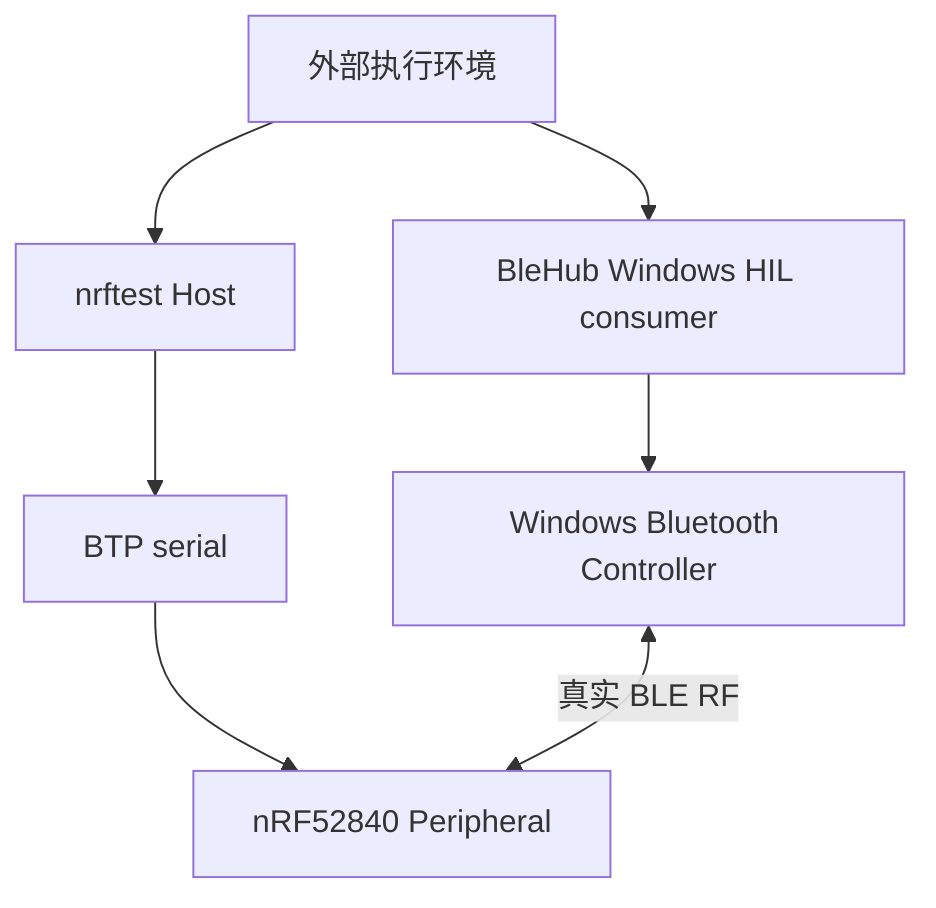

# Phase 2 动态 GATT 与真实 RF 退出报告

## 1. 结论摘要

| 项目 | 结果 |
|---|---|
| 阶段 | Phase 2：动态 GATT Profile |
| 执行日期 | 2026-09-09；Peripheral 原始报告使用 UTC 时间戳 `2026-09-08T23:*Z` |
| Profile | `blehub-nrf52840-basic-gatt-v1` |
| Profile SHA-256 | `7c6a51d45f928b645b9e3e7c68ecabb26070da5c63fe6ffef37d1300a0b30de1` |
| BleHub candidate | `0da70a26f6006fc04efc501cdcc154fbb0f9c4dd` |
| GATT discovery | 通过 |
| 公开 characteristic read | 通过，BleHub 在每轮写入前读取 `00`，写入后读取目标值 |
| Write With Response | 通过，BleHub 写入/读回 `10`，nRF 报告 handle `35`、value `10`、count `1` |
| Write Without Response | 通过，BleHub 写入/读回 `ab`，nRF 报告 handle `35`、value `ab`、count `1` |
| 生命周期 | fresh build 和后续 resident attach 均通过；每轮连接、断开、Host transport cleanup clean |
| 阶段判断 | **Phase 2 退出条件通过** |

本轮证明固定 upstream Zephyr Tester、固定 AutoPTS `pybtp`、PCA10059 和独立 BleHub Windows Central 可以完成 canonical Profile 的动态构建、公开发现、read、两种 write 和 Peripheral 侧 Attribute Value Changed 对账。Notification、Indication、数据库 removal/rebuild、异常 reset 和其他 Host/DUT 平台不在本轮证明范围内。

## 2. 双侧边界



两侧保持独立：

- `nrftest` 只控制 nRF Peripheral，并记录 BTP/Peripheral 事实；
- BleHub HIL consumer 只通过 BleHub 公共 Central API 驱动 Windows backend；
- BleHub consumer 不认识 BTP、串口、`nrftest` Profile 路径或 checkout；
- `nrftest` 不定位、构建、配置或启动 BleHub；
- 两个项目运行时唯一的数据通信是 BLE RF；外部执行环境只负责并行启动和关联证据。

经用户明确批准，BleHub 仅新增通用参数化 HIL 入口：

```text
write-once-smoke timeout service_uuid mode value_hex
```

它不修改 BleHub 公共 API、production backend、UniFFI/BoltFFI 或架构文档。

## 3. 固定变量

| 变量 | 固定值 |
|---|---|
| Board | Nordic PCA10059 / nRF52840 Dongle |
| USB application identity | `2FE3:0004` / serial `DBDBE94A2CED8C63` |
| Zephyr | `v4.4.2` / `dccb09599635bdff17633fa7e9dab014b91dce90` |
| Zephyr SDK | `1.0.1` / `arm-zephyr-eabi` |
| AutoPTS | `54e81c7f3495bce72e5f688e9c996b85b8272799` |
| Firmware HEX SHA-256 | `4a1a79fc123082a3ec987df10e566b4432a401aeee0bda351f7a50d9dff20308` |
| DFU ZIP SHA-256 | `d53fa63143ad862de23cff4dcc3af68e538f94feafa1fcadb37e295029b25326` |
| Firmware logging | `CONFIG_TEST_LOGGING_DEFAULTS=n`、`CONFIG_LOG=n` |
| Host OS | Microsoft Windows `10.0.26200.9168` |
| BleHub candidate | `0da70a26f6006fc04efc501cdcc154fbb0f9c4dd` |
| Root service | `fd000000-0000-4000-8000-000000000000` |
| Read/write characteristic | `fff10000-0000-4000-8000-000000000000` |
| BTP service lifecycle | AUTO register/attach；正常关闭不 unregister |

本机成功运行时端口解析为 `COM13`，但 recipe 和代码均未硬编码端口；fixture 按 USB identity 动态选择应用设备。

## 4. Dynamic database

固定 Tester 的实际数据库为：

| 对象 | Handle | 注册后 permission |
|---|---:|---:|
| Primary service | 33 | `0x01` |
| `read-write` declaration/value | 34 / 35 | `0x01` / `0x43` |
| `updates` declaration/value/CCC | 36 / 37 / 38 | `0x01` / `0x41` / `0x03` |
| `read-only` declaration/value | 39 / 40 | `0x01` / `0x41` |
| `write-only` declaration/value | 41 / 42 | `0x01` / `0x42` |

总计 10 个 attributes。`0x40` 是固定 Tester 在 native Zephyr permission 中加入的 `BT_GATT_PERM_PREPARE_WRITE`，不是 Profile schema 的 authorization 要求。

首次成功写入轮次发生在设备重新插入后的 fresh boot，mapping action 为 `built`；下一轮及回归轮次 action 为 `attached`。因此本轮同时覆盖了 fresh database 构建和跨 Host 进程的 resident Profile 复用，但没有覆盖 remove/rebuild。

## 5. 双侧执行与结果

### 5.1 Write With Response

并行执行：

```text
nrftest:
pixi run just btp-gatt-write-fixture "" profiles/blehub-nrf-basic-v1.json read-write 10 120

BleHub:
pixi run just windows write-once-smoke 120 fd000000-0000-4000-8000-000000000000 with-response 10
```

结果：

```text
BleHub:
mode=with-response initial_value=00 written_value=10 readback=10
Windows single-write smoke: PASS

nrftest:
NRFTEST_GATT_FIXTURE_CONNECTED
NRFTEST_GATT_FIXTURE_WRITE {"changed_count": 1, "handle": 35, "role": "read-write", "value_hex": "10"}
NRFTEST_GATT_FIXTURE_DISCONNECTED
nRF dynamic GATT RF fixture: PASS
```

Peripheral 原始报告：

```text
.work/reports/btp-gatt-profile-probe/20260908T231550Z.json
```

清除 AutoPTS 本地状态初始化噪声后的独立回归也通过：

```text
.work/reports/btp-gatt-profile-probe/20260908T232348Z.json
```

### 5.2 Write Without Response

并行执行：

```text
nrftest:
pixi run just btp-gatt-write-fixture "" profiles/blehub-nrf-basic-v1.json read-write ab 120

BleHub:
pixi run just windows write-once-smoke 120 fd000000-0000-4000-8000-000000000000 without-response ab
```

结果：

```text
BleHub:
mode=without-response initial_value=00 written_value=ab readback=ab
Windows single-write smoke: PASS

nrftest:
NRFTEST_GATT_FIXTURE_CONNECTED
NRFTEST_GATT_FIXTURE_WRITE {"changed_count": 1, "handle": 35, "role": "read-write", "value_hex": "ab"}
NRFTEST_GATT_FIXTURE_DISCONNECTED
nRF dynamic GATT RF fixture: PASS
```

Peripheral 原始报告：

```text
.work/reports/btp-gatt-profile-probe/20260908T231654Z.json
```

### 5.3 证据解释

| 事实 | 证明来源 | 可以证明 | 不能证明 |
|---|---|---|---|
| GATT database 和 properties | BleHub `discover_gatt` + nRF attribute enumeration | BleHub 公开 discovery 与实际 nRF database 一致 | Notification/Indication 已工作 |
| 初值和写后 readback | BleHub `CharacteristicRead` + command terminal | BleHub 公开 read API 读取到 `00` 和目标值 | nRF 存在 server-side read event |
| 写命令终端 | BleHub `CharacteristicWritten` + `CommandCompleted` | Windows backend 对该 write mode 报告完成 | 单独证明不了 Peripheral callback 已收到 |
| Attribute Value Changed | AutoPTS 本地 BTP event state | nRF handle `35` 收到目标值，且本轮 count 为 `1` | 吞吐、逐包 ledger 或 peer identity |
| connected/disconnected | nRF GAP state + BleHub command terminal | 双侧观察同一轮连接生命周期 | 被动断连或异常恢复 |

Central read 在固定 Tester 中没有独立 Peripheral 侧 BTP event，因此 read 证据来自 BleHub 公开读取结果；Central write 则由 BleHub terminal/readback 和 nRF Attribute Value Changed 两侧共同闭环。

## 6. AutoPTS 本地状态噪声

前两轮成功运行在 `NRFTEST_GATT_FIXTURE_READY` 前打印：

```text
ERROR:root:No attribute with 35 handle
```

这不是 nRF、ATT 或 BTP failure。固定 AutoPTS 的 `autopts/ptsprojects/stack/layers/gatt.py` 中：

- `attr_value_clr_changed()` 在 PC 端 `server_db` 尚无 handle 时记录该日志；
- `wait_attr_value_changed()` 会在 handle 缺失时创建本地 `GattCharacteristicDescriptor`；
- 新 Host 进程的本地 state 不继承前一个进程，但 nRF dynamic database 可以继续 resident。

活动薄适配层因此在 clear 前执行一次 `timeout=0` 的 `wait_attr_value_changed()`，只用于非阻塞地建立 AutoPTS 本地事件槽，随后再清除 value/count。该调用不发送 BTP command、不修改 nRF database，也不放宽事件判断。单元测试验证调用顺序，实机回归报告 `20260908T232348Z.json` 中日志消失，真实 write 仍为 handle `35`、value `10`、count `1`。

## 7. 前置失败排除

第一次启动双侧命令时 PCA10059 尚未连接：

```text
nrftest: matching 2FE3:0004 ports: <none>
BleHub: scan timed out
```

`nrftest` 在打开 BTP transport 前失败，没有广播、连接或写入；BleHub 只因不存在目标广播而扫描超时。该次运行是硬件前置条件失败，不计入 RF pass/fail 证据。设备插入后没有改固件、Profile 或代码参数，两种写模式随即通过。

## 8. Phase 2 退出判断

| 退出项 | 状态 | 证据 |
|---|---:|---|
| schema v1、Profile identity/signature | 通过 | `profile-check`；固定 SHA-256 |
| Dynamic Service/Characteristic/CCC | 通过 | 10-attribute mapping，handles `33..42` |
| BleHub 公开 GATT discovery | 通过 | 既有 `gatt-smoke` 双侧报告 |
| BleHub 公开 read | 通过 | 每轮初值读取和写后 readback |
| Write With Response | 通过 | BleHub PASS + nRF handle/value/count |
| Write Without Response | 通过 | BleHub PASS + nRF handle/value/count |
| Attribute Value Changed | 通过 | 两轮均为 handle `35`、目标 value、count `1` |
| 连接/断开与 Host cleanup | 通过 | 两轮 Peripheral 报告均 cleanup clean |

完整 basic GATT scenario 的两侧事实一致，因此 **Phase 2 于 2026-09-09 通过**。

## 9. 未覆盖边界

以下内容仍不得宣称通过：

- Notification、Indication、confirmation 和取消订阅后静默；
- CCC 订阅事实的完整可观测性；
- dynamic service removal、同 UUID rebuild 和资源回收；
- pending BTP command、固件 assertion/deadlock、target reset 和 J-Link fallback；
- macOS/Linux nrftest Host；
- Android、macOS、iOS 或 Linux BleHub DUT；
- throughput、长时间 soak、逐包无损或并发连接。

下一阶段按计划进入 Phase 3，仅处理 Notification、Indication 和相关语义缺口。

## 10. 静态与单元验证

实际执行并通过：

```text
BleHub:
pixi run just windows::check
pixi run just fmt
pixi run just lint

nrftest:
pixi run just fmt
pixi run just lint
pixi run just test
pixi run just profile-check
```

结果包括：

```text
BleHub Windows HIL cargo check: PASS
BleHub strict Clippy: PASS
nrftest Ruff: PASS
nrftest pytest: 57 passed
Profile SHA-256: 7c6a51d45f928b645b9e3e7c68ecabb26070da5c63fe6ffef37d1300a0b30de1
```
