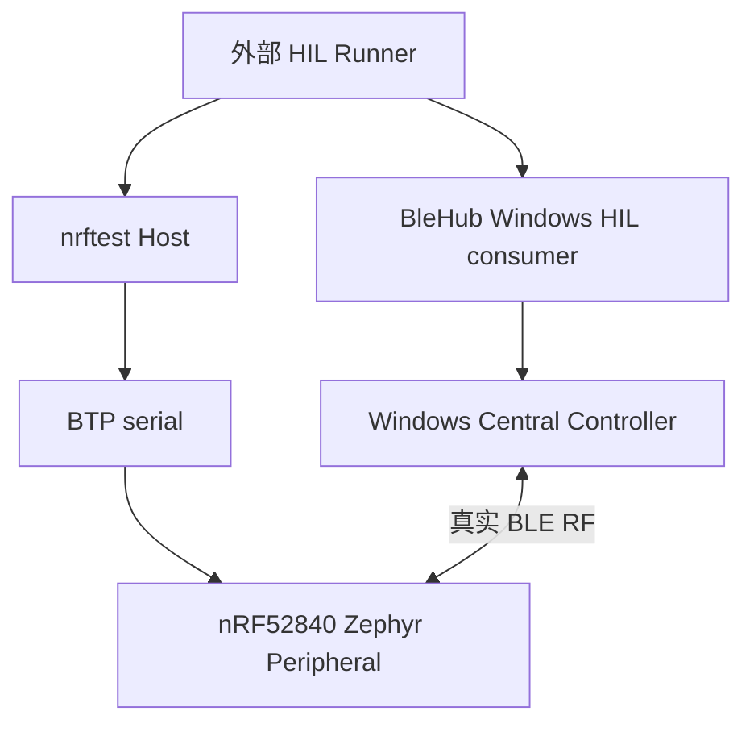

# Phase 3 Notification、Indication 与 Tester 语义报告

## 1. 报告范围

本文记录 `nrftest` Phase 3 在固定 Windows Host、PCA10059、Zephyr、AutoPTS、Profile 和 BleHub candidate 上完成的源码审计、对照固件实验与真实 BLE RF 验证。

本轮只回答以下问题：

- Central 写入的 CCC 是否可以在 nRF 侧按实际 peer 读取；
- Notification 和 Indication 是否分别以严格模式到达 BleHub；
- disable 后再次 Set Value 是否保持 Central 侧静默；
- 固定 Zephyr Tester 的 Set Value response 和 Indication confirmation 到底能证明什么；
- 是否需要重写 Tester 或扩展 BTP。

Dynamic database removal/rebuild、异常 reset、被动断连、soak、吞吐和其他 Host/DUT 平台不在本轮范围内。

## 2. 固定边界与变量



| 变量 | 固定值 |
|---|---|
| Board | Nordic PCA10059 / nRF52840 Dongle |
| Application identity | `2FE3:0004` / serial `DBDBE94A2CED8C63` |
| Zephyr | `v4.4.2` / `dccb09599635bdff17633fa7e9dab014b91dce90` |
| Zephyr SDK | `1.0.1` / `arm-zephyr-eabi` |
| AutoPTS | `54e81c7f3495bce72e5f688e9c996b85b8272799` |
| Firmware logging | `CONFIG_TEST_LOGGING_DEFAULTS=n`、`CONFIG_LOG=n` |
| Host OS | Microsoft Windows `10.0.26200.9168` |
| BleHub candidate | `0da70a26f6006fc04efc501cdcc154fbb0f9c4dd` |
| Profile | `blehub-nrf52840-basic-gatt-v1` |
| Profile SHA-256 | `7c6a51d45f928b645b9e3e7c68ecabb26070da5c63fe6ffef37d1300a0b30de1` |
| Root service | `fd000000-0000-4000-8000-000000000000` |
| Updates value / CCC handle | `37` / `38` |
| Connection scope | 单 Central、单 updates characteristic、单 subscription |

两个项目保持独立：`nrftest` 只通过 BTP 控制 nRF；BleHub consumer 只通过 BleHub 公共 Central API 和自己的 Windows Bluetooth Controller 工作。任何一方都不定位、配置或启动另一方，两者运行时唯一的数据通信是 BLE RF。

## 3. 预期协议语义

### 3.1 CCC 模式

| 模式 | Central 写入 CCC | Tester Set Value 时的预期动作 |
|---|---:|---|
| Disabled | `0000` | 只更新本地 value，不发送 RF update |
| Notification | `0100` | 调用 `bt_gatt_notify()` |
| Indication | `0200` | 调用 `bt_gatt_indicate()` |

`0300` 不作为本项目两种模式的合并写法。BleHub 分别使用严格 `RequireNotification` 和 `RequireIndication`，并验证后端报告的 `actual_mode`。

### 3.2 Delivery 与 confirmation

Notification 没有 ATT Confirmation；Central 收到预期 value 是本轮唯一严格 delivery 事实。

Indication 的标准确认链存在于 Zephyr Host 内部：

```text
Central ATT Confirmation
→ Zephyr att_confirm()
→ gatt_indicate_rsp()
→ Tester indicate_cb()
```

但固定 Tester 的 `indicate_cb()` 只记录日志，不发送 BTP event。当前正式固件又使用 `CONFIG_LOG=n`，所以 Peripheral 侧没有机器可读的逐条 confirmation telemetry。本轮可以严格证明 BleHub 收到 Indication；不能声称固定 BTP Host 直接观察到了 ATT Confirmation callback。

## 4. 固定 Tester 的缺陷

固定源码：

```text
E:/dev/nrftest-upstream/zephyrproject/zephyr/
  tests/bluetooth/tester/src/btp_gatt.c
```

stock `set_value()` 路径有两个独立的错误屏蔽点：

1. handler 丢弃 `alloc_value()` 返回的 status，最终无条件返回 BTP success；
2. `alloc_value()` 丢弃 `bt_gatt_notify()` / `bt_gatt_indicate()` 的 native return。

stock 的两种 update 都通过 `conn=NULL` 让 Host 自动选择连接：

```c
bt_gatt_notify(NULL, attr, data, len)
bt_gatt_indicate(NULL, &indicate_params)
```

stock Indication 调用在本轮固定单连接、CCC=`0200` 的实机条件下同步返回失败，但 stock Tester 把失败隐藏成 BTP success。indication-only patch 只把 Indication 改为显式连接；它完成一次 Notification 和一次 Indication 后，后续 Notification 的 `conn=NULL` 路径又稳定返回 failure。具体 native errno 没有进入 BTP payload，因此本轮不猜测错误码。

这属于 Zephyr Bluetooth Tester **应用适配层**问题，不是 BTP wire format、Bluetooth 规范、nRF Controller 或 BleHub public API 问题。

## 5. 对照实验矩阵

| 固件 | Notification | Indication | 实验作用 | 结论 |
|---|---|---|---|---|
| stock Tester | 双侧通过 | BTP 表面 success、本地 value 更新，但 BleHub 120 秒未收到 update | 建立原始行为 | stock success 不能证明 native Indication 已接受 |
| status-only patch | 双侧通过 | Set Value 立即返回现有 BTP failure | 只传播原生路径 status，不改变发送方式 | 证明 stock 隐藏的是 `bt_gatt_indicate(NULL, ...)` 的同步负返回 |
| indication-only patch | 首轮双侧通过；完成 Indication 后的新轮次稳定 failure | 双侧通过 | 只对 Indication 显式选择唯一 subscriber | 解决单次 Indication，但没有消除 Notification `conn=NULL` 的重复生命周期缺口 |
| update-single-subscriber patch | `N → I → N` 三轮双侧通过 | `N → I → N` 中间轮双侧通过 | 两种 update 都显式选择唯一模式匹配 subscriber | 标准 Zephyr API 与现有 BTP 足够；无需重写 Tester 或新增 opcode |

原始 Peripheral 报告：

| 固件 | 模式 | 报告 | 结果 |
|---|---|---|---|
| stock | Notification | `.work/reports/btp-gatt-subscription-fixture/20260909T001947Z.json` | `subscription-rf-pass` |
| stock | Indication | `.work/reports/btp-gatt-subscription-fixture/20260909T002243Z.json` | Central 未收到 update，fixture 等待 disable 超时 |
| status-only | Notification | `.work/reports/btp-gatt-subscription-fixture/20260909T010403Z.json` | `subscription-rf-pass` |
| status-only | Indication | `.work/reports/btp-gatt-subscription-fixture/20260909T010450Z.json` | `BTPError: Error opcode in response!` |
| indication-only | Notification | `.work/reports/btp-gatt-subscription-fixture/20260909T013352Z.json` | 首轮 `subscription-rf-pass` |
| indication-only | Indication | `.work/reports/btp-gatt-subscription-fixture/20260909T013445Z.json` | 首轮 `subscription-rf-pass` |
| indication-only | Notification repeat | `.work/reports/btp-gatt-subscription-fixture/20260909T020857Z.json`、`20260909T021508Z.json`、`20260909T022301Z.json` | 三次 immediate BTP failure；中间 Host off/on 未恢复 |
| update-single-subscriber | Notification | `.work/reports/btp-gatt-subscription-fixture/20260909T023808Z.json` | fresh `subscription-rf-pass` |
| update-single-subscriber | Indication | `.work/reports/btp-gatt-subscription-fixture/20260909T023904Z.json` | resident `subscription-rf-pass` |
| update-single-subscriber | Notification repeat | `.work/reports/btp-gatt-subscription-fixture/20260909T024005Z.json` | resident `subscription-rf-pass` |

stock Indication 报告中的 CCC 持续为 `0200`，是因为 BleHub 一直等待未到达的 update，未进入正常 disable 步骤；它不是“disable 写入后 CCC 未清零”的证据。

indication-only 候选的 Notification repeat failure 在同一 target 上连续复现。BTP doctor 仍通过；一次 `SET_POWERED(false)` 成功后 immediate `SET_POWERED(true)` 返回 BTP failure，延时后的正式 GAP control probe恢复 power/advertising，但再次 Notification 仍失败。恢复报告为 `.work/reports/btp-gap-control-probe/20260909T022214Z.json`。因此该缺口没有被归因于串口、BTP service 死亡或可由 Host off/on 清理的暂态资源；最终单变量改动是把 Notification 也从 `conn=NULL` 改为显式唯一 subscriber。

## 6. 最小 update-single-subscriber patch

活动补丁：

```text
firmware/patches/archive/zephyr-v4.4.2-tester-update-single-subscriber.patch
SHA-256 1fddcb3316608711e658c016d70079c3bbd1fbea297e853e12543150a89653b1
```

补丁只修改 staged Tester application 的 `src/btp_gatt.c`：

1. 使用 `bt_conn_foreach(BT_CONN_TYPE_LE, ...)` 枚举 LE 连接；
2. 使用 `bt_gatt_is_subscribed(conn, attr, ccc_type)` 查找订阅当前 attribute 和目标模式的连接；
3. 只有恰好一个 subscriber 时才 `bt_conn_ref()`；
4. Notification 调用标准 `bt_gatt_notify(conn, ...)`，Indication 调用标准 `bt_gatt_indicate(conn, params)`；
5. 零 subscriber 返回 failure；多 subscriber 返回 failure；
6. 传播 Notification/Indication 的 immediate native return；
7. 让 Set Value handler 返回 `alloc_value()` status。

未改变：

- BTP header、service ID、opcode 或 payload；
- AutoPTS `pybtp` framing/parser/worker；
- JSON Profile schema、UUID 或 handle mapping；
- Zephyr Bluetooth Host、Controller 或 ATT/GATT 实现；
- BleHub public API 或 production backend。

补丁没有把多连接策略伪装成已解决。当前 Phase 3 明确限定为 single-subscriber；零个或多个模式匹配 subscriber 都以现有 BTP failure 拒绝，而不是静默选择任意连接。

构建脚本把 Tester application 复制到 Zephyr workspace drive 上的临时 cache，先执行 `git apply --check --whitespace=error-all`，再应用补丁。固定 upstream checkout 没有被修改，最终核验 `git diff --exit-code` 通过。

## 7. update-single-subscriber candidate 启动验证

DFU 使用动态发现的 bootloader `1915:521F` 和当次端口 `COM10`，同时要求 package SHA-256 精确匹配。刷写报告：

```text
.work/reports/firmware-flash-20260909T023615Z.json
```

刷写后设备无需第二次人工拔插，重新枚举为：

```text
COM13
VID:PID=2FE3:0004
serial=DBDBE94A2CED8C63
```

随后执行：

```text
pixi run just btp-doctor
```

结果：

```text
services=['CORE', 'GAP', 'GATT']
service actions: GAP=registered, GATT=registered
BTP Core probe passed
```

报告：

```text
.work/reports/btp-core-probe/20260909T023714Z.json
```

## 8. Notification 双侧 RF

外部执行环境并行启动：

```text
nrftest:
pixi run just btp-gatt-subscription-fixture \
  notification 11 12 "" profiles/blehub-nrf-basic-v1.json 120

BleHub:
pixi run just windows subscription-once-smoke \
  120 fd000000-0000-4000-8000-000000000000 \
  notification 11 12 2
```

| 步骤 | Peripheral 事实 | Central 事实 |
|---|---|---|
| 连接 | peer `387a0ec160dc` 出现在 nRF GAP state | BleHub connect/discovery 完成 |
| enable | handle `38` payload=`0100` | `actual_mode=Notification` |
| enabled update | handle `37` 本地 readback=`11` | 收到 value `11` |
| disable | handle `38` payload=`0000` | disable terminal 完成 |
| after-disable | handle `37` 本地 readback=`12` | 公开 read 取得 `12`，2 秒内无 stale update |
| cleanup | nRF 观察 peer 移除，cleanup clean | disconnect/dispose 完成 |

双侧输出：

```text
nRF notification subscription fixture: PASS
Windows single-subscription smoke: PASS
```

active fresh Notification 报告为 `.work/reports/btp-gatt-subscription-fixture/20260909T023808Z.json`；完成 Indication 后的 resident Notification repeat 使用 value `31/32`，报告为 `.work/reports/btp-gatt-subscription-fixture/20260909T024005Z.json`，双侧同样通过。

## 9. Indication 双侧 RF

外部执行环境并行启动：

```text
nrftest:
pixi run just btp-gatt-subscription-fixture \
  indication 21 22 "" profiles/blehub-nrf-basic-v1.json 120

BleHub:
pixi run just windows subscription-once-smoke \
  120 fd000000-0000-4000-8000-000000000000 \
  indication 21 22 2
```

| 步骤 | Peripheral 事实 | Central 事实 |
|---|---|---|
| 连接 | peer `387a0ec160dc` 出现在 nRF GAP state | BleHub connect/discovery 完成 |
| enable | handle `38` payload=`0200` | `actual_mode=Indication` |
| enabled update | handle `37` 本地 readback=`21`；active BTP response success | 收到 value `21` |
| disable | handle `38` payload=`0000` | disable terminal 完成 |
| after-disable | handle `37` 本地 readback=`22` | 公开 read 取得 `22`，2 秒内无 stale update |
| cleanup | nRF 观察 peer 移除，cleanup clean | disconnect/dispose 完成 |

双侧输出：

```text
nRF indication subscription fixture: PASS
Windows single-subscription smoke: PASS
```

active resident Indication 报告为 `.work/reports/btp-gatt-subscription-fixture/20260909T023904Z.json`。三轮按 `Notification 11/12 → Indication 21/22 → Notification 31/32` 顺序执行，期间没有 target reset、power off/on 或人工拔插。

## 10. 证据语义

| 事实 | 本轮可以证明 | 本轮不能证明 |
|---|---|---|
| CCC payload `0100/0200/0000` | 实际 peer 的订阅模式与 disable 状态 | 单靠 CCC 证明 update 已到达 Central |
| CCC 的 ATT metadata `0x0c` | 固定 Tester 仍返回有效两字节 CCC payload | `0x0c` 是真实 CCC read failure |
| stock Set Value success | stock handler 返回了 success，本地 readback 可另行验证 | native send 被接受或 Central 已接收 |
| active Set Value success | value allocation/update 成功，显式连接的 native send API immediate return 为 `0` | 异步 RF delivery 或 Indication Confirmation callback |
| BleHub 收到严格模式 update | 对应 Notification/Indication 经真实 RF 到达 Central API | Peripheral 侧 BTP 已观察 ATT Confirmation |
| after-disable readback + 静默 | nRF value 已更新，但 BleHub 在 2 秒观察窗没有 stale update | 任意时长、并发或高负载下永久无迟到事件 |

固定 Tester 的 `GET_ATTRIBUTE_VALUE` 会把 CCC `user_data` 按普通 dynamic value 类型解释，导致 enable 轮次可能返回 ATT `0x0c`，同时 payload 仍为有效 `0100` 或 `0200`。活动 CCC reader 只对 CCC 接受 `0x00/0x0c`，并继续严格要求两字节 payload 和精确状态；普通 characteristic value read 仍只接受 `0x00`。

fixture 输出中的 `btp_set_value_semantics` 使用固件无关表述：BTP command 返回 success，但确切强度依赖 active firmware；Peripheral 报告只把本地 readback 作为自身事实，RF delivery 必须由独立 Central 证据证明。本报告再通过精确 package/patch identity，把 active candidate 的 success 收紧为显式连接上的 immediate native call 成功。

## 11. 固件与补丁身份

| 候选 | Patch SHA-256 | HEX SHA-256 | DFU ZIP SHA-256 | 归档 |
|---|---|---|---|---|
| stock | 无 | `4a1a79fc123082a3ec987df10e566b4432a401aeee0bda351f7a50d9dff20308` | `d53fa63143ad862de23cff4dcc3af68e538f94feafa1fcadb37e295029b25326` | `.work/artifacts/stock-zephyr-v4.4.2-dccb0959/` |
| status-only | `382457d1f24b0262eb2aee8c4536d8ac72f5b63d4be4794be6825f418be7827b` | `63dc769392b6ed553871603c02a07a070c2c19c741a3f4121e46de66875e4b74` | `4b15a07e08038699bcc6aa3bff26fa3b81f7e07b39758c9faf5fd512923d0503` | `.work/artifacts/status-propagation-zephyr-v4.4.2/` |
| indication-only intermediate | `f7fd3abad64e6da46f57a3c83744f9b4b7ed6322f8103e857bc6611da876a795` | `44f0f39ca3c938433d415ab82d2fcfe41a733e76483523e7efed398c9e1183ff` | `bd816b1903e09066719d9f937c3eaa435e5f8b5aaf1f53528750132f037ea21e` | `.work/artifacts/indication-single-subscriber-zephyr-v4.4.2/` |
| update-single-subscriber active | `1fddcb3316608711e658c016d70079c3bbd1fbea297e853e12543150a89653b1` | `e48beb5c5ba1e10acaf37363d1961663d8f4fd5259e51744441fd797f3c058c3` | `c5b8ea5d13ffe15fa2cc49fc51ad7ad210df0b68a2e519e543a4a5abec2e388b` | `.work/artifacts/update-single-subscriber-zephyr-v4.4.2/` |

默认 `firmware-build`/`firmware-package` 已提升为 update-single-subscriber candidate；从标准 `.work/build` pristine 重建得到相同 HEX 和 ZIP 哈希。显式 `*-stock` recipe 只构建、封装或刷写未修改 upstream 对照；`*-patched` 保留为 active candidate 的兼容名称。

所有 manifest 均记录 upstream `btp_gatt.c` SHA、patched source SHA 和 `wire_protocol_changed=false`。当前设备运行 update-single-subscriber candidate。

## 12. Phase 3 退出判断

| 退出项 | 状态 | 证据 |
|---|---:|---|
| CCC Notification enable | 通过 | nRF `0100` + BleHub `actual_mode=Notification` |
| CCC Indication enable | 通过 | nRF `0200` + BleHub `actual_mode=Indication` |
| 单条 Notification RF | 通过 | BleHub 收到 `11` |
| 单条 Indication RF | 通过 | BleHub 收到 `21` |
| CCC disable | 通过 | 三轮 nRF 均读取 `0000` |
| disable 后本地更新 | 通过 | nRF readback `12` / `22` / `32` |
| disable 后 Central 静默 | 通过 | 三轮均完成 2 秒 stale-route guard |
| Set Value response 语义 | 已明确 | stock、status-only、indication-only、active 四组对照 |
| Indication confirmation 可观测性 | 已明确但未补齐 | callback 存在，固定 Tester 无 BTP event |
| 标准 BTP 是否足够 | 是，限当前单连接单包范围 | 未增加 opcode/payload；active `N → I → N` 双侧通过 |

## 13. 结论

Phase 3 在固定 Windows + PCA10059 + BleHub Windows candidate 范围内通过。

不需要重写 Zephyr Bluetooth Tester，也不需要实现第二套 BTP Client 或私有 BTP 扩展。最终方案是保留 upstream Tester/BTP 主体，并维护一个固定 revision、wire-compatible、single-subscriber 的最小应用层 patch。该 patch 对 Notification 和 Indication 都显式选择唯一模式匹配连接，绕过 stock `conn=NULL` update 路径，同时停止隐藏 immediate native error。

当前明确限制：

- 只验证一个 Central、一个 updates characteristic、一个 subscriber；
- 固定 BTP 仍没有逐条 Indication confirmation event；
- `BTP_STATUS_FAILED` 不携带 native errno；
- 只验证单字节单包和 2 秒 disable 静默窗；
- 尚未验证其他 BleHub DUT 平台或 macOS/Linux nrftest Host。

下一阶段按计划进入 Phase 4：数据库重建、reset/re-enumeration、Host restart、passive disconnect、故障分类和 repeated lifecycle。若后续验收明确要求 Peripheral 侧机器可读的逐条 ATT Confirmation，再暂停并评审 BTP telemetry 扩展；本轮不预先增加该协议负担。
