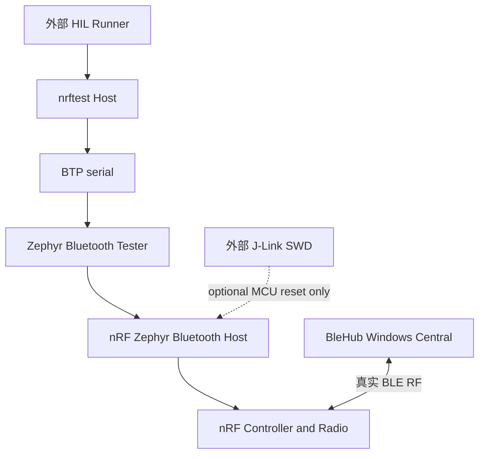

# Phase 4 固定 Profile 生命周期与可选 target reset 报告

## 1. 报告状态

| 项目 | 当前结论 |
|---|---|
| 阶段 | Phase 4：固定 Profile 生命周期和恢复，**已通过** |
| 固件候选 | 固定 Zephyr Tester + `single-subscriber-database-lifecycle` 组合 patch |
| Profile unregister/rebuild | **一次 A→remove→B nRF-side 实机通过**；仅作为能力边界实验 |
| Phase 2/3 RF 回归 | **通过**：两种 write + `Notification → Indication → Notification` |
| Dynamic database 完整回收 | **未通过，也未宣称**；Tester backing state 仍是 append-only |
| 正常生命周期策略 | 每个 MCU boot provision 一个固定 Profile；每轮 attach、恢复初值、复核 mapping |
| 自动 target reset 软件层 | **已实现并通过单元测试**；保留为可选灾难恢复后端 |
| 自动 target reset 实机能力 | **未执行**；当前机器缺少外部 J-Link、原生 SEGGER library 和 SWD 接线；不阻塞 Phase 4 |
| Host clean restart/reopen | **通过 10 轮**；每轮独立 Host 进程重新 attach，cleanup 均为 `clean` |
| Host abnormal restart | Phase 1 advertising-active 强杀/reopen 已通过；pending BTP response interruption 仍未执行 |
| Passive disconnect/recovery | **通过**：BTP radio-stack power-off、BleHub `command_id=None`、power-on、new Host attach 和普通 RF |
| Direct BTP GAP `DISCONNECT` | **未通过**：当前 Windows peer 返回 BTP status error；未冒充为逻辑 disconnect 成功 |
| 10-cycle resident lifecycle | **10/10 双侧 RF 通过**；5 次 Notification + 5 次 Indication |

本报告严格区分三类事实：真实硬件/RF 已通过、固定本地源码确认、尚未执行。单次标准 BTP removal 成功不等于资源回收，也不能替代 10-cycle resident lifecycle 证据。经用户批准，普通 testcase 不再 remove/rebuild，也不以 target reset 为前置条件。

## 2. 层级与本轮改变



| 层级 | 本轮动作 | 未做的事情 |
|---|---|---|
| BTP wire protocol | 继续使用固定 AutoPTS opcode `0x23` | 未新增 opcode/event/header/payload |
| Tester application | 修复动态 Service 的 0-based 槽位索引 | 未重写 Tester，未修改 GATT Host |
| Zephyr Bluetooth Host | 调用既有 `bt_gatt_service_unregister/register` | 未 patch Zephyr GATT core |
| BLE RF | 用独立 BleHub Central 回归 read/write/update | BleHub 未控制 nrftest，也未成为 nrftest 依赖 |
| Recovery | 保留外部 J-Link reset/re-enumeration 薄层作为可选后端 | 未把它设为普通 testcase 或 Phase 4 退出门；未把关闭 COM、USB PnP restart 或 `bt_disable()` 当 MCU reset |

## 3. 固定变量和候选身份

| 变量 | 固定值 |
|---|---|
| Board | Nordic PCA10059 / nRF52840 Dongle |
| Application USB identity | `2FE3:0004` / serial `DBDBE94A2CED8C63` / 本轮 `COM13` |
| Bootloader identity | `1915:521F` / serial `F3CDDDE125C5` / 本轮 `COM10` |
| Zephyr | `v4.4.2` / `dccb09599635bdff17633fa7e9dab014b91dce90` |
| Zephyr SDK | `1.0.1` / `arm-zephyr-eabi` |
| AutoPTS | `54e81c7f3495bce72e5f688e9c996b85b8272799` |
| Firmware logging | `CONFIG_TEST_LOGGING_DEFAULTS=n`、`CONFIG_LOG=n` |
| Patch（现归档位置） | `firmware/patches/archive/zephyr-v4.4.2-tester-single-subscriber-database-lifecycle.patch` |
| Patch SHA-256 | `d13ac4e3f8f79a6a5442de1f108ca18c8f4ce242c71f5417e68a36bff5baf636` |
| Upstream `btp_gatt.c` SHA-256 | `3b87af97c50784b23d61e7764eeaf7855ff3566048e0e71246f76be926f62c70` |
| Patched `btp_gatt.c` SHA-256 | `b0435f59e67267195bd7c1ecb9ea430f1804fc23c717e7d77136e06625a099e2` |
| HEX SHA-256 | `4dbce498501bfd0090880f8494761a99fbcba01d4e26bb00e1830b0cb9f7c2d5` |
| DFU ZIP SHA-256 | `3393e36271aa31f4d93a6802765cb364030c482c51524961460539446fbb6715` |
| Flash / RAM | `393600 B` / `95256 B` |
| Wire protocol changed | `false` |
| Artifact archive | `.work/artifacts/single-subscriber-database-lifecycle-zephyr-v4.4.2/` |

Phase 3 的 patch 和 artifacts 均保留，未被覆盖。固定 upstream checkout 在新候选构建后执行 `git diff --exit-code` 通过。

## 4. stock Tester 的 Service 槽位缺陷

### 4.1 失败事实

第一次在 Phase 3 固件上执行 A→remove→B：

```text
Profile A service_handle=33
→ remove_handle_from_db(33)
→ BTPError: Error opcode in response!
```

原始报告：

```text
.work/reports/btp-gatt-profile-rebuild-probe/20260909T053437Z.json
```

失败后重新 attach Profile A 通过，因此本次 failure 发生在 Tester service lookup，尚未调用 native `bt_gatt_service_unregister()`，有效数据库没有被修改。

### 4.2 固定源码根因

stock `add_service()` 先增加数量：

```c
svc_count++;
```

stock `register_service()` 却直接把数量当作 0-based 数组下标：

```c
server_svcs[svc_count].attrs = ...;
bt_gatt_service_register(&server_svcs[svc_count]);
```

第一个 Service 因此注册在 `server_svcs[1]`。Removal 只搜索：

```c
for (int i = 0; i < svc_count; i++)
```

当 `svc_count == 1` 时只检查 `server_svcs[0]`，永远找不到第一个 Service。这个缺陷还浪费 slot `0`，并使第十个 Service 存在访问 `server_svcs[10]` 的越界风险。

这属于 Zephyr Bluetooth Tester **应用层**缺陷，不是 Python wrapper、BTP framing、Zephyr GATT Host、Controller、USB CDC 或 BleHub 的问题。

### 4.3 最小根因修复

组合 patch 保留 Phase 3 已验证的 single-subscriber/status 修复，并新增：

```c
server_svcs[svc_count - 1U]
```

同时在增加 `svc_count` 前拒绝超过数组容量的新 Service：

```c
if (svc_count >= ARRAY_SIZE(server_svcs)) {
    return BTP_STATUS_FAILED;
}
```

Removal 继续搜索 `0..svc_count-1`，现在与注册布局一致。没有采用 `i <= svc_count` 这种只绕过症状、仍保留 slot 浪费和越界风险的改法。

## 5. 构建和静态验证

| 验证 | 结果 | 证据边界 |
|---|---:|---|
| 新 patch `git apply --check --whitespace=error-all` | 通过 | patch 干净适用于固定 upstream |
| 隔离 pristine build | 通过 | `.work/build-single-subscriber-database-lifecycle/` |
| 默认 `firmware-build` pristine build | 通过 | 默认 recipe 已切换到 Phase 4 patch |
| 两次 HEX SHA 对比 | 相同 | 均为 `4dbce498…` |
| Manifest | 通过 | 记录 upstream/patch/patched SHA 和 `wire_protocol_changed=false` |
| Flash boundary | 通过 | 应用段未覆盖 MBR 或原厂 bootloader |
| Deterministic DFU package | 通过 | ZIP SHA-256 `3393e362…` |
| `pixi run just fmt` | 通过 | 48 个活动 Python 文件格式正确 |
| `pixi run just lint` | 通过 | Ruff check/format check 通过 |
| `pixi run just test` | 通过 | 最终 76 tests passed |
| Profile A/B validation | 通过 | 两个 JSON schema/semantic signature 均有效 |

Kconfig 仍有已记录的 upstream hidden-choice warning；最终 `.config` 再次确认普通 logging 关闭。本轮没有通过复制整份 upstream `prj.conf` 消除提示。

## 6. 新固件启动和 Phase 2/3 RF 回归

### 6.1 启动

新 DFU 在明确选择 `COM10`、bootloader VID/PID/hardware serial 和完整 package SHA 后刷写成功：

```text
.work/reports/firmware-flash-20260909T061730Z.json
```

设备随后无需第二次人工拔插，按应用 identity 回到 `COM13`。BTP doctor 通过：

```text
CORE/GAP/GATT
GAP=registered
GATT=registered
```

报告：

```text
.work/reports/btp-core-probe/20260909T061838Z.json
```

fresh Profile A 构建通过，实际 root handle 仍为 `33`、attributes 为 `33..42`：

```text
.work/reports/btp-gatt-profile-probe/20260909T061935Z.json
```

### 6.2 RF 回归矩阵

| 场景 | Peripheral 事实 | BleHub Central 事实 | 结果 |
|---|---|---|---:|
| Write With Response `10` | handle `35`、`changed_count=1` | write terminal + readback `10` | 通过 |
| Write Without Response `ab` | handle `35`、`changed_count=1` | write terminal + readback `ab` | 通过 |
| Notification `11/12` | CCC `0100→0000`，readback `12` | 收到 `11`，disable 后 2 秒静默 | 通过 |
| Indication `21/22` | CCC `0200→0000`，readback `22` | 严格 Indication 收到 `21`，disable 后静默 | 通过 |
| Notification repeat `31/32` | CCC `0100→0000`，readback `32` | 收到 `31`，disable 后静默 | 通过 |

Peripheral 报告：

```text
.work/reports/btp-gatt-profile-probe/20260909T062130Z.json
.work/reports/btp-gatt-profile-probe/20260909T062227Z.json
.work/reports/btp-gatt-subscription-fixture/20260909T062326Z.json
.work/reports/btp-gatt-subscription-fixture/20260909T062418Z.json
.work/reports/btp-gatt-subscription-fixture/20260909T062509Z.json
```

这些结果证明 Service 槽位修复没有破坏 Phase 2/3 已验证路径。它们仍限定为 Windows BleHub Central、单连接、单 subscriber 和单字节更新。

## 7. A→remove→B 实验

成功实验：

```text
Profile A attached
→ actual service handle 33
→ standard BTP GATT remove-handle-from-db opcode 0x23
→ Profile A 不再存在于有效 database
→ Profile B built
→ Profile B actual mapping/value verification passed
```

原始报告：

```text
.work/reports/btp-gatt-profile-rebuild-probe/20260909T062620Z.json
```

| 项目 | Profile A | remove 后 | Profile B |
|---|---|---|---|
| Root UUID | `fd000000-...` | A 不再可枚举 | `fd000001-...` |
| Profile action | `attached` | 标准 opcode `0x23` success | `built` |
| Dynamic attribute count | 10 | 有效 DB 回到 32 个基础 attributes | 10 |
| 实际 numeric handles | `33..42` | 旧动态 handles 不在有效 DB | 重新分配为 `33..42` |
| Core GAP/GATT service | resident | 未 unregister | resident |

numeric handle 被复用不是 stale handle 证据：Profile B 是通过重新枚举 UUID、declaration 和 value 得到的新 mapping。但这也说明 Host 绝不能仅凭 numeric handle 判断 Profile identity。

### 7.1 为什么日常流程不能继续 rebuild

固定 Tester 在 removal 后没有回收：

- `server_db` append pointer；
- `attr_count` / `svc_count`；
- value buffer；
- CCC bookkeeping；
- 已注销 Service 的 backing arrays。

因此本次只证明“一个有效 native Service 可注销，随后可注册一个不同 Service”。它不证明同 boot 可无限 rebuild，也不证明内存/slot 回收。

经用户批准，后续普通生命周期不再做第二次 removal/rebuild，而是把每个 MCU boot 上已 provision 的 Profile 视为 resident fixture。最初计划直接让结构等价的 Profile B 进入 10-cycle，但第一轮在广播前失败：

```text
ensure Profile B attached
→ restore read-write value handle 35
→ BTP Set Value returns ERROR
→ no advertising
→ BleHub scan timeout as a downstream consequence
```

失败报告：

```text
.work/reports/btp-gatt-subscription-fixture/20260909T155846Z.json
```

固定源码解释了这个结果：`bt_gatt_service_unregister()` 会清零 Host 自动分配的旧 Service handles，而 Tester `set_value()` 仍使用：

```c
&server_db[attr_id - server_db[0].handle]
```

Profile A removal 后 `server_db[0].handle` 被清零；Profile B append 在后续 backing slots，虽然 native Host 重新给它分配 `33..42`，`Set Value(35)` 已不能定位 Profile B 的 value attribute。组合 patch 传播了 `alloc_value()` 的真实失败，因此 Host 收到明确 BTP `ERROR`，而不是被 stock Tester 伪装成成功。

这进一步确认：A→remove→B 只证明 effective database replacement，**不能把 B 当作可继续运行的 resident fixture**。Profile identity 每轮仍必须通过 UUID、declaration、role 和实际 mapping 判断；numeric handles 相同既不代表同一 Profile，也不保证 Tester backing lookup 正确。

当前只在破坏性实验结束后进行了一次人工断电重启；这是 suite-boundary cleanup，不是普通 testcase 步骤。重新上电后的状态为：

```text
Core/GAP/GATT fresh registered
→ canonical Profile A built at handles 33..42
→ subsequent normal cycles only attach/restore/verify
```

证据：

```text
.work/reports/btp-core-probe/20260909T162713Z.json
.work/reports/btp-gatt-profile-probe/20260909T162806Z.json
```

## 8. 10-cycle resident lifecycle

一次 fresh provision 后，外部 runner 串行执行 10 轮独立双进程测试：nrftest Host 通过 BTP 控制 nRF，BleHub Windows Central 只通过自己的 Controller 与 nRF 进行真实 BLE RF 通信。轮次之间没有 target reset、人工拔插、Service removal 或 Profile rebuild。

| Cycle | Mode | Enabled / after disable | nrftest report | Profile / cleanup | BleHub |
|---:|---|---|---|---|---:|
| 1 | Notification | `41` / `42` | `20260909T162909Z.json` | attached / clean | PASS |
| 2 | Indication | `43` / `44` | `20260909T163018Z.json` | attached / clean | PASS |
| 3 | Notification | `45` / `46` | `20260909T163126Z.json` | attached / clean | PASS |
| 4 | Indication | `47` / `48` | `20260909T163230Z.json` | attached / clean | PASS |
| 5 | Notification | `49` / `4a` | `20260909T163342Z.json` | attached / clean | PASS |
| 6 | Indication | `4b` / `4c` | `20260909T163444Z.json` | attached / clean | PASS |
| 7 | Notification | `4d` / `4e` | `20260909T163547Z.json` | attached / clean | PASS |
| 8 | Indication | `4f` / `50` | `20260909T163652Z.json` | attached / clean | PASS |
| 9 | Notification | `51` / `52` | `20260909T163754Z.json` | attached / clean | PASS |
| 10 | Indication | `53` / `54` | `20260909T163900Z.json` | attached / clean | PASS |

所有 nrftest 报告位于：

```text
.work/reports/btp-gatt-subscription-fixture/
```

10 轮共同满足：

- `mapping.action=attached`；
- service handle `33`、dynamic attribute count `10`；
- characteristic/CCC mapping 始终为 `35/37/38/40/42`；
- Notification CCC 为 `0100`，Indication CCC 为 `0200`；
- disable 后 CCC 均为 `0000`；
- enabled update 和 after-disable local readback 均与轮次参数完全一致；
- BleHub 每轮收到指定模式和 enabled value，随后通过 2 秒 stale-route silence；
- nRF 每轮观察到连接和断连；
- 每轮 Host transport cleanup 均为 `clean`，下一进程可重新 attach。

该结果证明当前固定 Profile 的 10-cycle 功能生命周期，不外推为 1000-packet soak、吞吐、多连接、异常进程终止或其他 Host OS 证据。

## 9. Peripheral-side fault、passive disconnect 与恢复

### 9.1 Direct GAP disconnect 未通过

第一轮使用固定 AutoPTS `gap_disconnect(peer_address, peer_type)`：nRF 已观察到 Windows Central 连接和 Notification CCC=`0100`，但 BTP GAP `DISCONNECT` 返回 status error，BleHub 因没有收到 passive event 而超时。

```text
nrftest failure:
.work/reports/btp-gatt-passive-disconnect-fixture/20260909T165637Z.json

BleHub:
external/subscribed passive-disconnect consumer timed out
```

固定 AutoPTS 的 payload 是 `address type + little-endian 6-byte address`，与 Zephyr `btp_gap_disconnect_cmd` 一致。固定 Tester 随后执行 `bt_conn_lookup_addr_le()` 和 `bt_conn_disconnect()`；两处任一失败都会只返回统一 BTP failed status。当前固件 `CONFIG_LOG=n`，因此本轮不能进一步区分“lookup 未命中”与“native disconnect 返回错误”，不能把其中一种推断写成实机事实。

该失败属于 direct logical-disconnect 能力边界。项目没有关闭 assertion、没有改 BTP framing，也没有新增私有 opcode。

### 9.2 已采用的等价测试门

用户批准以达到测试目的为准，不要求依赖 direct `DISCONNECT`。正式门改用标准 BTP GAP `SET_POWERED(false)`，其固定 Tester 实现调用 `bt_disable()`；connection callback 在 disable 完成前仍有效，因此 nRF 可观察 disconnect event。随后同一 session 执行 `SET_POWERED(true)`，调用 `bt_enable()`，但不把它称作 MCU reset。

两侧仍完全独立：

- nrftest 看到 connection/CCC 后等待 2 秒，再发 BTP power-off；
- BleHub 的通用 `external` HIL provider 不调用任何 nrftest/Android/QEMU recipe，只等待 RF 对端故障；
- 两项目不 import、不启动也不配置彼此。

新增 nrftest 薄层：

```text
host/nrftest/passive_disconnect.py
tools/btp_gatt_passive_disconnect_fixture.py
tests/unit/test_passive_disconnect.py
pixi run just btp-gatt-passive-disconnect-fixture
```

BleHub 只修改测试 consumer：

```text
tests/hil/windows/src/passive_disconnect.rs
just/windows/hil.just
provider=external
```

`external` 不提供 trigger/restore recipe；故障触发和恢复完全由外部 runner 与 nrftest 控制面负责。

### 9.3 双侧 RF 结果

```text
nrftest:
.work/reports/btp-gatt-passive-disconnect-fixture/20260909T170628Z.json
run_id=88b1ec0e-eec9-4053-a837-34a9568e7790

BleHub:
Windows passive-disconnect smoke: PASS (1/1 cycles)
provider=external
anchor=subscribed
```

通过链路：

```text
Profile A attached; mapping 33..42
→ BleHub scan/connect/discover
→ Notification subscription enabled
→ nRF observes CCC 0100
→ BTP SET_POWERED(false) accepted; Powered=false
→ nRF disconnect event; peer absent
→ BleHub command_id=None Disconnected
→ BleHub pre-dispose connection/GATT/subscription resource release
→ BleHub dispose exact resource release
→ BTP SET_POWERED(true) accepted; Powered=true
→ nrftest cleanup=clean
```

BleHub consumer 只有在 `wait_for_passive_disconnect()` 匹配 `command_id=None` 且连接资源在 dispose 前释放、其余资源在 dispose 后释放时才输出 PASS。该结果证明 Windows BleHub + 当前 nRF 固件的一次 active-subscription radio-stack fault，不证明 direct GAP `DISCONNECT`、MCU reset 或其他 DUT/Host 平台。

### 9.4 恢复后的新进程和普通 RF

故障 fixture 退出后，新 nrftest Host 进程重新 attach 同一 Profile A、恢复 JSON 初值并核对 mapping：

```text
.work/reports/btp-gatt-profile-probe/20260909T170727Z.json
Profile action=attached
service=33
attributes=10
```

随后 Notification `61`、disable 后 value `62` 的普通双侧 RF 再次通过：

```text
.work/reports/btp-gatt-subscription-fixture/20260909T170825Z.json
BleHub: Windows single-subscription smoke: PASS
```

这证明 recovery 到达“可重新执行正常业务”的状态，而不只是 `SET_POWERED(true)` 命令返回成功。

## 10. 可选 target reset fallback 设计

### 10.1 方案选择

| 候选 | 是否真正重启 MCU | 决策 |
|---|---:|---|
| 关闭 AutoPTS/socat/COM | 否 | 仅 Host transport cleanup |
| BTP `SET_POWERED(false/true)` | 否 | 仅 Bluetooth Host/Controller 运行状态，不清 Tester 静态数据 |
| Windows USB PnP restart | 未证明；通常只重建 Host USB stack | 不作为 database reset 证据 |
| 新增私有 BTP reboot opcode | 可以 | 计划禁止，未实现 |
| MCUboot/mcumgr | 可以 | 会改变 bootloader/partition，当前不静默切换 |
| 外部 J-Link/SWD reset | 是 | **可选灾难恢复 fallback**；不进入正常 testcase |
| 受控 USB power switch | 是 | 无外部 SWD 时的最终硬件 fallback，尚未设计 |

当前 J-Link 路径只执行 reset，不通过 SWD 刷写，所以不会改变现有 `nrf52840dongle/nrf52840` build、Flash layout 或原厂 USB bootloader。只有未来改为 SWD 烧录时，才涉及 `/bare` board variant 和 bootloader 迁移决策。

### 10.2 已实现的软件边界

新增：

```text
host/nrftest/target_reset.py
tools/target_reset.py
tests/unit/test_target_reset.py
```

本机配置新增可选字段：

```toml
[tools]
jlink_library = "<SEGGER native library selected by developer>"

[device]
debugger_serial = "<explicit J-Link hardware serial>"
```

不提供硬编码安装路径，也不由普通 recipe 下载或重新分发 SEGGER 软件。Windows/macOS/Linux 分别显式选择 `.dll`、`.dylib` 或 `.so`。

单步入口：

```text
pixi run just btp-target-reset
```

完整恢复入口：

```text
pixi run just btp-target-recover
```

完整入口按以下顺序执行：

```text
按当前应用 identity 选择 PCA10059
→ 按 debugger serial 打开唯一 J-Link
→ SWD connect NRF52840_XXAA
→ reset-and-halt
→ 必须观察 2FE3:0004 + application serial 消失
→ release CPU
→ 按同一 application hardware serial 重发现，允许 COM/tty 改名
→ fixed AutoPTS BTP Core/GAP/GATT handshake
→ fresh-build canonical Profile A
```

如果 CDC 未消失、未在期限内重新出现、hardware serial 改变、出现重复 identity、J-Link release/close 失败或 BTP/Profile gate 失败，完整恢复不得报告成功。

### 10.3 当前实机前置条件

当前机器检查结果：

```text
JLink.exe: not found
JLinkARM.dll: not found
Present SEGGER/J-Link PnP device: none
nrftest.local.toml jlink_library: unset
nrftest.local.toml debugger_serial: unset
```

`pixi run just btp-target-reset` 已验证会在任何 reset 动作前明确失败：

```text
target reset error: jlink_library is not configured
```

所以自动 target reset 的**代码与失败边界已验证**，但硬件执行仍未通过。不能把 76 个单元测试替代为 J-Link/SWD 实机证据；该未执行项单独记录，不阻塞 resident lifecycle 的 Phase 4 退出门。

## 11. 证据分类

| 结论 | 分类 |
|---|---|
| stock `svc_count` 存在 off-by-one 和第十个 slot 越界风险 | 固定本地源码确认 |
| 新组合 patch 可应用、编译、打包且不改 BTP wire | 本机构建实证 |
| 新固件两种 write 和 `N→I→N` | 双侧真实 BLE RF 实证 |
| Profile A 可注销、Profile B 可同 boot 重建 | nRF BTP/GATT 实机实证 |
| removal 不回收 Tester backing state | 固定本地源码确认，并由报告边界约束 |
| removal 后 Profile B 可枚举但标准 `Set Value(handle)` 定位失败 | nRF 实机失败 + 固定本地源码确认 |
| fresh Profile A 的 10-cycle resident lifecycle | 10/10 双侧真实 BLE RF 实证 |
| 10 轮独立 Host reopen、初值恢复、mapping/CCC/断连/cleanup | nrftest JSON 与 BleHub 命令结果确认 |
| J-Link reset 软件层保持 identity、允许 COM 改名 | 单元测试确认 |
| PCA10059 通过外部 J-Link reset 后实际消失/重枚举 | **未验证、可选能力** |
| reset 后 GAP/GATT 为 fresh register、Profile A 为 fresh build | **未验证、可选能力** |
| direct BTP GAP `DISCONNECT` | **未通过**；只得到统一 BTP failed status，具体 native 分支未区分 |
| BTP power-off active-subscription fault + BleHub passive disconnect + resource release | 双侧真实 BLE RF 实证 |
| power-on + new Host attach + 普通 Notification RF 恢复 | 双侧真实 BLE RF 实证 |
| advertising-active Host 强杀/reopen | Phase 1 实机证据；未重跑但候选 wire/transport 未改变 |
| pending BTP response interruption、固件 assertion/deadlock | **未验证，不是当前 Phase 4 退出门** |
| 1000-packet soak、throughput、多连接、macOS/Linux Host | **未验证** |

## 12. 结论与后续

Phase 4 当前退出门已满足：10-cycle resident lifecycle 通过；一次 active-subscription Peripheral-side radio-stack fault、BleHub passive disconnect/resource release、power-on、新 Host attach 和普通 RF 恢复通过；正常 testcase 不需要人工拔插、database rebuild、J-Link 或 target reset。

后续进入 Phase 5/6：

1. 在 macOS Apple Silicon 和 Linux x64 上重复 Host doctor、Profile attach、基础 GATT、Notification/Indication 与 resident lifecycle；
2. 执行 1000-packet soak、write ledger 和吞吐分层；
3. direct GAP `DISCONNECT` 保留为未通过能力，可单独做上游问题定位，不阻塞已批准的 radio-stack fault 门；
4. pending-response interruption、固件 assertion/deadlock 和 J-Link 实机 reset 继续单独标记未验证，不因 Phase 4 通过而外推。
